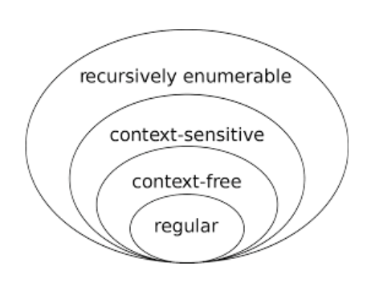
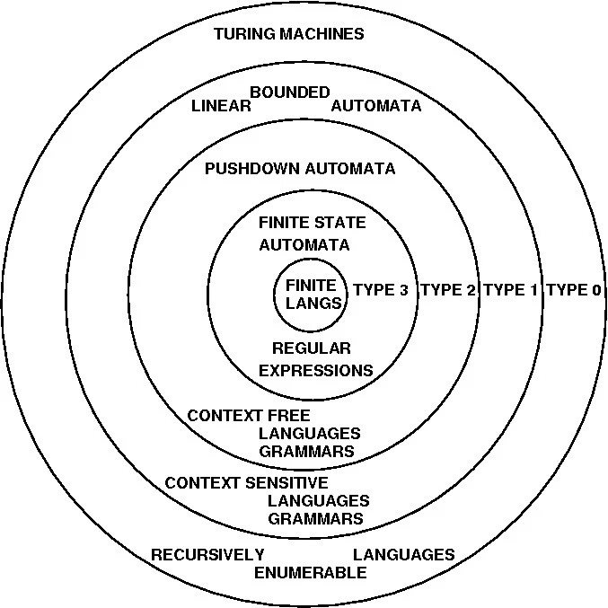

# Introducción a los Lenguajes Formales

## Lenguaje Formal (L)

* Esta formado por PALABRAS que son cadenas constituídas por SÍMBOLOS de un ALFABETO
* Son lenguajes definidos sobre un alfabeto Σ

## Símbolo (ó)

* Es el elemento constructivo básico; es la entidad fundamental, indivisible (atómica)
* Ejemplos:

  | Símbolos ||
  | -- | -- |
  | **a**              | forma parte del alfabeto español, inglés, etc. |
  | **>, = y +**       | son elementos del alfabeto de los operadores de los lenguajes Pascal y ANSI C |
  | **IF, ELSE, THEN** | para construir una sentencia condicional simple en un lenguaje de programación |

## Alfabeto (Σ)

* Es un conjunto no vacío y finito de símbolos indivisibles
* Con sus símbolos se construyen las palabras de un lenguaje

  | Σ | |
  | -- | -- |
  | **Σ1 = {0, 1}** | proporciona los símbolos utilizados en la construcción de los números binarios |
  | **Σ2 = {0, 1, 2, 3, 4, 5, 6, 7, 8, 9, -, +}** | proporciona los números enteros con signo en base 10 |
  | **Σ3 = {na, pa, la, bra}** | alfabeto formado por cuatro símbolos |
  | **Σ4 = {a, b, ab}** | no son símbolos indivisibles ab se forma con a y b. Es un alfabeto AMBIGUO |

## Palabra (w)

* Es una secuencia finita de símbolos tomados de cierto alfabeto y colocados uno a continuación de otro (concatenación/yuxtaposición)
* Una secuencia es una colección enumerada de objetos en la cual las repeticiones están permitidas y el orden importa
* w = s1s2 ... sn  donde si ∈ Σ, para 1 ≤ i ≤ n

  | w | se lee | |
  | -- | -- | -- |
  | **abac**    | "a-b-a-c"                   | es una palabra formada con símbolos del alfabeto {a, b, c} |
  | **101110**  | "uno-cero-uno-uno-uno-cero" | es una palabra construida con símbolos del alfabeto {0, 1} |
  | **abc, abb, aaaaaa** |                    | son palabras construidas con símbolos del alfabeto {a, b, c} |

### Longitud de una palabra (|w|)

* Es la cantidad de símbolos del alfabeto que la componen
* Formalmente |w|: Σ* -> Nat U {0}

  | w | \|w\| | Σ |
  | -- | -- | -- |
  | **palabra** | 7 | {a, b, c, d, ..., z} |
  | **palabra** | 3 | {na, pa, la, bra} |
  | **abac**    | 4 | {a, b, c} |
  | **b**       | 1 | {a, b} |

### Palabra vacía (λ - lambda - )

* Es la palabra que no tiene símbolos, es decir, |λ| = 0
* λ no forma parte de ningún alfabeto

### Potenciación de un símbolo

* c^n representa la repetición del símbolo c, n veces
* Simplifica la escritura de palabras

| w | |
| -- | -- |
| **aaaaabbbbbbb** | **a^5b^7** |
| **aaaabbbb**     | **a^4b^4** |

### Concatenación de dos palabras

* Operación aplicada a palabras (w1w2) y produce una nueva palabra formada por los símbolos de la primera palabra seguidos inmediatamente por los símbolos de la segunda palabra
* Formalmente .: Σ\* x Σ\* -> Σ\*
* No es conmutativa, es decir, w1 w2 ≠ w2 w1
* λ es la identidad para la concatenación, es decir, w λ = λ w = w

  | w1 | w2 | w1w2 |
  | -- | -- | -- |
  | aab | ba    | **aabba**    |
  | abc | aaaaa | **abcaaaaa** |

### Potenciación de una palabra

* Si w es una palabra, entonces w^n (con n ≥ 1 y entero) representa la palabra que resulta de concatenar la palabra w, consigo misma, n-1 veces
* w^n = w.w.w ... w (n-veces)

  | w  | w^0 | w^2  | w^3    |
  | -- | --  | --   | --     |
  | **ab** | λ   | abab | ababab |
  | **a**  | λ   | aa   | aaa    |

### Igualdad de palabras

* Si w1 es una palabra (w1 = a1a2 ... an) y w2 es otra palabra (w2 = b1b2 ... bm), (w1, w2 ∈ Σ*), entonces w1 = w2 si se cumple que:
  * |w1| = |w2|  y
  * (∀i: 1 ≤ i ≤ n: ai = bi)
* Ejemplos:
  * abc = abc
  * abc ≠ ac

### Reflexión o reversa de una palabra

* Si w es una palabra (w = a1a2 ... an), entonces w^-1 o w^R representa la palabra que resulta de invertir el orden de los símbolos en la palabra
* w^-1 = an ... a2 a1

| w | w^-1 |
| -- | -- |
| **ab**    | **ba** |
| **abc**   | **cba** |
| **aaaab** | **baaaa** |

### Prefijo, sufijo e infijo de una palabra

| | | Ejemplo para w = abcd |
| -- | -- | -- |
| **Prefijo** | secuencia de 0 ó + símbolos iniciales de esa palabra | **λ, a, ab, abc, abcd** |
| **Sufijo**  | secuencia de 0 ó + símbolos finales de esa palabra   | **λ, d, cd, bcd, abcd** |
| **Infijo**  | secuencia de símbolos que se obtiene eliminando 0 ó + símbolos iniciales y 0 ó + símbolos finales de esa cadena | **abcd, bcd, cd, d, abc, ab, a, bc, b, c, λ** |

## Lenguaje Natural vs Lenguaje Formal

| | Lenguaje Natural | Lenguaje Formal |
| -- | -- | -- |
| Definición   | hablado y/o escrito por los seres humanos para comunicarse | abstracto |
| Foco         | Semántica (significado de las palabras)                    | Sintaxis  |
| Evolucionan? | SI, incorporando nuevos términos y reglas gramaticales     | NO        |
| Reglas       | después del lenguaje                                       | antes     |  
| Ambigüedad?  | admite (ejemplo: En el cerro hay una llama)                | no admite |
  
### Definición de un lenguaje formal

|||
| -- | -- |
| **Enumeración (extensión)** | {aa, aaaa, aaaaaa, aaaaaaaa, ... } |
| **Comprensión coloquial**   | {palabras con cantidad par de aes} |
| **Comprensión simbólica**   | {a^2n / n >= 1} |

### Cardinalidad de un lenguaje formal

* Es la cantidad de palabras que lo componen

  | L(Σ), Σ = {a, b} | Cardinalidad |
  | -- | -- |
  | L = {a, ab, aab} | **3** |
  | L = {λ}          | **1** |

### Sublenguaje

* Dado que un lenguaje formal es un conjunto, un SUBLENGUAJE es un subconjunto de un lenguaje dado
* Ejemplo: Sea L1 = {a, ab, aab}. Entonces,  L2 = {ab, aab} es un sublenguaje de L1, mientras que L3 = { } es el sublenguaje vacío de L1

### Tipos de Lenguajes formales según cardinalidad

* **Lenguajes formales finitos**: lenguajes con un número finito de palabras

  | L | |
  | -- | -- |
  | L = {} = Ø       | Lenguaje finito vacío |
  | L = {λ}          | Lenguaje finito que contiene sólo la palabra vacía |
  | L = {a, ab, aab} | Lenguaje finito que contiene sólo tres palabras |

* **Lenguajes formales infinitos**: lenguajes con un número infinito de palabras

| L ||
| -- | -- |
| L = {a^n / n ≥ 1}            | Lenguaje infinito (no exite límite superior para el supra índice n) |
| L = {a^(2n+1) b^n / n > 1}   | Lenguaje infinito |
| L = {a^(2n+1) b^m / n,m > 1} | Lenguaje infinito |

### Lenguaje Universal (Σ* - clausura sobre un alfabeto)

* Es un lenguaje infinito que contiene todas las palabras que se pueden formar con símbolos del alfabeto Σ, más la palabra vacía, ya que pertenece a todos los universos
* Es cerrado bajo concatenación, es decir, la concatenación de dos palabras cualesquiera de este lenguaje producirá siempre otra palabra del lenguaje

* Σ* = U Σ^i para i ≥ 0
* Σ^i es el conjunto de todas las palabras de longitud i sobre Σ

  | Si Σ = {a, b, c}, entonces |
  | -- |
  | Σ^0 = {λ} |
  | Σ^1 = {a, b, c} |
  | Σ^2 = {a, b, c} {a, b, c} = {aa, ab, ac, ba, bb, bc, ca, cb, cc} |
  | Σ* = {λ, a, b, aa, ab, ba, bb, aaa, aab, aba, abb, ..., aabaabbbab, ...} |

### Lenguaje sobre un alfabeto (L(Σ))

* Es todo subconjunto de Σ*, entonces L ⊆ Σ*
* Como el universo asociado a un alfabeto es infinito, hay infinitos lenguajes asociados a un alfabeto
* Ejemplos:
  * Si Σ = {na, pa, la, bra}, dos posibles lenguajes de Σ serían:
    * L1(Σ) = {nana, napa, lana}, y
    * L2(Σ) = {λ, nana, pana, palabra, papa, pala}
  * Si  Σ = {a, b, c}, Σ* = {λ, a, b, c, aa, ab, ac, ba, bb, bc, ca, cb, cc, aaa, aab, aac, ...}
    * L1(Σ) = {}
    * L2(Σ) = {λ}
    * L3(Σ) = {a, b, aa, bb, ab, ba}
    * L4(Σ) = {a, aa, aaa, aaaa, ...} = {a^n / n ≥ 1}
    * L5(Σ) = {a^n b^n / n ≥ 1} = {ab, aabb, aaabbb, ...}

### Operaciones con lenguajes

* Sea L1 = {nana, napa, lana}, L2 = {λ, nana, pana, palabra, papa, pala}, L3 = {0, 1}, L4 = {0, 10}

| Operación | Definición | Ejemplo |
| -- | -- | -- |
| **Unión**        | L1 U L2  = {w ∈ Σ* : w ∈ L1 v  w ∈ L2}  | {λ, nana, napa, lana, pana, palabra, papa, pala} |
| **Intersección** | L1 ∩ L2  = {w ∈ Σ* : w ∈ L1 ^ w ∈ L2}   | {nana} |
| **Complemento**  | ~L1  =  {w ∈ Σ* : w ∉ L1}               | {λ, nanana, palana, ...} |
| **Diferencia**   | L1 - L2 = L1 ∩ ~L2                      | {napa, lana} |
| **Producto**     | L1 L2 = {w1w2 ∈ Σ* : w1 ∈ L1 ^ w2 ∈ L2} | {nana, napa, lana, nananana, napanana, ...} |
| **Potencia**     | L^n = { {λ} si n=0 v LL^(n-1) si n>0}   | L3^2 = {00, 01, 10, 11} |
| **Reflexión**    | L^(-1) = {w^(-1) : w ∈ L}               | L4^(-1) = {0, 01} |
| **Cierre estrella (Kleene)** | L* = U L^i  i ≥ 0           | L3* = {λ, 0, 1, 00, 01, 10, 11, 000, 001, ...} |
| **Cierre positivo**          | L+ = U L^i i > 0            | L3+ = {0, 1, 00, 01, 10, 11, 000, 001, ...} |

### Propiedades de los lenguajes

| Propiedad | |
| -- | -- |
| **Concatenación con lenguaje vacio**           | LØ = Ø = ØL |
| **Concatenación es asociativa**                | (L1 L2) L3 = L1 (L2 L3) |
| **Concatenación no es conmutativa**            | L1 L2 ≠ L2 L1 |
| **Distributiva respecto a la unión**           | L1 (L2 U L3) = L1L2  U  L1L3 |
| **No distributiva respecto a la intersección** | L1 (L2 ∩ L3) ≠ L1L2  ∩  L1L3 |
| **Potencia del lenguaje**                      | L^0 = {λ}, L^1 = L, L^2 = LL, ..., L^k = LL^(k-1) |
| **Clausura del Lenguaje**                      | L* = L^0 U L^1 U L^2 U L^3 U ... |
| **Reversa del Lenguaje**                       | L^R = L^(-1) = {w^R ∈ Σ* / w ∈ L} |

### Equivalencias

* L\* = {λ} U L+
* L+ = L\*  <=> λ ∈ L <=> λ ∈ L+
* L\*L = LL\* = L+L\* = L\*L+  = L+
* L\*L\* = L\* pero L+L+ = L^2L\*
* (L\*)\* = (L+)\* = (L\*)+ = L\*
* (L+)+ = L+
* Ø\* = {λ}
* Ø+ = Ø

## Jerarquía de Chomsky

* En 1956 y 1959, el lingüista norteamericano Noam Chomsky publicó dos trabajos sobre los Lenguajes Naturales que, aplicados al área de los Lenguajes Formales, produjeron lo que se conoce como Jerarquía de Chomsky
* Su idea: modelar los lenguajes naturales, con miras a la traducción automática
* Establece una clasificación (según las restricciones que se imponen a sus producciones) de cuatro tipos de gramáticas formales que, a su vez, generan cuatro tipos diferentes de lenguajes formales

  

  

## En resumen

  
