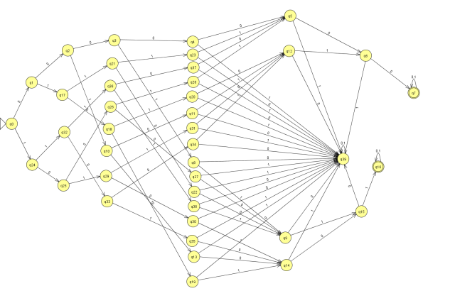
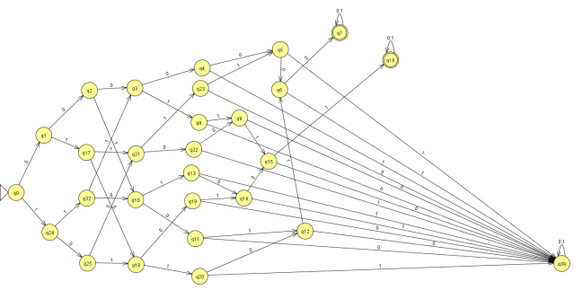
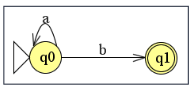
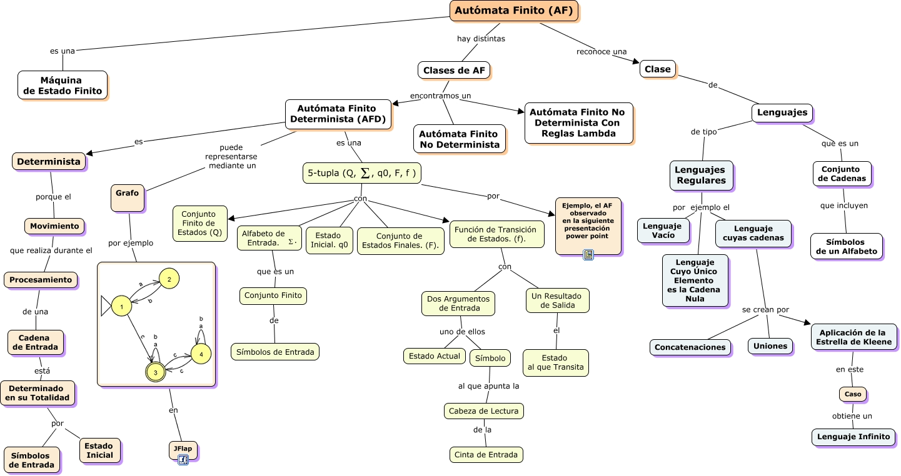

# Autómata Finito (AF)

## Definición

* Es una herramienta abstracta que se utiliza para reconocer un determinado LR
* Es un modelo formal matemático de un sistema que recibe una cadena constituida por símbolos de cierto alfabeto Σ y tiene capacidad de determinar si esa cadena pertenece al LR que el AF reconoce
* Es una máquina de estados finitos. Una máquina es una abstracción matemática que capturan solamente el aspecto referente a las secuencias de eventos (transiciones) que ocurren

  

  

## Reconocimiento

* RECONOCER un LR: aceptar cada cadena que es una palabra del LR y rechazar cada cadena que no pertenece al lenguaje
* Una palabra es aceptada si:
  * Cadena ha sido consumida (se ha analizado todos los símbolos de la cadena)
  * El AF se encuentra en un estado especial llamado ESTADO FINAL o ESTADO DE ACEPTACIÓN

## Definición formal

* Formalmente un autómata finito se define como una 5-upla:  M = <Q, Σ, q0, F, δ>
  * Q: conjunto finito de estados
  * Σ: alfabeto (conjunto finito de símbolos) de entrada reconocido por el autómata
  * q0: estado inicial q0 ∈ Q, único en un conjunto
  * F: conjunto de estados finales o estados de aceptación, F ⊆ Q
  * δ: función de transición de estados, δ: Q x Σ -> Q

## Representación gráfica

* Un autómata generalmente se representa por un grafo dirigido y etiquetado (etiquetas posibles: ó o λ), llamado diagrama de transición de estados
* Cada nodo o vértice representa un estado
* Cada flecha o arista representa una transición
* El estado inicial se representa con un nodo con una flecha que no tiene origen
* Los estado finales se representan por doble círculo



## Casos

* ACEPTACIÓN: cadena ab
  * ACTIVIDAD:  q0 -> a -> q0 -> b -> q1   ACEPTA
  * Se dice que la cadena w es aceptada por el AF M cuando δ(q0, w) ∈ F
  * Se define el Lenguaje aceptado por el AF M como: L(M) = {w ∈ Σ* / δ(q0, w) ∈ F}
* RECHAZO: cadena a
  * ACTIVIDAD:  q0 -> a -> q0    RECHAZA
* RECHAZO: cadena abab
  * ACTIVIDAD:  q0 -> a -> q0 -> b -> q1 -> a -> ?  RECHAZA

## Malos diseños

* **Incorrecto**: "Sobran palabras". El autómata acepta algunas palabras que no debería aceptar
* **Incompleto**: "Faltan palabras". Palabras en el lenguaje que no son aceptadas por el autómata cuando debería serlo

## Tipos de AF

* **Autómatas Finitos Deterministas (AFD)**:
  * Deterministic Finite Automaton.
  * Para cualquier estado en que se encuentre el autómata en un momento dado, la lectura de un símbolo determina, SIN AMBIGÜEDADES, cuál será el estado de llegada en la próxima transición. (unívocamente determinado)
  * Es un AFN (ya que es un caso especial).
  * Se puede encontrar un AFD por cada AFN que acepte el mismo lenguaje.
* **Autómatas Finitos No Deterministas (AFN)**:
  * Non-deterministic Finite Automaton.
  * Permite cero, una o más transiciones a partir de un estado con un determinado símbolo de entrada.
  * Una cadena de entrada se dice que es aceptada por un AFN si existe una secuencia de transiciones, correspondiente a la cadena de entrada, que lleva del estado inicial a algún estado final.
  * Acepta transiciones vacías: el autómata puede cambiar de estado sin tener que leer ningún símbolo de la entrada (arcos sin etiquetas entre pares de estados).

## Ejemplos AFD

* L = {ab^n / n ≥ 0} = {a, ab, abb, abbb, ...}
  * Q = {q0, q1}
  * Σ = {a, b}
  * q0 = q0
  * F = {q1}
  * δ = {δ(q0, a) = q1, δ(q1, b) = q1}

    | Q | a | b |
    | -- | -- | -- |
    | >q0 | q1 | - |
    | *q1 | - | q1 |

* L = {a^ncb^m / n > 0 ^ m ≥ 0} = {ac, acb, aaaac, acbbbb, aaaacbbbbb, ...}
  * Q = {q0, q1, q2}
  * Σ = {a, b, c}
  * q0 = q0
  * F = {q2}
  * δ = {δ(q0, a) = q1, δ(q1, a) = q1, δ(q1, c) = q2, δ(q2, b) = q2}

    | Q | a | b | c |
    | -- | -- | -- | -- |
    | >q0 | q1 | - | - |
    | q1 | q1 | - | q2 |
    | *q2 | - | q2 | - |

* L = {00w1 / w ∈ {0, 1}*} = {001, 00001101, 00110011, ...}
  * Q = {q0, q1, q2, q3}
  * Σ = {0, 1}
  * q0 = q0
  * F = {q3}
  * δ = {δ(q0, 0) = q1, δ(q1, 0) = q2, δ(q2, 0) = q2, δ(q2,1) = q3,  δ(q3, 0) = q2, δ(q3, 1) = q3}

    | Q | 0 | 1 |
    | -- | -- | -- |
    | >q0 | q1 | - |
    | q1 | q2 | - |
    | q2 | q2 | q3 |
    | *q3 | q2 | q3 |

* L = {wc^3m / w ∈ {a, b}* y la cantidad de b´s es par ^ m ≥ 0} = {λ, a, bb, ccc, accc, abbcccccc, babaccc, ...}
  * Q = {q0, q1, q2, q3, q4}
  * Σ = {a, b, c}
  * q0 = q0
  * F = {q0 ,q4}
  * δ = {δ(q0, a) = q0, δ(q0, b) = q1, δ(q1, a) = q1, δ(q1, b) = q0,  δ(q0, c) = q2, δ(q2, c) = q3, δ(q3, c) = q4,  δ(q4, c) = q2}

    | Q | a | b | c |
    | -- | -- | -- | -- |
    | >*q0 | q0 | q1 | q2 |
    | q1 | q1 | q0 | - |
    | q2 | - | - | q3 |
    | q3 | - | - | q4 |
    | *q4 | - | - | q2 |

* ER = a (a | ba*)  L = {aa, ab, aba, abaa, abaaa, ...}
  * Q = {q0, q1, q2, q3}
  * Σ = {a, b}
  * q0 = q0
  * F = {q2, q3}
  * δ = {δ(q0, a) = q1, δ(q1, a) = q2, δ(q1, b) = q3, δ(q3, a) = q3}

    | Q | a | b |
    | -- | -- | -- |
    | >q0 | q1 | - |
    | q1 | q2 | q3 |
    | *q2 | - | - |
    | *q3 | q3 | - |

## AF completo

* Un AF es completo si cada estado tiene exactamente una transición por cada símbolo del alfabeto
* Un AF es completo cuando su tabla de transiciones no tiene "huecos";  si los tiene, el AF es incompleto
* Completar un AF significa eliminar los "huecos" de su tabla de transiciones, agregando un nuevo estado, que se denomina ESTADO DE RECHAZO o ESTADO DE NO ACEPTACIÓN o ESTADO DE ERROR (qe)
* Ejemplo:

  | Q | a | b |
  | -- | -- | -- |
  | >q0 | q1 | qe |
  | q1 | q2 | q3 |
  | *q2 | qe | qe |
  | *q3 | q3 | qe |
  | qe | qe | qe |

## AF equivalentes

* Dos AF son EQUIVALENTES si reconocen al mismo LR
* Ejemplos:

  | Q | a | b |
  | -- | -- | -- |
  | >*q0 | q0 | q1 |
  | q1 | q0 | q1 |

  | Q | a | b |
  | -- | -- | -- |
  | >*q0 | q1 | q2 |
  | *q1 | q1 | q2 |
  | q2 | q0 | q2 |

## Ejemplos AFN

* L = {a^nb^m / n ≥ 1 ^ m ≥ 0} = {a, aa, ab, abb, ...}

  | Q | a | b |
  | -- | -- | -- |
  | >q0 | {q0, q1} | - |
  | *q1 | - | q1 |

* L = {w / w ∈ {0, 1}* y w contiene la subpalabra 00 o w contiene la subpalabra 11} = {00, 11, 000101010, 101011010, 10100, ...}

  | Q | 0 | 1 |
  | -- | -- | -- |
  | >q0 | {q0, q3} | {q0, q1} |
  | q1 | - | q2 |
  | *q2 | q2 | q2 |
  | q3 | q4 | - |
  | *q4 | q4 | q4 |

* ER = (a | b)* abb

  | Q | a | b |
  | -- | -- | -- |
  | >q0 | {q0, q1} | q0 |
  | q1 | - | q2 |
  | q2 | - | q3 |
  | *q3 | - | - |

## Operaciones con AF

* Complemento
* Intersección
* Unión
* Concatenación

### Complemento

* Se define el autómata complementario Mc como aquel que se obtiene a partir de M dando a los estados no aceptadores el carácter de aceptadores y viceversa  L(M^c) = ~L(M)
  * M^c = (Q, Σ, q0, F = Q - F, δ)
* El complemento de un AFD ya es un AFD que se obtiene invirtiendo los estados finales y no finales, es decir:
  * Todo estado no final del AFD dato será un estado final del AFD complemento, y
  * Todo estado final del AFD dato será un estado no final del AFD complemento. Por esta situación, es muy importante que el AFD dato esté completo, ya que su estado de rechazo se convierte en un estado final
* Formalmente, sea un AFD M = \<Q, Σ, q0, F, δ\>. Entonces, el autómata complemento se define Mc = \<Q, Σ, q0, Q – F, δ\>
* La única diferencia entre el AFD dato y el AFD resultado radica en el conjunto de estados finales: en el AFD resultado, el conjunto Q – F es el complemento, con respecto al conjunto total de estados, del conjunto de estados finales del AFD original
* Ejemplo: Sea el lenguaje L: "Todas las palabras sobre el alfabeto {a, b} que comienzan con b y tienen longitud mayor o igual que tres"

  | Q | a | b |
  | -- | -- | -- |
  | >q5 | q9 | q6 |
  | q6 | q7 | q7 |
  | q7 | q8 | q8 |
  | *q8 | q8 | q8 |
  | q9 | q9 | q9 |

  | Q | a | b |
  | -- | -- | -- |
  | >*q5 | q9 | q6 |
  | *q6 | q7 | q7 |
  | *q7 | q8 | q8 |
  | q8 | q8 | q8 |
  | *q9 | q9 | q9 |

### Intersección

* M1 ∩ M2
* M = (Q = Q1 x Q2, Σ, q0 = q1,q2,  F = F1 x F2
* ∀p ∈ Q1, ∀q ∈ Q2, ∀w ∈ Σ*
* δ((p, q), w) = (δ1(p, w), δ2(q, w))
* (p, q)w = (pw, qw)

### Unión

* M1 U M2
* M = (Q = Q1 U Q2, Σ, q0 = q1 U q2, F = F1 U F2, δ = δ1 U δ2)
* δ(q, w) = δ1(q, w) si q ∈ Q1
* δ(q, w) = δ2(q, w) si q ∈ Q2

### Concatenación

* M1.M2
* M = (Q = Q1 U Q2, Σ, q0 = q1, F = F2
* δ(q, a) = δ1(q, a) si q ∈ Q1 y a ∈ Σ
* δ(q, a) = δ2(q, a) si q ∈ Q2 y a ∈ Σ
* δ(q, λ) = q2  ∀q ∈ F1

## Programa Prolog que implementa un AF

```prolog
% Ejemplo: ER a* (b | bb)
final(q1).
final(q2).
transicion(q0, a, q0).
transicion(q0, b, q1).
transicion(q1, b, q2).
automata([], E) :- final(E).
automata([H|Q], E) :- transicion(E, H, E2), automata(Q, E2), !.
automata(L) :- automata(L, q0).

% ?- automata([b, b, b]).
% false

% ?- automata([a, a, b, b]).
% true
```

## En resumen

  
