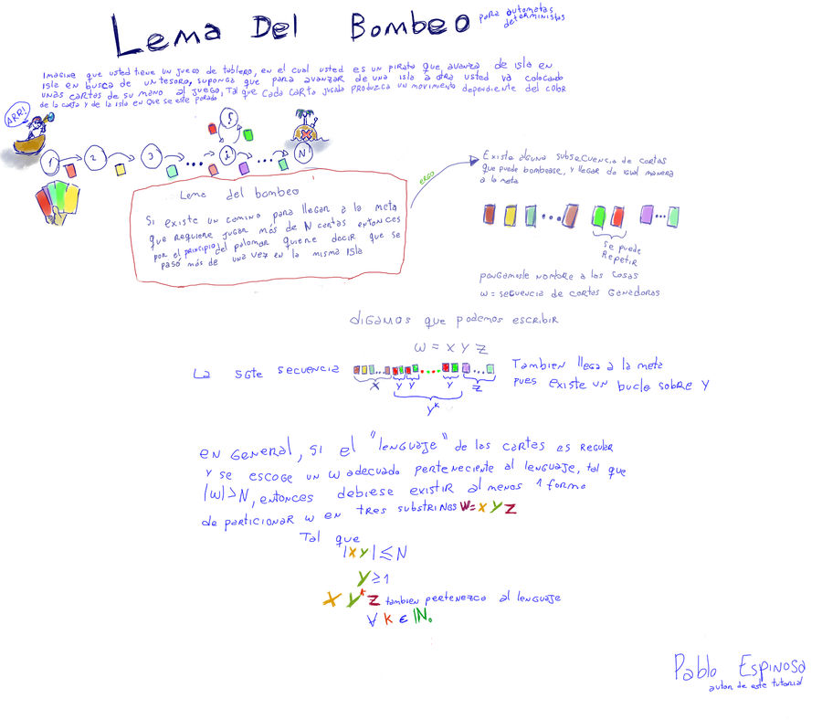
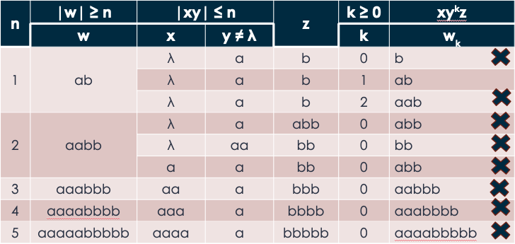

# Algoritmos con Autómata Finito

| Algoritmos | Transformación | |
| -- | -- | -- |
| **Algoritmo de Thompson**             | ER -> AFNλ         | [Ir](#algoritmo-de-thompson-er---afnλ)             |
| **Algoritmo "Arden"**                 | AFD -> ER          | [Ir](#algoritmo-arden-afd---er)                    |
| **Algoritmo de Clausura-λ**           | {AFN, AFNλ} -> AFD | [Ir](#algoritmo-de-clausura-λ-afn-afnλ---afd)      |
| **Algoritmo reducido del Clausura-λ** | AFN -> AFD         | [Ir](#algoritmo-reducido-del-clausura-λ-afn---afd) |
| **Algoritmo de Clases**               | AFD -> AFDmin      | [Ir](#algoritmo-de-clases-afd---afdmin)            |
| **Algoritmo**                         | AFD -> GR          | [Ir](#algoritmo-afd---gr)                          |
| **Algoritmo**                         | GR -> AF           | [Ir](#algoritmo-gr---af)                           |

## Algoritmo de Thompson: ER -> AFNλ

1. Desmembrar la ER en sus componentes básicos: símbolos, operadores (precedencia: *, ., |) y λ (si forma parte de la ER)
1. Generar un AF básico por cada σ o λ de la ER

    * Ejemplo: a(a|b)*

      | Q | a |
      | -- | -- |
      | >q0 | q1 |
      | *q1 | -  |

      | Q | a |
      | -- | -- |
      | >q2 | q3 |
      | *q3 | -  |

      | Q | b |
      | -- | -- |
      | >q4 | q5 |
      | *q5 | -  |

1. Componer estos AF básicos según los operadores existentes en la ER, hasta lograr el AF que reconoce a la ER dada. El AF que se obtiene es un AFNλ

    * **Autómata para la unión**:
      1. Los estados iniciales de los AF básicos dejan de ser iniciales y los estados finales dejan de ser finales
      1. Se agrega un nuevo estado inicial
      1. Se agregan dos transiciones-λ que relacionan al nuevo estado inicial con los dos ex estados iniciales
      1. Se agrega un nuevo estado final
      1. Se agregan dos transiciones-λ para unir a los dos ex estados finales con este nuevo estado final

          | Q | a | b | λ |
          | -- | -- | -- | -- |
          | >q6 | -  | -  | {q2, q4} |
          | q2  | q3 | -  | -        |
          | q4  | -  | q5 | -        |
          | q3  | -  | -  | q7       |
          | q5  | -  | -  | q7       |
          | *q7 | -  | -  | -        |

    * **Autómata para la clausura de Kleene**:
      1. El estado inicial deja de ser inicial y el estado final deja de ser final
      1. Se agrega un nuevo estado inicial y un nuevo estado final
      1. Se agrega una transición-λ desde el nuevo estado inicial hasta el ex estado inicial
      1. Se agrega una transición-λ desde el ex estado final al nuevo estado final
      1. Se agrega una transición-λ desde el nuevo estado inicial al nuevo estado final (para que reconozca la palabra vacía)
      1. Se agrega una transición-λ desde el ex estado final al ex estado inicial (para reconocer la repetición del símbolo)

          | Q | a | b | λ |
          | -- | -- | -- | -- |
          | >q8 | -  | -  | {q6, q9} |
          | q6  | -  | -  | {q2, q4} |
          | q2  | q3 | -  | -        |
          | q4  | -  | q5 | -        |
          | q3  | -  | -  | q7       |
          | q5  | -  | -  | q7       |
          | q7  | -  | -  | {q9, q6} |
          | *q9 | -  | -  | -        |

    * **Autómata para la concatenación**:
      1. Se construyen los AF básicos (izquierdo y derecho)
      1. El estado final del izquierdo deja de ser final y el estado inicial del derecho deja de ser inicial (los otros estados no se alteran)
      1. Se agrega una transición-λ que vincule al ex estado final del izquierdo con el ex estado inicial del derecho
      1. El AFN ya está terminado, siendo su estado inicial el estado inicial del izquierdo, y siendo su estado final el estado final del derecho

          | Q | a | b | λ |
          | -- | -- | -- | -- |
          | >q0 | q1 | -  | -        |
          | q1  | -  | -  | q8       |
          | q8  | -  | -  | {q6, q9} |
          | q6  | -  | -  | {q2, q4} |
          | q2  | q3 | -  | -        |
          | q4  | -  | q5 | -        |
          | q3  | -  | -  | q7       |
          | q5  | -  | -  | q7       |
          | q7  | -  | -  | {q9, q6} |
          | *q9 | -  | -  | -        |

## Algoritmo "Arden": AFD -> ER

1. Depurar el AF: detectar y eliminar todos los estados erróneos y todas las referencias que haya a estos estados
    * Estados a los que no se puede llegar desde el estado inicial (estados inalcanzables)
    * Estados que no conducen a un estado final (estados de rechazo)

    | Q | a | b |
    | -- | -- | -- |
    | >q0 | q1 | q2 |
    | q1  | q1 | q4 |
    | q2  | q4 | q5 |
    | q3  | q4 | q4 |
    | *q4 | q5 | q4 |
    | q5  | q5 | q5 |

    | Q | a | b |
    | -- | -- | -- |
    | >q0 | q1 | q2 |
    | q1  | q1 | q4 |
    | q2  | q4 | -  |
    | *q4 | -  | q4 |

1. Establecer un Sistema de Ecuaciones:
    * Tendrá tantas ecuaciones como estados tenga el AF
    * Cada ecuación tiene:
      * En su lado izquierdo, el estado cuyo comportamiento es descrito por una ecuación
      * En su lado derecho, la unión de términos que representan las transiciones que parten del estado mencionado en el lado izquierdo. Cada uno de estos términos se forma mediante el símbolo que etiqueta a la transición concatenado con el estado de llegada. La única excepción se produce cuando se desarrolla la ecuación de un estado final, en este caso, se agrega un término λ para indicar que este estado, por ser final, acepta una palabra que finalice cuando el AF llega a este estado

1. Reducir:
    * Se debe realizar en una ecuación que tiene uno o más ciclos. En estas ecuaciones se puede apreciar que el estado que figura en el lado izquierdo de la ecuación también se encuentra en el lado derecho. Por ello, una ecuación con estas características se las denomina ecuación recursiva, cuyo formato es: q = αq + β
      * q: estado
      * α: ER
      * β: ER que puede estar formada por símbolos, λ y estados
    * Cuando existe una ecuación recursiva, ésta se debe reducir aplicando el Lema de Arden, de esta forma: q = αq + β = α*β
      * Ejemplo 1: q0 = aq0 + bq1 + λ = aq0 + (bq1 + λ) = a*(bq1 + λ)
      * Ejemplo 2: q2 = (a + b)q2 + aq1 = (a + b)*aq1

1. Resolver el Sistema de Ecuaciones (sustituir):
    * Puede realizarse en cualquier orden, con una sola excepción: la ecuación que corresponde al estado inicial debe ser la última en resolverse porque en su lado derecho quedará la ER buscada

| Ejemplo | Paso 1 | Paso 2 | Paso 3 | Paso 4 | ER |
| -- | -- | -- | -- | -- | -- |
| **EJ 1**  | N/A | q0 = aq1, q1 = λ                       | N/A                    | q0 = aq1 = aλ = a                         | a |
| **EJ 2**  | N/A | q0 = aq1 + λq2, q1 = λ, q2 = λ         | N/A                    | q0 = aq1 + λq2 = aλ + λλ = a + λ          | a \| λ |
| **EJ 3**  | N/A | q0 = aq0 + bq1 + λ, q1 = λ             | q0 = a*(bq1 + λ)       | q0 = a*(bq1 + λ) = a*(bλ + λ) = a*(b + λ) | a*(b \| λ) |
| **EJ 4**  | N/A | q0 = aq2 + bq5, q2 = aq2 + bq5, q5 = λ | q2 = aq2 + bq5 = a*bq5 | q2 = a\*bq5 = a\*b, q0 = aq2 + bq5 = aa\*b + bλ = aa\*b + b | aa*b \| b |
| **EJ 5**  | N/A | q0 = (a + b)q0 + aq1, q1 = λ           | q0 = (a + b)*aq1       | q0 = (a + b)\*aq1 = (a + b)\*aλ = (a + b)\*a | (a \| b)*a |
| **EJ 6**  | N/A | q0 = (a + b)q0 + λ                     | q0 = (a + b)*          | | (a \| b)* |
| **EJ 7**  | N/A | q0 = aq1, q1 = bq2 + λ, q2 = (a + b)q2 + aq1 | q2 = (a + b)*aq1 | q1 = bq2 + λ = b(a + b)\*aq1 + λ = (b(a + b)\*a)\*, q0 = aq1 = a(b(a + b)\*a)\* | a(b(a \| b)\*a)\* |
| **EJ 8**  | N/A | q0 = 0q0 + 1q1, q1 = 0q1 + 1q2 + λ, q2 = 0q2 + 1q1 | q0 = 0q0 + 1q1 = 0\*1q1, q1 = 0q1 + 1q2 + λ = 0\*(1q2 + λ), q2 = 0q2 + 1q1 = 0\*1q1 | q1 = 0\* (10\*1q1 + λ) = 0\* 10\*1q1 + 0\* = (0\* 10\*1)\*0\*, q0 = 0\*1(0\* 10\*1)\*0\* | 0\*1(0\* 10\*1)\*0\* |
| **EJ 9**  | N/A | s = Ss + Ut, t = Tt +Vs + λ | s = S\*Ut, t = T\*(Vs + λ) = T\*Vs + T\* | s = S\*U(T\*Vs + T\*) = S\*UT\*Vs + S\*UT\* = (S\*UT\*V)\*S\*UT\* | (S\*UT\*V)\*S\*UT\* |
| **EJ 10** | N/A | p = 0q + 1r, q = 0s + 1r, r = 0q + 1s, s = 0s + 1s + λ | s = (0 + 1)s + λ = (0 + 1)\* λ = (0 + 1)\* | r = 0q + 1s = 0q + (0 + 1)\*, q = 0(0 + 1)\* + 1r = 0(0 + 1)\* + 1(0q + (0 + 1)\*) = 0(0 + 1)\* + 10q + 1(0 + 1)\* = (10)\*(0(0 + 1)\* + 1(0 + 1)\*) = (10)\*(0 + 1)(0 + 1)\*, r = 0(10)\*(0 + 1)(0 + 1)\* + (0 + 1)\*, p = 0(10)\*(0 + 1)(0 + 1)\*  + 1(0(10)\*(0 + 1)(0 + 1)\* + (0 + 1)\*) | 0(10)\*(0 \| 1)(0 \| 1)\*  \| 1(0(10)\*(0 \| 1)(0 \| 1)\* \| (0 \| 1)\*) |

## Algoritmo de Clausura-λ: {AFN, AFNλ} -> AFD

* Ejemplo: a*b

  | Q | a | b | λ |
  | -- | -- | -- | -- |
  | >q0 | -  | -  | {q1, q3} |
  | q1  | q2 | -  | -        |
  | q2  | -  | -  | {q1, q3} |
  | q3  | -  | -  | q4       |
  | q4  | -  | q5 | -        |
  | *q5 | -  | -  | -        |

| Conceptos | | Ejemplo 1 | Ejemplo 2 |
| -- | -- | -- | -- |
| **Clausura-λ de un estado**              | c-λ(q) = {q} U {estados a los cuales se llega desde q usando λ} | c-λ(q0) = {q0, q1, q3, q4} | c-λ(q2) = {q2, q1, q3, q4} |
| **Clausura-λ de un conjunto de estados** | c-λ({q1, q2}) = c-λ(q1) U c-λ(q2)                               | | |
| **Conjunto "HACIA"**                     | h(c-λ(q), σ) = {estados de llegada}                             | h(c-λ(q0), a) = {q2}       | h(c-λ(q0), b) = {q5} |

1. Se obtiene el estado inicial del AFD, que es la clausura-λ del estado inicial del AFN
1. Se agrega este estado a la primera columna de la TT
1. Para cada σ ∈ Σ, se calcula el conjunto hacia del estado que se acaba de agregar a la primera columna de la TT
1. Se determinan nuevos estados del AFD por medio de la clausura-λ de cada conjunto hacia recién obtenido. Estos estados (conjuntos) se incorporan a la TT, en las columnas que les corresponden
1. Si un nuevo estado obtenido en el punto anterior no existe todavía en la primera columna de la TT se lo agrega
1. Se repiten los pasos (3) al (5) hasta que no surjan nuevos estados

* Los estados finales del AFD son todos aquellos conjuntos de estados del AFN que contienen por lo menos, un estado final

  | Q | a | b |
  | -- | -- | -- |
  | >q0 | h(c-λ(q0), a) = {q2} | h(c-λ(q0), b) = {q5} |
  | q2  | h(c-λ(q2), a) = {q2} | h(c-λ(q2), b) = {q5} |
  | *q5 | h(c-λ(q5), a) = {}   | h(c-λ(q5), b) = {}   |

## Algoritmo reducido del Clausura-λ: AFN -> AFD

1. Completar la TT con todos los Q del AFN
1. Nuevos estados pasan a ser filas de la TT
1. [q0q1] para cada σ ∈ Σ
    * [q0] U [q1]
    * Ejemplo a: [q0q1] U [-] = [q0q1]
    * Ejemplo b: [q0] U [q2] = [q0q2]
1. Si los estados se repiten en la unión se deja uno
1. Si en el nuevo estado luego de la unión se encuentra el estado final, entonces también es final
1. Se eliminan estados no accesibles desde q0

* Ejemplo:

  | Q | a | b |
  | -- | -- | -- |
  | >[q0]   | [q0q1] | [q0]   |
  | [q1]    | -      | [q2]   |
  | [q2]    | -      | [q3]   |
  | *[q3]   | -      | -      |
  | [q0q1]  | [q0q1] | [q0q2] |
  | [q0q2]  | [q0q1] | [q0q3] |
  | *[q0q3] | [q0q1] | [q0]   |

## Algoritmo de Clases: AFD -> AFDmin

* Es el AFD con la mínima cantidad de estados que reconoce a un LR
* Por ello, se lo considera como el único autómata óptimo asociado a la aceptación de determinado LR
* Tiene la TT más reducida, con menor cantidad de filas, hecho que beneficia la implementación del AFD mediante un programa de computadora
* Ejemplo:

  | Q | a | b |
  | -- | -- | -- |
  | >q0 | q1 | q2 |
  | q1  | q3 | q4 |
  | q2  | q7 | q8 |
  | q3  | q3 | q2 |
  | *q4 | q5 | q8 |
  | *q5 | q6 | q8 |
  | *q6 | q6 | q8 |
  | *q7 | q8 | q8 |
  | q8  | q8 | q8 |

1. Particionar el conjunto de estados del AFD completo en dos clases: la clase de los estados no finales (C0) y la clase de los estados finales (C1)

    | Q | a | b |
    | -- | -- | -- |
    | >q0 | q1 | q2 |
    | q1  | q3 | q4 |
    | q2  | q7 | q8 |
    | q3  | q3 | q2 |
    | q8  | q8 | q8 |
    | --  | -- | -- |
    | *q4 | q5 | q8 |
    | *q5 | q6 | q8 |
    | *q6 | q6 | q8 |
    | *q7 | q8 | q8 |

1. Detectar estados equivalentes y reducir el AFD:
    * Dos estados son equivalentes si:
      * Pertenecen a la misma clase y
      * Tienen el mismo comportamiento (n-upla formada por los estados de su fila en la TT). Por ejemplo el comportamiento de q0 es (q1, q2) y de q4 es (q5, q8)
    * En el ejemplo, en C0 no hay estados equivalentes, mientras que en C1, q5 tiene el mismo comportamiento que q6: (q6, q8)
    * Si dos o más estados son equivalentes, significa que sólo uno de ellos es necesario porque tienen el mismo comportamiento
    * Reducir el AFD, el cual quedará con uno solo de los estados equivalentes como representante del conjunto de estados equivalentes. Reemplazar referencias por el nombre del estado que permanecerá

      | Q | a | b |
      | -- | -- | -- |
      | >q0 | q1 | q2 |
      | q1  | q3 | q4 |
      | q2  | q7 | q8 |
      | q3  | q3 | q2 |
      | q8  | q8 | q8 |
      | --  | -- | -- |
      | *q4 | q5 | q8 |
      | *q5 | q5 | q8 |
      | *q7 | q8 | q8 |

    * Continuar reduciendo, ya que ahora q4 y q5 son estados equivalentes

      | Q | a | b |
      | -- | -- | -- |
      | >q0 | q1 | q2 |
      | q1  | q3 | q4 |
      | q2  | q7 | q8 |
      | q3  | q3 | q2 |
      | q8  | q8 | q8 |
      | --  | -- | -- |
      | *q4 | q4 | q8 |
      | *q7 | q8 | q8 |

1. Construir la "Tabla de Transiciones por Clases (TTC)"

    | Q | a | b |
    | -- | -- | -- |
    | >q0 | C0 | C0 |
    | q1  | C0 | C1 |
    | q2  | C1 | C0 |
    | q3  | C0 | C0 |
    | q8  | C0 | C0 |
    | --  | -- | -- |
    | *q4 | C1 | C0 |
    | *q7 | C0 | C0 |

1. Buscar estados equivalentes por clase y realizar la partición de la clase en subclases
    * Buscar estados equivalentes por clase, que son aquellos estados que están en la misma clase y tienen el mismo comportamiento por clases
    * Realizar la partición de la clase en subclases que se caracterizan por contener estados que son equivalentes por clase. Y este proceso continúa hasta que se llega a la situación en que cada clase está formada por un solo estado, con lo que se deduce que el AFD no se puede minimizar más. En este último caso, se elige un representante de la clase como se ha hecho anteriormente

      | Q | a | b | C |
      | -- | -- | -- | -- |
      | >q0 | C0 | C0 | C0 |
      | q3  | C0 | C0 |    |
      | q8  | C0 | C0 |    |
      | --  | -- | -- | -- |
      | q1  | C0 | C1 | C2 |
      | --  | -- | -- | -- |
      | q2  | C1 | C0 | C3 |
      | --  | -- | -- | -- |
      | *q4 | C1 | C0 | C1 |
      | --  | -- | -- | -- |
      | *q7 | C0 | C0 | C4 |

1. Mientras surjan nuevas clases, actualizar la TTC a partir de la TT original
    * Actualizar la TTC porque al haber particionado las clases originales, la TTC ha cambiado. Por ejemplo, leyendo la TT original, vemos que el estado q0 tiene comportamiento (q1, q2); y se observa que, con esta última partición, el estado q1 pertenece a la clase C2, mientras que el estado q2 pertenece a la clase C3, y así...
    * Las clases C2, C3, C1 y C4 ya son mínimas porque cada una está constituida por un solo estado. En cuanto a la clase C0, se distingue que está formada por 3 estados que ahora tienen diferentes comportamientos por clases, por lo que se debe separar, colocando a cada uno en una nueva subclase. Finalmente, todas las clases quedan con un único estado y el AFD no se puede minimizar más
    * En definitiva, y volviendo a la TT original, el AFD mínimo sin completar (es decir, sin estado de rechazo q8) está representado por la siguiente tabla:

      | Q | a | b |
      | -- | -- | -- |
      | >q0 | q1 | q2 |
      | q1  | q3 | q4 |
      | q2  | q7 | -  |
      | q3  | q3 | q2 |
      | *q4 | q4 | -  |
      | *q7 | -  | -  |

      

* Ejemplo 1: a*b

  | AFD | a | b |
  | -- | -- | -- |
  | >q0 | q1 | q2 |
  | q1  | q1 | q2 |
  | *q2 | qe | qe |
  | qe  | qe | qe |

  | AFDmin | a | b |
  | -- | -- | -- |
  | >q0 | q0 | q2 |
  | *q2 | -  | - |

* Ejemplo 2: (a|b)*

  | AFD | a | b |
  | -- | -- | -- |
  | >*q0 | q1 | q1 |
  | *q1  | q1 | q1 |

  | AFDmin | a | b |
  | -- | -- | -- |
  | >*q0 | q0 | q0 |

* Ejemplo 3: b\*a(b\*ab\*a)\*b\*

  | AFD | a | b |
  | -- | -- | -- |
  | >q0 | q1 | q0 |
  | *q1 | q2 | q1 |
  | q2  | q1 | q2 |

  | AFDmin | a | b |
  | -- | -- | -- |
  | >q0 | q1 | q0 |
  | *q1 | q0 | q1 |

* Ejemplo 4: (a|b)((a|b)(a|b))*

  | AFD | a | b |
  | -- | -- | -- |
  | >q0 | q1 | q1 |
  | *q1 | q2 | q2 |
  | q2  | q3 | q3 |
  | *q3 | q2 | q2 |

  | AFDmin | a | b |
  | -- | -- | -- |
  | >q0 | q1 | q1 |
  | *q1 | q0 | q0 |

## Algoritmo: AFD -> GR

* **Entrada**: AFD = \<Q, Σ, q0, F, δ\>
* **Salida**:  GR = \<ΣT, ΣN, S, P\>. Donde P:

  | Si ... | Entonces ... |
  | -- | -- |
  | δ(q, a) = p         | q -> ap, (a ∈ Σ, q ∈ Q, p ∈ Q) |
  | δ(q, a) = p y p ∈ F | q -> a,  (a ∈ Σ, q ∈ Q, p ∈ Q) |
  | q0 ∈ F              | q -> λ                         |

* Ejemplo 1: a*b

  | Q | a | b |
  | -- | -- | -- |
  | >q0 | q0 | q1 |
  | *q1 | -  | - |

  ```plain
  q0 -> aq0 | b
  ```

* Ejemplo 2:

  | Q | 0 | 1 |
  | -- | -- | -- |
  | >q0 | q1 | q2 |
  | q1  | q1 | q3 |
  | *q2 | q0 | q4 |
  | q3  | q3 | q3 |
  | *q4 | q0 | q4 |

  ```plain
  q0 -> 0q1 | 1q2 | 1
  q1 -> 0q1 | 1q3
  q2 -> 0q0 | 1q4 | 1
  q3 -> 0q3 | 1q3 
  q4 -> 0q0 | 1q4 | 1
  ```

* Ejemplo 3:

  | Q | 0 | 1 |
  | -- | -- | -- |
  | >S | A | B |
  | A  | C | B |
  | B  | A | C |
  | *C | C | C |

  ```plain
  S -> 0A | 1B 
  A -> 0C | 1B | 0
  B -> 0A | 1C | 1
  C -> 0C | 1C | 0 | 1
  ```

* Ejemplo 4: λ | a\* | (a\*ba\*b)\*ccc(ccc)\*

  | Q | a | b | c |
  | -- | -- | -- | -- |
  | >*A | A | B | C |
  | B   | B | A | - |
  | C   | - | - | D |
  | D   | - | - | E |
  | *E  | - | - | C |

  ```plain
  A -> aA | bB | cC | λ | a
  B -> aB | bA | b
  C -> cD 
  D -> cE | c
  E -> cC 
  ```

## Algoritmo: GR -> AF

* **Entrada**: GR = \<ΣT, ΣN, S, P\>
* **Salida**:  AF = \<Q, Σ, q0, F, δ\>. Donde:
  * Q = ΣN U {F}
  * Σ = ΣT
  * q0 = S
  * F = {F}, donde F ∉ ΣN  es un nuevo símbolo no terminal
  * δ:

    | Si ... | Entonces ... |
    | -- | -- |
    | A -> vB | δ(A, v) = B |
    | A -> v  | δ(A, v) = F |
    | S -> λ  | δ(S, λ) = F |

* Ejemplo: (ab)*

  ```plain
  A -> aB | λ
  B -> bC | b
  C -> aB
  ```

  | Q | a | b | λ |
  | -- | -- | -- | -- |
  | >A | B | -      | F |
  | B  | - | {C, F} | - |
  | C  | B | -      | - |
  | *F | - | -      | - |

## Lema del bombeo para LR

* Se utiliza para demostrar que determinados lenguajes infinitos no son regulares
* Dado un lenguaje L, ¿L es LR?
  * Si L es finito, es LR y se podrá construir un AF o una ER
  * Si L es especificado por medio de un AF o una ER
  * Si L es infinito se deben obtener algunas propiedades que comparten todos los LR infinitos y que no estén presentes en los lenguajes no regulares
* Cómo conseguir un LR infinito si se tiene un número finito de estados en un AF
* Sea L un LR infinito
* ∃ una constante n / ∀ w ∈ L con |w| ≥ n, se puede descomponer w en tres segmentos, w = xyz, de modo que:
  * |y| ≥  1 ; es decir, y ≠ λ
  * |xy| ≤ n
  * ∀ k ≥ 0, la palabra xy^kz ∈ L
* Con otras palabras...
  * Si un AFD es capaz de aceptar un número infinito de palabras, entonces debe aceptar una palabra que consista en la concatenación de tres segmentos (xyz) tales que cualquier repetición del segmento central (y, que no es vacío) dé como resultado otra palabra aceptable
  * Es decir, pueden generarse otras palabras aceptables "bombeando" o "ampliando" una palabra aceptable
* El lema de bombeo afirma que, si un LR contiene una palabra suficientemente larga, esta palabra tiene una subpalabra (y) que se puede bombear, es decir, repetirse tantas veces como se quiera, sin que el resultado deje de ser una palabra del LR
* Este lema define una condición necesaria, pero no suficiente para que un L = LR
* Existen versiones del lema de bombeo que proporcionan condiciones necesarias y suficientes para que un lenguaje sea regular. Uno de ellos es el primer teorema de Myhill-Nerode

  

* L = {ab^na / n > 0}

  

* L = {a^nb^n / n > 0}

  

## Aplicaciones

* Los AF se usan en problemas que implican el análisis de cadenas de caracteres
* Ejemplos:
  * Reconocimiento de cadenas que satisfaga ciertos criterios (por ejemplo, si se espera un entero sin signo como dato de entrada y el usuario confunde uno de los dígitos con un carácter no numérico, se puede dar todo tipo de resultados impropios, desde una terminación anormal hasta el cálculo de resultados incorrectos). Solución: especificar la información correcta por medio de ER = L(L|D|_)*(L|D)
  * Búsqueda de cadenas en archivos
  * Desarrollo de Compiladores de Lenguajes de Programación
  * Procesamiento de Lenguaje Natural
