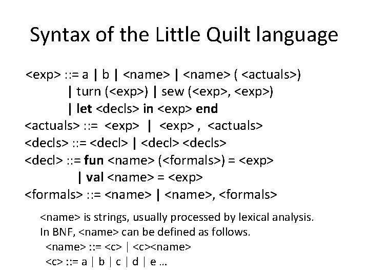

# Gramática Independiente de Contexto (GIC)

* También llamadas Gramáticas Libres de Contexto o Incontextuales
* Generan las palabras de los LIC (tipo de LF)
* Son de gran utilidad en la representación de la sintaxis de los Lenguajes de Programación (expresiones aritméticas, sentencias de un lenguaje de programación, etc.)
* Ejemplo: LIC = {A:=A+B, C:=D-E*F, ...}

  ```plain
  <sent_asig> ::= <var> := <expresion>
  <expresion> ::= <expresion> + <termino> | <expresion> - <termino> | <termino>
  <termino> ::= <termino> * <factor> | <termino> / <factor> | <factor>
  <factor> ::= (<expresion>) | <var> | <num>
  <var> ::= A | ... | Z
  <num> ::= 0 | ... | 9
  ```

* Restricciones:

  |||
  | -- | -- |
  | lado izquierdo | un solo no terminal |
  | lado derecho   | secuencia de terminales y no terminales |
  | axioma         | puede o no derivar a λ |

  ||
  | -- |
  | P = {(S -> λ) \| (A -> v) / A ∈ ΣN, v ∈ Σ+} |

* Ejemplos:

  ||
  | -- |
  | P = {(S -> λ), (S -> 01S1), (S -> 0S10), (S -> A1), (A -> 0S10)} |
  | P = {(A -> 1B1), (A -> 11), (B -> 1), (B -> 0)} |
  | P = {(S -> A), (A -> aAa), (A -> bAb), (A -> c)} |
  | P = {(S -> ABC), (S -> AC), (S -> BC), (S -> C), (A -> 0A1), (A -> 01), (B -> 1B2), (B -> 12), (C -> 3C), (C -> 3)} |

## Ejemplos GIC

1. L = {a^n b^n / n ≥ 1}

    ```plain
    S -> aSb | ab
    ```

1. L = {a^n b^(2n+1) c^r / n ≥ 0, r ≥ 1}

    ```plain
    S -> bC | AC
    A -> abbb | aAbb
    C -> cC | c
    ```

1. L = {0^n 1^m / n > 0 ^ n > m}

    ```plain
    S -> 0 | 0S | 0S1
    ````

1. L = {xyx y^p z y^(2p+1) a^i b^k c^n / p, i, k ≥ 0 ^ n > i+k}

    ```plain
    S -> xyxAB
    A -> yAyy | zy
    B -> aBc | C
    C -> bCc | D
    D -> cD | c
    ```

1. Colchita

    

## Eficiencia en el diseño de gramáticas

* **Gramática limpia**: si no tiene reglas innecesarias y símbolos inaccesibles

  * **Reglas innecesarias**: son las que tienen la forma A -> A (A ∈ ΣN). Se deben eliminar de las gramáticas, ya que no generan derivaciones útiles

    ```plain
    S  -> aA
    A -> aA | A | a
    ```

  * **Símbolos inaccesibles**: aquellos símbolos no terminales A ∈ ΣN  que no pueden ser alcanzados por derivaciones desde el axioma de la gramática

    ```plain
    S  -> D0 | E10 | λ
    B  -> 1C3
    C -> C
    D -> 1S
    E  -> 1E
    ```

* **Gramática bien formada**: si está limpia, no tiene reglas generativas y no tiene reglas de redenominación

  * **Reglas no generativas**: una regla es no generativa cuando A -> λ,  A ≠ S

    ```plain
    S  -> C0B | λ
    B  -> BC | λ
    C -> 0B | λ
    ```

  * Para eliminarlas, se puede seguir el algoritmo:

    ```plain
    P’ = P
    Repetir
      Por cada P = (A -> λ) ∈ P’ ^ (A ≠ S)
        P’ = P’ – {P}
        Por cada P’ = (B -> xAy) ∈ P’ (x, y ∈ Σ*)
          P’ = P’ U {(B -> xy)} – {P’}
    Hasta que todas las reglas sean generativas
    ```

  * **Reglas de redenominación**: una regla es de redenominación cuando A -> B con  A, B ∈ ΣN. Para eliminarlas, se borra esa regla y se genera una nueva producción A -> x por cada B -> x, con x ∈ Σ*

    ```plain
    S  -> C0B | 0B|C0 | 0 | λ
    B  -> BC | C
    C -> 0B | 0
    ```

## Formas Normales

* Son simplificaciones a las reglas de producción de una GIC
* Uso en compiladores más eficientes para diversos lenguajes de programación
* Tipos:

| Siglas en Ingles | Siglas en Español | Nombre |
| -- | -- | -- |
| CNF | FNC | Forma Normal de Chomsky     |
| GNG | FNG | Forma Normal de Greibach    |
| BNF | FNB | Forma Normal de Backus-Naur |

### Forma Normal de Chomsky

* P = {(S -> λ) | (A -> BC) | (A -> a) / A, B, C ∈ ΣN, a ∈ ΣT}

1. Ejemplo de GIC en FNC:

    ```plain
    S -> AB | b
    A -> a
    B -> SA
    ```

1. Ejemplo de GIC en FNC:

    ```plain
    A  -> CD | EB | λ
    B  -> BC |1
    C -> 2
    D -> BC
    E  -> 1
    ```

* Ventajas

  ||
  | -- |
  | Todo árbol de derivación es de tipo binario |
  | Toda palabra de longitud n es derivable en 2n-1 pasos |
  | Estos elementos son de importancia teórica y práctica (por ejemplo, programación de compiladores) |

* Algoritmo GIC -> FNC:
  * Entrada: G = (ΣN, ΣT, S, P)
  * Salida:  G’= (ΣN’, ΣT, S, P’) en FNC

    ```plain
    Mientras existen producciones cuyo lado derecho no respeta la FNC hacer:
      1. Reemplazar cada producción A -> B / B -> v1 | v2 | ... | vn por la producción A -> v1 | v2 | ... | vn 

      A -> B 
      B -> a | b | c

      A -> a | b | c

      2. Para cada producción, si su lado derecho tiene dos o más símbolos y contiene algún terminal v, reemplace las apariciones de v por un nuevo no terminal V. Agregue la regla V -> v. Es decir, para un no terminal V / V ∉ ΣN, ΣN’ = ΣN ∪ {V},  P’ = P ∪ {V -> v}

      A -> pBq

      A  -> PBQ   
      P  -> p
      Q -> q

      3. Para cada producción B -> C1C2...Cn, donde n > 2, reemplazar la producción por B -> C1D, y D -> C2...Cn, que introducen un nuevo no terminal D

      A -> BCDE

      A  -> BC1   
      C1 -> CDE
    ```

* Ejemplo:

  ```plain
  S -> aSa | T
  T -> b 

  Paso 1:
  S -> aSa
  S -> b

  Paso 2:
  S -> ASA
  S -> b
  A -> a

  Paso 3:
  S -> AB
  S -> b
  A -> a
  B -> SA
  ```

### Forma Normal de Greibach

* P = {(S -> λ) | (A -> aX)  / A ∈ ΣN,  X ∈ ΣN*, a ∈ ΣT}
* Ejemplo:

  ```plain
  A  -> 2BC | 1B | λ
  B  -> 1B’ | 1
  B’ -> 2B’ | 2
  C  -> 2
  ```

* Ventaja:

  ||
  | -- |
  | se conoce que cada palabra de longitud n es derivable en n pasos |

* Algoritmo GIC -> FNG
  * Entrada: G = (ΣN, ΣT, S, P)
  * Salida: G’ = (ΣN’, ΣT, S, P’) en FNG
  
    ```plain
    1. Eliminar la recursión a izquierda (por ejemplo: A -> Aa) sustituyendo cada sublenguaje generado recursivamente por un conjunto de reglas equivalente,  pero sin recursión
    2. Agregar nuevas reglas de reescritura y no terminales para llevar las reglas existentes a la forma de Greibach:
      a. Reemplazar A ∈ ΣN en cada α -> β, de a una por vez, para introducir terminales a izquierda
      b. Reemplazar cada a ∈ ΣT que no está en la parte izquierda de β por nuevos A’ ∈ ΣN (esto deja solo no terminales a derecha)
    ```

* Ejemplo 1:

  ```plain
  S  -> AB
  S  -> B
  A -> Aa
  A -> b
  B -> Ab
  B -> c

  Paso 1:
  S -> AB
  S -> B
  A -> b
  A -> bD 
  D -> aD
  D -> a 
  B -> Ab
  B -> c

  Paso 2a:
  S -> bB
  S -> bDB
  S -> bb
  S -> bDb
  S -> c
  D -> aD
  D -> a
  B -> bb
  B -> bDb
  B -> c

  Paso 2b:
  S -> bB
  S -> bDB
  S -> bE
  S -> bDE
  S -> c 
  D -> aD
  D -> a
  B -> bE
  B -> bDE
  B -> c 
  E -> b
  ```

* Ejemplo 2:

  ```plain
  S -> xyxAB
  A -> yAyy | zy
  B -> aBc | C
  C -> bCc | D
  D -> cD | c

  S -> xYXAB
  A -> yAYY | zY
  B -> aBE | bCE | cD | c
  C -> bCE | cD | c
  D -> cD | c
  Y -> y
  X -> x
  E -> c
  ```

### Forma Normal de Backus-Naur

* En 1959, John Backus (Fortran) y Peter Naur (Algol) desarrollaron la notación BNF
* BNF fue desarrollada en paralelo con las GIC de Chomsky
* La notación BNF es equivalente a usar Diagramas de Conway
* Conjunto de reglas que definen, con precisión, la sintaxis de los componentes y de las estructuras de un Lenguaje de Programación
* Cada regla BNF se forma con elementos provenientes de 3 conjuntos disjuntos (convenciones):

  | Elementos || Ejemplos |
  | -- | -- | -- |
  | **Metavariables o noterminales** | palabras encerradas entre corchetes angulares  | \<identificador\>, \<letra\>, \<digito\> |
  | **Terminales**                   | símbolos del alfabeto | if, else, while, =, != |
  | **Metasímbolos**                 | ayudan a representar estas reglas | <>, ::=, \| |

1. BNF para validar la correcta apertura y cierre de una palabra de paréntesis:

    ```plain
    <palabra_par>  ::=  <palabra_par> <parentesis> | <parentesis> 
    <parentesis>  ::=  (<palabra_par>) | ()
    ```

1. BNF de un identificador en ALGOL

    ```plain
    <identificador> ::= <letra> | <identificador> <letra> | <identificador> <dígito>
    <letra> ::= a | b | c | ... | z | A | B | C | ... | Z
    <dígito> ::= 0 | 1 | 2 | ... | 9
    ```

1. BNF de números enteros en ALGOL

    ```plain
    <número entero> ::= <entero sin signo> | + <entero sin signo> | - <entero sin signo>
    <entero sin signo> ::= <dígito> | <entero sin signo> <dígito>
    <dígito> ::= 0 | 1 | 2 | ... | 9
    ```

1. BNF para un pequeño lenguaje

    ```plain
    <program> ::= begin <stmt_list> end
    <stmt_list> ::= <stmt> | <stmt> ; <stmt_list>
    <stmt> ::= <var> = <expression>
    <var> ::= A | B | C
    <expression> ::= <var> + <var> | <var> - <var> | <var>
    ```
