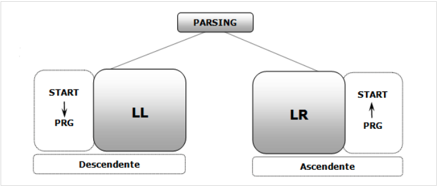

# Parsers (analizadores sintácticos)

* La función principal es comprobar que los tokens que le suministra el Scanner van ordenados según la especificación de la gramática del lenguaje a compilar. Y si no es así, dar los mensajes de error adecuados, pero continuar funcionando sin detenerse, hasta que se llegue al final del archivo de entrada
* Generalmente, los Parsers obtienen un árbol teórico, árbol de análisis sintáctico (AAS) que permite expresar el orden de los lexemas según van apareciendo

## Estrategias de análisis sintáctico

* Hay varios algoritmos de análisis sintáctico (incluso para las gramáticas ambiguas), pero su costo computacional es elevado (del orden de n^3)
* Por lo que se debe modificar la GIC (si es necesario) para que se pueda utilizar un algoritmo de menor costo computacional (de costo lineal, n)
* Si se consigue eliminar la ambigüedad, se pueden utilizar dos estrategias:
  * **Análisis Sintáctico Descendente (ASD)**: produce una derivación por izquierda, que comienza en el no terminal llamado axioma y finaliza con los terminales que forman la construcción analizada
  * **Análisis Sintáctico Ascendente (ASA)**: utiliza una derivación a derecha, pero en orden inverso, esto es: la última producción aplicada en la derivación a derecha, es la primera producción que es “descubierta”, mientras que la primera producción utilizada, la que involucra al axioma, es la última producción en ser “descubierta”. En otras palabras, “reduce el árbol de análisis sintáctico” hasta llegar al axioma

  

### Análisis Sintáctico Descendente (ASD)

* Se parte de la raíz del AAS y se van aplicando **reglas por la izquierda** para obtener una derivación por la izquierda del símbolo inicial
* Para saber la regla a aplicar, se van leyendo tokens de la entrada
* De esta manera se construye el AAS
* Recorriendo el árbol en profundidad, de izquierda a derecha, se tendrá en las hojas los tokens ordenados
* Las gramáticas de tipo LL(k) se pueden analizar en tiempo lineal por el método de análisis descendente
  * k: número de símbolos de entrada que es necesario conocer en cada momento para poder realizar el análisis

* Ejemplo: derivar la cadena aabcdd

```grammar
S -> aST | b
T -> cT | d
```

| Cadena de derivación obtenida | Próxima producción a aplicar |
| -- | -- |
| S | S -> aST |
| aST | S -> aST |
| aaSTT | S -> b |
| aabTT | T -> cT |
| aabcTT | T -> d |
| aabcdT | T -> d |
| aabcdd | accept |

* Tipos de análisis:
  * **Análisis Sintáctico Descendente con retroceso** -> ASD con retroceso
  * **Análisis Sintáctico Descendente Predictivo** -> ASDP LL(1)

### Análisis Sintáctico Ascendente (ASA)

* Se parte de la palabra de entrada y se va construyendo el árbol a partir de las hojas para llegar a la raíz
* Si se recorre el árbol generado, se encontrarán los tokens ordenados
* Las gramáticas de tipo LR(k) se pueden analizar en tiempo lineal por el método de análisis ascendente

* Ejemplo: derivar la cadena aabcdd

```grammar
S -> aST | b
T -> cT | d
```

1. Derivación a derecha:

    | Cadena de derivación obtenida | Próxima producción a aplicar |
    | -- | -- |
    | S | S -> aST |
    | aST | T -> d |
    | aSd | S -> aST |
    | aaSTd | T -> cT |
    | aaScTd | T -> d |
    | aaScdd | S -> b |
    | aabcdd | |

1. Orden Inverso a la derivación por derecha

    | Cadena de derivación obtenida | Próxima producción a aplicar |
    | -- | -- |
    | aabcdd | S -> b |
    | aaScdd | T -> d |
    | aaScTd | T -> cT |
    | aaSTd | S -> aST |
    | aSd | T -> d |
    | aST | S -> aST |
    | S | accept |

* Tipos de análisis:
  * **Análisis Sintáctico Ascendente con retroceso** -> ASA con retroceso
  * **Análisis Sintáctico Ascendente Predictivo** -> ASAP SLR, LR(1), LR(k), LALR
