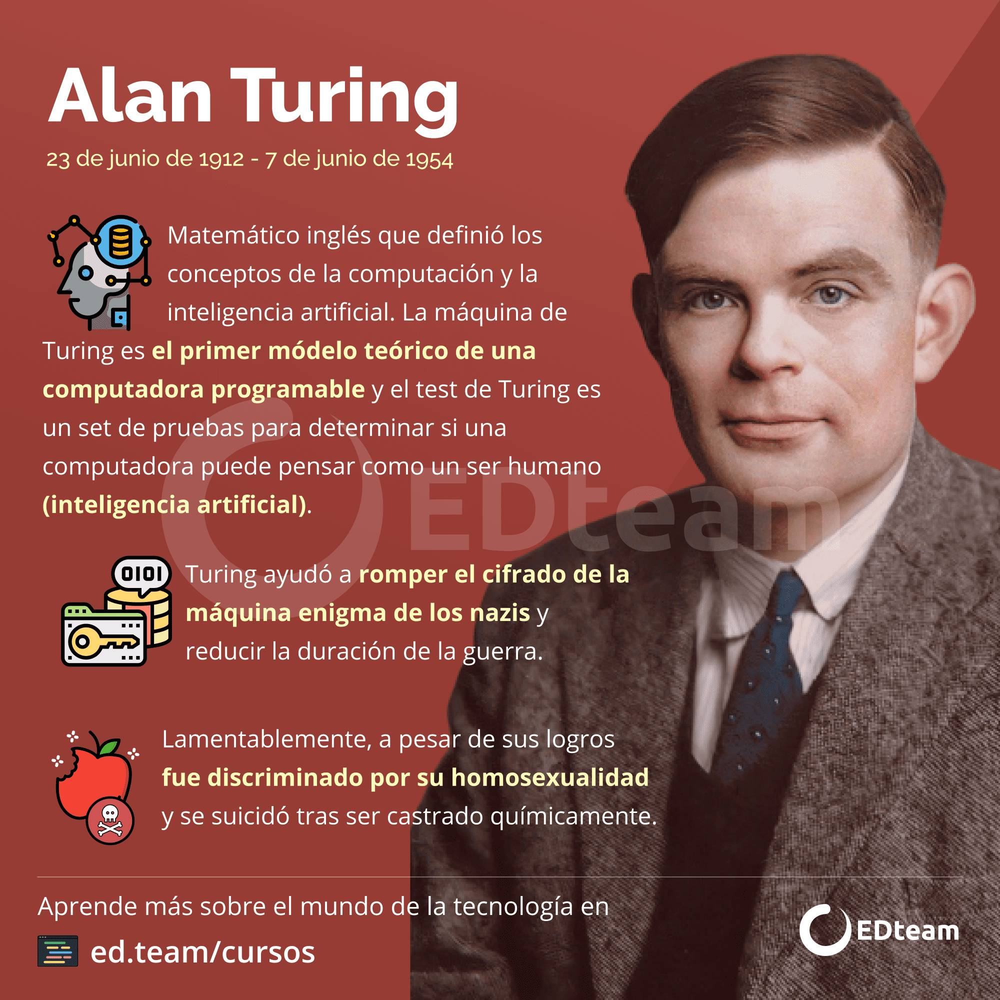
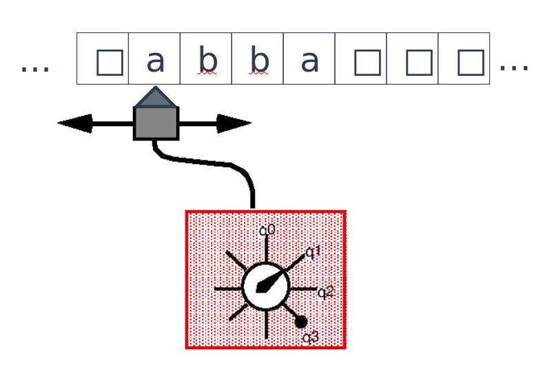
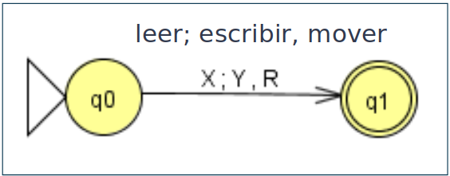
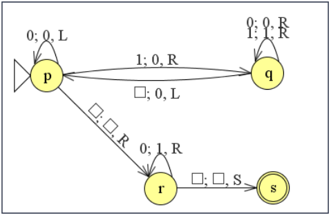
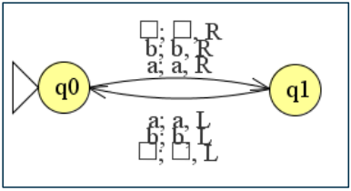
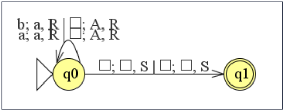
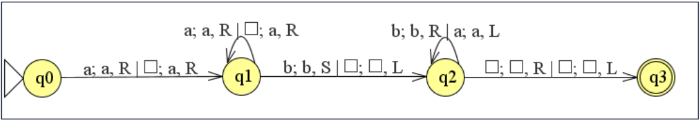
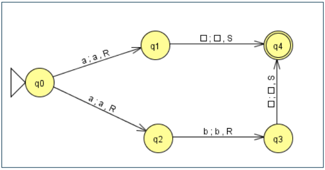

# Máquina de Turing (MT)

## Extendiendo el poder de cómputo

* **Pregunta central en computación: ¿qué máquinas puedo construir? ¿qué límites tendrán?**

| Lenguajes | Máquina | Límite |
| -- | -- | -- |
| Regulares                  | AF  | L = {a^n b^n / n>0} |
| Incontextuales             | AP  | L = {a^n b^n c^n / n>0} |
| Contextuales               | ALA | Autómata Linealmente Acotado, no se estudiará este autómata (pues puede verse como restricción de otro formalismo que es más potente aún...) |
| Recursivamente Enumerables | MT  | Máquina de Turing |

## Alan Mathison Turing

* (Matemático inglés, 23/06/1912 - 07/06/1954)
* Hitos de su carrera científica:
  * Diseño de una **máquina hipotética**, la Máquina de Turing, creando los conceptos teóricos que permitieron la construcción de las primeras computadoras
  * Como **criptógrafo** se destacó por conseguir desvelar los códigos Enigma, con los que los alemanes cifraban sus mensajes durante la Segunda Guerra Mundial
  * Realizó investigaciones pioneras con las que sentó las bases de la **inteligencia artificial** y la **biología matemática**

  

* En 1936 escribió un artículo científico, titulado **"On computable numbers, with an application to the Entscheidungsproblem"**, en el que hizo una de las aportaciones científicas más importantes de su vida: la Máquina de Turing
* Turing bautizó originalmente como máquina-a (máquina automática). En la actualidad se considera la propuesta a nivel teórico de la primera computadora de la historia de la ciencia
* Sin embargo, pese a la genialidad de las ideas que Turing manejaba en 1937, estas no eran suficientes para que se materializaran realmente en la construcción de una computadora
* Lamentablemente, hizo falta un conflicto bélico a gran escala, la Segunda Guerra Mundial, para que matemáticos e ingenieros aunaran esfuerzos para conseguir que se diseñara y construyera la computadora

  

## Arquitectura

* Es una máquina abstracta, sin existencia real, que representa la configuración más sencilla de una computadora
* Turing empezó tratando de modelar a una computadora humana, es decir, a un humano tratando de resolver algorítmicamente un problema utilizando papel y lápiz:

  | Abstracción | Modelo básico ||
  | -- | -- | -- |
  | **papel** | una **cinta** | lineal teóricamente infinita que se divide en celdas. Cada celda de la cinta puede contener un solo **símbolo del alfabeto** de la cinta |
  | **lápiz** | una **cabeza de lectura/escritura** | que lee un sólo símbolo de la cinta por vez controlado un **conjunto finito de estados** que representan los distintos "estados mentales", y borra un símbolo o lo reemplaza por otro |

  

  

## Definición formal

* Formalmente una MT se define como una 7-upla: M = <Г, Σ, b, Q, q0, F, δ>

  |||
  | -- | -- |
  | **Г**  | alfabeto de la cinta, Г = Σ U {b} U símbolos_aux |
  | **Σ**  | alfabeto de entrada, Σ ⊂ Г, Σ ∩ símbolos_aux = Ø |
  | **b**  | símbolo blanco, b ∈ Г, b ∉ Σ |
  | **Q**  | conjunto finito de estados |
  | **q0** | estado inicial, q0 ∈ Q |
  | **F**  | conjunto de estados finales, F ⊆ Q |
  | **δ**  | función de transición de estados, δ: Q x Г -> Q x Г x {L (Left), R (Right), S (Stay)} |

* Ejemplo de transición: δ(q0, X) = (q1, Y, R)

  

## Características

* La cinta es infinita, por lo que a los dos lados de la información que aparezca en la entrada, habrá espacios en blanco representado por b. (otros autores consideran que la cinta tiene una celda de inicio a la izquierda, pero es infinita a derecha)
* Inicialmente contiene un número finito de símbolos de Σ (las n posiciones más a la izquierda de la cinta de entrada contiene la palabra de entrada w, donde |w|= n) precedidos y seguidos de infinitos blancos (símbolo especial b, del alfabeto de la cinta)
* Al igual que el resto de los autómatas, se representa por la tabla de transición en la que en las filas están los estados, en las columnas los símbolos de Г, y en la posición (q, a) aparece δ(q, a)

## Ejemplo: MT que duplica cantidad de unos



* MT = < Г = {0, 1, □}, Σ = {1}, b = □, Q = {p, q, r, s}, q0 = p, F = {s}, δ>

  | δ | 1 | 0 | □ |
  | -- | -- | -- | -- |
  | >p | q0R | p0L | r□R |
  | q | q1R | q0R | p0L |
  | r | - | r1R | s□S |
  | *s | -  | - | - |

  

## Descripción instantánea

* Permite describir la configuración de la MT en cada momento
* Notación: w1qσw2

  ||||
  | -- | -- | -- |
  | **w1** | w1 ∈ Г+ | palabra de la cinta que precede a la celda sobre la que se encuentra la cabeza de entrada/salida |
  | **q**  | q ∈ Q   | estado actual |
  | **σ**  | σ ∈ Г   | símbolo de la cinta sobre el que se encuentra la cabeza de entrada/salida |
  | **w2** | w1 ∈ Г+ | palabra que hay a continuación de la cabeza de entrada/salida |

* Ejemplo: 11q00

## Movimientos

* Se denota el paso de una configuración a otra por medio del símbolo: ├
* Ejemplo: p11 ├ 0q1 ...

## Computación

* Es la secuencia de todos los movimientos que conducen a una configuración de parada
* Ejemplo: p11 ├* 1111s□

### MT que nunca parará

* La MT se moverá por tiempo indefinido con la cabeza de lectura/escritura desplazándose de derecha a izquierda alternativamente. Se dice que la MT se encuentra en un "bucle infinito"
* Computación: aabq0abb ├* ∞

  

### Lenguaje aceptado por una MT: L(M)

* Una MT se puede comportar como un aceptador de un lenguaje, de la misma forma que lo hace un AF o AP
* Una palabra es reconocida por una MT, si dispuesta inicialmente en la cinta de entrada, con la cabeza de lectura en el primer símbolo de la palabra y la MT en el estado inicial, la máquina es capaz de transitar a un estado final y pararse
* Un lenguaje L es Turing-aceptable si ∃ MT que da halt ∀w ∈ L, es decir, la palabra w es aceptada por la MT
* L(M) = {w ∈ Σ\* / w1qσw2 ├* w1pσw2 ^ p ∈ F ^ wi ∈ Γ}

* Es el autómata más general, capaz de reconocer las palabras de los lenguajes generados por las gramáticas menos restrictivas
* Ejemplo: L = {w / |w|a = |w|b = |w|c}

    ```grammar
    S -> SABC | λ
    AB -> BA
    BA -> AB
    AC -> CA
    CA -> AC
    BC -> CB
    CB -> BC
    A -> a
    B -> b
    C -> c
    ```

* Ejemplo: L = {a^nb^nc^n / n ≥ 0}

    ```grammar
    S → aBTc | abc | λ
    T → ABTc |ABc
    BA → BX
    BX → YX
    YX → AX
    AX → AB
    aA → aa
    aB → ab
    bB → bb
    ```

### Aceptación de palabras por MT

* Una palabra w ∈ Σ* es aceptada por una MT T si empezando con la configuración inicial correspondiente a la palabra x, eventualmente se llega al estado de aceptación ha
* No es necesario procesar toda la palabra para aceptarla
* El lenguaje aceptado por T es el conjunto de palabras aceptadas por T

### Rechazo de palabras por MT

* Una palabra w ∈ Σ* es rechazada por una MT T si empezando con la configuración inicial correspondiente a la palabra w, eventualmente se llega al estado de rechazo hr
* No es necesario procesar toda la palabra para rechazarla
* Es costumbre omitir el estado de rechazo y rechazar una palabra cuando no existe una transición, es decir, cuando la máquina se queda "colgada"

### Ejemplo: MT que acepta L = {aw / w ∈ {a, b}*}

* MT = <{a, b, □}, {a, b}, □, {q, a, r}, q, {a}, δ>

  | δ | a | b | □ |
  | -- | -- | -- | -- |
  | >q | aaS | rbS | r□S |
  | *a | - | - | - |
  | r | - | - | - |

### Ejemplo: MT que acepta L = {wa / w ∈ {a, b}*}

* MT = <{a, b, □}, {a, b}, □, {p, q, a, r}, p, {a}, δ>

  | δ | a | b | □ |
  | -- | -- | -- | -- |
  | >p | paR | pbR | q□L |
  | q | aaS | rbS | r□S |
  | *a | - | - | - |
  | r | - | - | - |

### Ejemplo: MT que acepta L = {0^n1 / n ≥ 0}

* MT = <{0, 1, □}, {0, 1}, □, {p, q, r, a}, p, {a}, δ>

  | δ | 1 | 0 | □ |
  | -- | -- | -- | -- |
  | >p | q1R | p0R | r□R |
  | q | r1S | r0S | a□S |
  | r | - | - | - |
  | *a | -  | - | - |

### Ejemplo: MT que acepta L = {0^n1^n / n ≥ 1}

* MT = <{0, 1, x, y, □}, {0, 1}, □, {q0, q1, q2, q3, q4}, q0, {q4}, δ>

  | δ | 1 | 0 | x | y | □ |
  | -- | -- | -- | -- | -- | -- |
  | >q0 | - | (q1,x,R) | - | (q3,y,R) | - |
  | q1 | (q2,y,L) | (q1,0,R) | - | (q1,y,R) | - |
  | q2 | - | (q2,0,L) | (q0,x,R) | (q2,y,L) | - |
  | q3 | -  | - | - | (q3,y,R) | (q4,□,S) |
  | *q4 | -  | - | - | - | - |

## Modificaciones de las MT

* Existen otras definiciones de las MT que son equivalentes a la original
* Algunos de esos modelos alternativos son mucho más complicados aunque todos tienen la misma potencia computacional (o de cálculo)
* Muchas de ellas dotan de mayor flexibilidad al diseño de una MT que resuelva un problema particular
* Variaciones:

  |||
  | -- | -- |
  | **MT multipistas**        | cada celda de la cinta se divide en subceldas |
  | **MT multidimensionales** | permite que la cinta tenga muchas dimensiones, δ: Q x Γ -> Q x Γ x {L, R, U (up), D (down), S} |
  | **MT multicinta**         | |
  | **MTND**                  | |

### MT multicinta

* Tiene varias cintas, cada una de las cuales tiene su propia cabeza de lectura/escritura
* Las cabezas de lectura/escritura se controlan al mismo tiempo independientemente:
  * No tienen que moverse en la misma dirección
  * Ni realizar el mismo número de movimientos
  * Ni incluso, hacer nada a la vez
* La función de transición para una MT con n cintas es de la forma: δ: Q x Γ^n -> Q x Γ^n x {L, R, S}^n Donde una transición de la forma: δ(q, (σ1, σ2, ..., σn)) = (p, (τ1, τ2, ..., τn), (X1, X2, ..., Xn)). Significa que cambia del estado q a p, reemplaza σi por τi en la cinta i y mueve la cabeza de la cinta i en la dirección Xi
* Las MT multicinta simplifican en gran medida alguna de las actividades que se desearía hacer con la MT original

  

### Ejemplo: MT multicinta (bicinta) que acepta L = {a^nb^n / n ≥ 1}

  

* MT = <{a, b, □}, {a, b}, □, {q0, q1, q2, q3}, q0, {q3}, δ>

  | δ | C1 | C2 | C1:new | C1:mov | C2:new | C2:mov | Qdest |
  | -- | -- | -- | -- | -- | -- | -- | -- |
  | q0 | a | □ | a | R | a | R | q1 |
  | q1 | a | □ | a | R | a | R | q1 |
  | q1 | b | □ | b | S | □ | L | q2 |
  | q2 | b | a | b | R | a | L | q2 |
  | q2 | □ | □ | □ | R | □ | L | q3 |

### Ejemplo: MT multicinta (bicinta) que acepta L = {a^nb^nc^n / n ≥ 1}

  

* MT = <{a, b, □}, {a, b}, □, {q0, q1, q2, q3}, q0, {q3}, δ>

  | δ | C1 | C2 | C1:new | C1:mov | C2:new | C2:mov | Qdest |
  | -- | -- | -- | -- | -- | -- | -- | -- |
  | q0 | a | □ | a | R | a | R | q0 |
  | q0 | b | □ | b | S | □ | L | q1 |
  | q1 | b | a | b | R | a | L | q1 |
  | q1 | c | □ | c | S | □ | R | q2 |
  | q2 | c | a | c | R | a | R | q2 |
  | q2 | □ | □ | □ | S | □ | S | q3 |

## MTND

* Se elimina el requerimiento de que la regla de transición sea una función. Para un estado actual y el símbolo actual de la cinta, puede haber un número finito de movimientos a elegir (la MT proporciona alternativas a la ejecución)
* Por tanto, la regla de transición, ∆, de dicha máquina, satisface: ∆(q, σ) ⊆ Q x Г x {L, R, S}
* Por ejemplo, si la MT tiene una transición ∆(q1, a) = {(q1, b, R), (q2, a, L)}, entonces los movimientos posibles son:
  * abbq1ab ├ abbbq1b
  * abbq1ab ├ abq2bab
* Ejemplo:

  

* ∆(q0, a) = {(q1, a, R), (q2, a, R)}
* Puede verse, que dependiendo del camino de análisis escogido, en algunos casos se acepta una palabra de entrada y en otros se rechaza
* En las MTND se considera que una palabra es aceptada si existe al menos una forma de analizarla en la que la máquina la acepte
* Inversamente una palabra será rechazada si queda rechazada por todas las formas posibles de analizarla
* El lenguaje L(N) aceptado por una MTND N es el conjunto de palabras para las que existe al menos un camino que conduce la máquina a pararse en un estado final
* Para toda MTND, existe una MT D equivalente, y viceversa
* Las MTD son un caso particular de las MTND
* Por tanto, no se gana ninguna potencia adicional a causa del no determinismo

## Programa Prolog que implementa una MT

```prolog
turing(Tape0, Tape) :-
     perform(q0, [], Ls, Tape0, Rs),
     reverse(Ls, Ls1),
     append(Ls1, Rs, Tape).

perform(qf, Ls, Ls, Rs, Rs) :- !.
perform(Q0, Ls0, Ls, Rs0, Rs) :-
     symbol(Rs0, Sym, RsRest),
     once(rule(Q0, Sym, Q1, NewSym, Action)),
     action(Action, Ls0, Ls1, [NewSym|RsRest], Rs1),
     perform(Q1, Ls1, Ls, Rs1, Rs).

symbol([], b, []).
symbol([Sym|Rs], Sym, Rs).

action(left, Ls0, Ls, Rs0, Rs) :- left(Ls0, Ls, Rs0, Rs).
action(stay, Ls, Ls, Rs, Rs).
action(right, Ls0, [Sym|Ls0], [Sym|Rs], Rs).

left([], [], Rs0, [b|Rs0]).
left([L|Ls], Ls, Rs, [L|Rs]).

% Se declaran las reglas para el lenguaje {a^n b^n / n > 0 } 
rule(q0, 0, q1, x, right).
rule(q1, 0, q1, 0, right).
rule(q1, y, q1, y, right).
rule(q1, 1, q2, y, left).
rule(q2, 0, q2, 0, left).
rule(q2, y, q2, y, left).
rule(q2, x, q0, x, right).
rule(q0, y, q3, y, right).
rule(q3, y, q3, y, right).
rule(q3, b, qf, b, stay).

% ?- turing([0, 0, 1, 1, 1, 0], Ts).
% false

% ?- turing([0, 0, 1, 1], Ts).
% [x, x, y, y, b]
```
