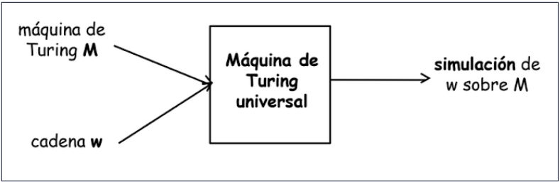

# Teoria de la Computabilidad

* Parte de la computación que analiza y determina los problemas que pueden resolverse por medio de un algoritmo o bien por una MT

## Extendiendo el poder de cómputo

* **Pregunta central en computación: ¿qué máquinas puedo construir? ¿qué límites tendrán?**
* Recordemos que los autómatas siempre computan una función (usualmente estudiamos la de reconocer una cadena)
* En la primera pregunta, habremos encontrado una forma de realizar cualquier cálculo sobre cualquier lenguaje, **sin limitaciones**
* En la segunda pregunta, habremos encontrado una forma de realizar cualquier cálculo sobre ciertos lenguajes, y habremos descubierto que **hay cosas que nunca podremos resolver**
* **¡Responder a estas preguntas es encontrar el límite de la computabilidad!**

## Computabilidad

* Dos científicos abordaron principalmente este problema:
  * **Alan Turing** (23/06/1912 - 07/06/1954)
  * **Alonzo Church** (14/06/1903 - 11/08/1995)

## Una breve Evolución Histórica

* Hacia fines de siglo XIX, el matemático alemán **David Hilbert (1862 - 1943)** postuló la necesidad de bases firmes para las matemáticas. Con este fin, en un congreso realizado en 1900 se plantearon tres problemas:
  * Dada una afirmación cualquiera de la matemática, ¿puede demostrarse siempre si ésta es verdadera o falsa?
  * La matemática ¿es consistente?
  * "Entscheidungsproblem" (en alemán = "problema de la decisión"): ¿existen métodos para responder a la primer pregunta?

* En un nuevo congreso en 1928, el matemático checo **Kurt Gödel (1906 - 1978)** demostró que algunos de los problemas planteados por Hilbert tenían respuesta **negativa**
* Toda teoría formal con suficiente poder expresivo como para reproducir la aritmética tenía teoremas no demostrables, o bien era inconsistente
* Este hecho tuvo consecuencias tremendas sobre las matemáticas...

## Entscheidungsproblem

* Pero el **"problema de la decisión"** seguía pendiente, y atrajo el interés del estudiante Alan Turing (en Cambridge,
R.Unido) y Alonzo Church (EEUU)
* Turing y Church mostraron separadamente que existen problemas **sobre los que nunca podrá establecerse un método para resolverlos**
* Indirectamente, el acercamiento de Turing involucraba cómo debía definirse la noción de **método o procedimiento efectivo**, que llegó a nuestros días como **algoritmo**.
* Esto resultó en un modelo formal, llamado **Máquina de Turing**, que establece qué problemas puede resolver una computadora actual.

* ¿Se puede ordenar una lista con una computadora?
* Problema:
  * [4,2,3,1] -> [1,2,3,4]
  * Entscheidungsproblem / Hilbert y Ackerman. El problema viene de Leibnitz. Construyó una máquina para hacer cálculos numéricos. Luego se preguntó si sería posible trabajar con cálculo simbólico.
  * Dada una proposición en un sistema formal, ¿existe un algoritmo tal que pueda decidir si la proposición es cierta (y por tanto es un teorema del sistema) o por el contrario es falsa?
  * 3 respuestas:
    * Cálculo lambda, Church
    * Funciones recursivas, Kleene
    * Máquinas de Turing, Turing

## Procedimiento efectivo (PE)

* Es un conjunto de reglas, destinadas a resolver un problema, escritas en un determinado lenguaje, que son interpretables y ejecutables.
* La noción de **procedimiento efectivo** es **primitiva** (no está definida por otros conceptos)
  * Máquinas de Turing
  * Funciones recursivas parciales (Kleene, 1936)
  * Gramáticas estructuradas por frases (Chomsky, 1956)
  * Redes de Petri (Petri, 1962)

## Procedimientos vs Algoritmos

* En nuestro enfoque, no distinguiremos entre **procedimiento efectivo** y **algoritmo**
* Si distinguiremos entre algoritmos totales y parciales
  * **Algoritmo total**: siempre otorga una respuesta
  * **Algoritmo parcial**: no necesariamente otorga una respuesta

## Propiedades básicas de algoritmos

* Un pe está formado por una secuencia finita de instrucciones
* Existe un procesador mecánico o agente que puede intepretar las instrucciones, y producir resultados predecibles y repetibles
* El procesador puede almacenar resultados intermedios en una memoria
* No existe un límite finito ni para la entrada y para la salida de datos
* No existe límite a la cantidad de almacenamiento requerido para realizar la computación
* No existe límite a la cantidad de pasos discretos requeridos. Pueden existir computaciones infinitas

## Máquinas de Turing (MT)

* En 1936 Turing (quien tenía entonces 24 años) definió una máquina abstracta, conocida hoy como Máquina de Turing
* Su idea central era abstraer el conjunto de operaciones que realiza una persona cuando realiza un cálculo
* El gran aporte de Turing es establecer que una MT es capaz de ejecutar cualquier pe
* Si existe un algoritmo para realizar cierta tarea, entonces también existe una MT que realice la misma tarea, y viceversa

### MT: idea

  

* La cabeza lecto-escritora puede **leer** y **escribir** símbolos sobre la cinta
* La cabeza lecto-escritora puede realizar movimientos hacia la **izquierda** o hacia la **derecha**

### MT: formalismo

* MT = < Г, Σ, b, Q, q0, F, δ>. Donde:
  * Г: es el alfabeto de símbolos de cinta. Г = Σ U {b} U símbolos_aux
  * Σ ⊂ Г: es el alfabeto de símbolos de entrada. Como la MT puede escribir en la cinta, es diferente el alfabeto de los símbolos que, inicialmente pueden aparecer en la cinta (Σ) del alfabeto de los símbolos que, en algún momento, pueden aparecer en la cinta (Г). Σ ∩ símbolos_aux = Ø
  * b ∈ Г, b ∉ Σ: es un símbolo de la cinta de entrada especial que representa el espacio en blanco
  * Q: es el conjunto finito de estados
  * q0 ∈ Q: es el estado inicial
  * F incluido o igual Q: es el conjunto de los estados finales
  * δ: Q x Г -> Q x Г x {L, R, S}: es la función de transición, donde L (left) es izquierda, R (right) es derecha y S (stay) es parada (o no hay movimiento)
    * Sin embargo, δ puede estar indefinida para algunos argumentos, por ejemplo, no se permiten movimientos a izquierda de la celda de inicio de la cinta
    * Ejemplo: δ(q0, X) = (q1, Y, R) se puede representar gráficamente de la siguiente manera:

  

### MT: convenciones

1. Se asume que la cinta contiene inicialmente blancos (*, b, ...). Por ejemplo, si la cadena es abc, la cinta contiene: \* \* \* a b c \* \* \*
1. Inicialmente la cabeza lectoescritora está ubicada sobre el 1er. caracter de la entrada
1. Los números usualmente se escribirán en formato unario
   * Nro natural n = una cadena de n+1 símbolos "1"
   * \*\*\*1\*\*\*, representa al número natural **0**
   * \*\*\*11\*\*\*, representa al número natural **1**
   * \*\*\*11111\*\*\*, representa al número natural **4**

### Algunos usos de las MT

* Para **reconocer** lenguajes
* Para **computar** funciones

### Ejemplo de MT reconociendo un lenguaje

* **L = {a^2n / n>=0}**. Configuración cinta = \*\*\*aaaa\*\*\*

  * Г = {a, *}
  * Σ = {a}
  * b = *
  * Q = {q0, q1, q2}
  * q0 = q0
  * F = {q2}
  * δ = {δ(q0,a) = (q1,a,R), δ(q1,a) = (q0,a,R), δ(q0,\*) = (q2,\*,S)}

### Ejemplo de MT computando una función

* **f(x,y) = x+y**. Configuración cinta = \*\*\*1111#11\*\*\*

  * Г = {1, *, #}
  * Σ = {1}
  * b = {*}
  * Q = {q0, q1, q2, q3}
  * q0 = q0
  * F = {q3}
  * δ = ???

* Ejecutar: 0+4 y 2+2

### MT simulator

* Existe gran cantidad de **simuladores de MT** (esto es, programas que imitan el comportamiento de una MT) Ejercicio: buscar en Internet algún simulador y probarlo; la notación puede variar ligeramente en cada software
* Un simulador útil: Turing Machine Simulator (disponible como un applet y ejecutable desde un navegador)
* [https://turingmachinesimulator.com/](https://turingmachinesimulator.com/)

### Configuración en MT

* Una configuración de una MT T = < Г, Σ, b, Q, q0, F, δ>  se denota por w1qσw2, donde
  * w1: palabra de la cinta que precede a la celda sobre la que se encuentra la cabeza de entrada/salida
  * q: estado actual
  * σ: es el símbolo de la cinta sobre el que se encuentra la cabeza de entrada/salida
  * w2: palabra que hay a continuación de la cabeza de entrada/salida

* Ejemplo: (\*\*q0aaaa\*\*)

### Movimiento en MT

* Se denota el paso de una configuración a otra por medio del símbolo: ├
* Ejemplo: (\*\*q0aaaa\*\*) ├ (\*\*aq1aaa\*\*)

### Computación

* Es la secuencia de todos los movimientos que conducen a una configuración de parada
* Ejemplo: (\*\*q0aaaa\*\*) ├* (\*\*aaaaq2\*\*)

### En honor a Kurt Gödel y Alan Turing

* **Premio Gödel**: se concede anualmente; son 5000 us$ para el mejor trabajo en teoría de ciencias de la computación
* **Premio Turing**: se lo conoce como el Premio Nobel de la Computación. El sponsor es Intel Corporation, y el premio son 100.000 us$

## MT para computar funciones

* Una función **fT: Σ\* -> Σ\* es computable por una MT**, si existe una  MT T = < Г, Σ, b, Q, q0, F, δ> tal que q0w ├\* fT(w)r□ , donde w, f ∈ Σ\*, r ∈ F
* **En otras palabras:** comenzando en estado inicial q0, con una
representación de w ∈ Σ\* en la cinta, T se detiene con un estado final fT(w) ∈ Σ\* en la cinta
* \*\*\*w\*\*\* => \*\*\*fT(w)\*\*\*
* Se asegura que T **se detiene** para w si w ∈ Σ\*  y w pertenece al dominio de la función. **No se asegura que T se detenga si fT no está definida para w**

## Turing–calculable

* Toda MT describe un algoritmo. ¿Todo algoritmo puede ser realizado por una MT?
* Toda computación puede ser concebida como un proceso susceptible de ser dividido en pasos aislados
* Un paso de computación lleva de una cierta situación inicial o configuración inicial a una nueva situación o configuración
* Sea f una función, se dice que f es Turing-computable si existe una MT sobre un alfabeto Γ con Σ < Γ tal que si se escribe una palabra arbitraria w (sobre Σ) en la cinta de cálculo, entonces MT se detendrá después de un número finito de pasos tras una palabra que represente el valor f(w) de la función
* Las MT también pueden ser utilizadas para calcular resultados u operaciones a partir de la entrada
* En vez de considerar como "basura" el contenido de la cinta al llegar a halt, se podría ver como un resultado calculado
* Una MT M calcula una función f : Σ\* -> Σ\* si para toda entrada w, M calcula un resultado u tal que f(w) = u. Si hay una MT que calcula una función f, se dice que f es Turing-calculable
* Las MT se pueden utilizar para cálculos de funciones, en donde los números de esas funciones se encuentran codificados en unarios (unos).  Ejemplo 5 = 111111
* Si la función tiene más de un valor de entrada, los mismos se encuentran en la cinta de entrada separados por el símbolo distinto de 1, por ejemplo: #
* El resultado de la función también se encuentra codificado en unario
* En el caso de querer representar el valor cero "0", el mismo se muestra a través del símbolo 1

### Ejemplo MT que calcula el complemento a 1 de un número binario

| Q | 0 | 1 | □ |
| -- | -- | -- | -- |
| >q0 | (q0,1,R) | (q0,0,R) | (q1,□,S) |
| *q1 | - | - | - |

### Ejemplo MT que calcula el número consecutivo de un número binario

| Q | 0 | 1 | □ |
| -- | -- | -- | -- |
| >q0 | (q0,0,R) | (q0,1,R) | (q1,□,L) |
| q1 | (q2,1,S) | (q1,0,L) | (q2,1,S) |
| *q2 | - | - | - |

### Ejemplo MT que calcula n % 2

| Q | 1 | □ |
| -- | -- | -- |
| >q0 | (q0,1,R) | (q1,□,L) |
| q1 | (q2,□,L) | (q4,□,S) |
| q2 | (q1,□,L) | (q3,□,R) |
| q3 | - | (q4,1,L) |
| *q4 | - | - |

### Ejemplo MT que suma dos números unarios separados por cero

| Q | 0 | 1 | □ |
| -- | -- | -- | -- |
| >p | (p,1,R) | (p,1,R) | (q,□,L) |
| q | - | (s,□,S) | (s,□,S) |
| *s | - | - | - |

## Lenguaje Turing-Decidible

* Sea Σ un alfabeto, y sean Y, N dos símbolos distinguidos np pertenecientes a Σ
* Un lenguaje L ⊆ Σ\* se dice **Turing-decidible** sssi la función total X: Σ* -> {Y, N} es Turing Computable, donde X(w) =
  * Y si w ∈ L
  * N si w ∉ L
* En tal caso, una MT T constituye un algoritmo de decisión para L, que siempre termina informando si la cadena pertenece o no al lenguaje

## Procedimiento efectivo

* Es un **conjunto de reglas**, destinadas a resolver un problema, escritas en un determinado lenguaje, que son **interpretables** y **ejecutables**
* Esta definición posee un alto grado de abstracción
* Intenta capturar aquellos mecanismos de resolución de algún problema cualquiera...
* **"conjunto de reglas"** puede ser un conjunto de instrucciones en Pascal, o en LDA, o en castellano sin ambigüedades o imprecisiones ...
* **¿Qué relación existirá entre los problemas solubles por PE y aquellos solubles por Máquinas de Turing?**
* Turing propuso una tesis (no teorema) que afirma la equivalencia de los dos conceptos: PE (informal) y MT (formal)

## Tesis de Turing-Church

* Tengamos en cuenta que: Si una función f es **computada por una MT T**, entonces las **quíntuplas que definen δ constituyen en sí un algoritmo**, pues son una lista finita de instrucciones, codificadas en un lenguaje, y que pueden llevarse a cabo de manera mecánica
* Alonzo Church enunció una tesis similar, pero utilizando otro formalismo: las funciones recursivas parciales
* Suele mencionarse este conjunto de tesis como la **Tesis de Turing-Church**

### Tesis de Turing

* Todo proceso que corresponda a un **PE** puede ser realizado por una **MT**, es decir es Turing-computable
* Todo proceso computacional realizado por una MT es en realidad el cálculo de una función recursiva parcial

### Tesis de Church

* Todo proceso que corresponda a un **PE** o las fcs. efectivamente computables constituyen la clase de **Funciones Recursivas Parciales**
* Son f: N -> N. Ejemplo: función constante cero C(x)=0, función sucesor S(x) = x + 1, función proyección Πn,i (x1, ..., xn) = xi
* Toda función recursiva parcial es computable por una MT

### Conclusión

* Church y Turing trabajaron en el mismo problema pero en forma independiente y llegaron a los mismos resultados en cuanto al Entscheidungsproblem y las conclusiones de ellos forman lo que hoy se conoce como la tesis de Turing-Church, que establece que: **"Si una MT no puede resolver un problema, ninguna otra computadora podrá hacerlo puesto que no existe algoritmo para resolver dicho problema"**
* Dado que son equivalentes, para estudiar el poder de cómputo de las computadoras, podemos estudiar las MT, cuyo funcionamiento es más simple

## Máquina de Turing Universal (MTU)

* Alan Turing introdujo una generalización de su máquina, a la que se denominó Máquina de Turing Universal (MTU) o máquina-u
* También llamada Máquina de Propósito General, pues no fue construida para un problema específico
* Se trata de una MT que es capaz de simular cualquier otra MT, y por tanto capaz de procesar distintos programas. Por consiguiente, una computadora, celular, tablet son ejemplos de MTU
* Es una máquina que recibe en la cinta una descripción de otra MT, y el contenido de la cinta de esta MT, y produce, como resultado de su ejecución, el mismo resultado que produciría la MT sobre su cinta
* Recibe el nombre de universal, porque es capaz de simular el comportamiento de cualquier MT
* Se convierte de esta forma, en un dispositivo análogo a una computadora, capaz de realizar cualquier cómputo

  

### Un poco de historia

* En 1945, el físico e ingeniero John Von Neumann redacta el primer borrador de lo que luego sería la EDVAC **Idea: construir una computadora electrónica basada en la Máquina Universal de Turing (MUT), con la noción de "programa almacenado"**
* En 1948, Frederic C. Williams, Tom Kilburn and Geoff Tootill construyen la **Manchester Small-Scale Experimental Machine (SSEM)** en la Univ. de Manchester (Inglaterra), apodada **"Baby Machine"**. Es la primer computadora que tiene un programa almacenado. Podía guardar 32 instrucciones. El 21 de junio de 1948 se ejecuta por primera vez un programa almacenado
* La máquina está reconstruida en el Museum of Science & Engineering de Manchester, y puede verse en funcionamiento todos los martes
* El primer programa almacenado tenía 17 instrucciones
* Escrito por Tom Kilburn (1921 - 2001), fue diseñado para encontrar el factor más grande de 2^18 probando todos los números desde 2^18 – 1 hacia abajo
* Ejecutarlo llevó 3,5 millones de operaciones, y tardó 52 minutos

### En honor a Turing

* Existe la Turing Award (Premio Turing) de la ACM (Association for Computing Machinery)
* Existe el lenguaje de programación Turing, desarrollado en el Imperial College, Reino Unido
* Existió un grupo de rock instrumental llamado "The Turing Machine", fundado en 1998...
* Año 2012 : se cumplen 100 años del nacimiento de A. Turing

### ¿Cómo definir una MTU?

* Sin perder generalidad, se puede reducir el número de MT que una MTU es capaz de simular, a las máquinas binarias con cinta limitada a la derecha (MTBD)
* La cinta de una MTU es infinita en ambos sentidos, y se divide en dos partes, separadas por símbolo identificativo (por ejemplo, $)
* A la derecha de $ se codifica la MTDB
* A la izquierda de $ se codifica su cinta (CMTDB)
* El resultado de la ejecución de la MTU consistirá en dejar la parte derecha de la cinta (la que describe la MTBD) intacta, y, en la izquierda, la misma información que habría dejado en su cinta la MTDB
* Para que la MTU realice su trabajo, simulando a otra MT, se debe codificar la MT y su cinta de entrada en la cinta de entrada de la MTU
* La codificación de la CMTBD transcribe la cinta tal cual, exceptuando la posición que ocupa la cabeza lectora grabadora, en la cual se coloca otro símbolo identificativo de cabeza lectora grabadora (por ejemplo,  *)
* El bit que había en dicha posición, se transcribe justo a la derecha del símbolo $
* Para codificar la MTBD, en primer lugar se codifican los estados en binario. Así, si se tienen 6 estados, se necesitarán 3 bits para su codificación
* La parte derecha de la cinta se divide en tantos registros como entradas tenga la tabla de transiciones de la MTBD
* Cada registro está separado por un símbolo especial (por ejemplo, #) y contiene, en binario, la codificación de cada transición, de la siguiente manera:
  * El estado en que está (estado origen, codificado en binario)
  * El símbolo a leer (0 ó 1)
  * El estado al que va (estado destino, codificado en binario)
  * El símbolo a escribir (0 ó 1)
  * El movimiento a realizar (codificado en binario, por ejemplo 0 derecha "R", 1 izquierda "L")
  * Entre el símbolo $ y el primer registro, denotado por # está el estado en que está la máquina y el símbolo que lee en ese momento la cabeza lectora grabadora

* Ejemplo: Suponer que se tiene la siguiente MT: MTB2 = ({0, 1}, 0, {p, q, r}, p, δ, {})

| Q | 0 | 1 |
| -- | -- | -- |
| p | q0R | p1L |
| q | p1L | r0R |
| r | q1R | p0L |

* Y la cinta CMTB2 contiene la siguiente secuencia binaria, donde la cabeza de lectura escritura estaría en el tercer uno: CMTB2 = ...101101

1. Se calcula el número de bits necesarios para representar los estados. Se necesitan 2 bits para codificar los estados: p -> 00, q -> 01, r -> 10
2. El número de bits para codificar las entradas es 1. En esta caso, la codificación es inmediata: el 0 para representar a la entrada 0 y el 1 para la entrada 1
3. En el caso del movimiento, se codifica con un bit para los dos posibles movimientos (0 para la R y 1 para la L)

* Así, la cinta de la MTU sería: 101*01$001#0000100#0010011#0100011#0111000#1000110#10100001

* Donde, por ejemplo, el contenido del primer registro, 0000100, estará formado por la primera transición: 00 (estado p), 0 (entrada 0), 01(transita al estado q), 0 (escribe un 0), y 0 (se mueve a la derecha)
* Con esta codificación, el funcionamiento de la MTU sería el siguiente:
  1. Localizar en alguno de los registros la cadena que aparece entre los símbolos $ y # (llamarlo registro 0);
  1. Leer y memorizar uno a uno los símbolos que restan del registro encontrado, excepto el último (que se corresponde con el movimiento a realizar);
  1. Para c/u de los símbolos memorizados con anterioridad, colocarlos en la parte correspondiente del registro 0;
  1. El penúltimo bit del registro localizado (que se corresponde con el bit a escribir), se escribe en el lugar que ocupa el *;
  1. Se localiza y memoriza el último bit del registro encontrado anteriormente (que se corresponde con el movimiento), para desplazar la cabeza lectora/grabadora correctamente y colocar el * en el lugar adecuado;
  1. El contenido que había en la posición donde se escribe el * ha de ser memorizado y escrito en la última posición del registro 0, para, de esta forma, recoger lo que lee la cabeza lectora y poder preparar todo el sistema para una nueva lectura

## Limitaciones de computabilidad

* ¿Qué cosas las MT NO pueden hacer?
* Se pueden categorizar a los problemas de acuerdo a la posibilidad de resolverlos en términos de MT

## Problemas y lenguajes

* Un problema se describe con un lenguaje => cuanto más formal el lenguaje, más precisa la formulación del problema.
* Los problemas se clasifican en:
  * Problemas de Decisión
  * Problemas de Salida General
* Los lenguajes formales se clasifican en:
  * Lenguajes Recursivos
  * Lenguajes Recursivos enumerables

## Problemas de Decisión (PD)

* Es aquel formulado por una pregunta (referida a alguna propiedad) que requiere una respuesta de tipo "sí/no"; es decir, cuando el resultado de la computación es sí o no (1 ó 0)

w ----> MT ----> si
           ----> no

### Tipos de Problemas de Decisión

* **Decidibles**:
  * Existe un ALGORITMO TOTAL que para TODA INSTANCIA del problema devuelve la RESPUESTA CORRECTA (responder sí o no a cada caso)
  * Existe una MT que **siempre para** al resolver el problema
  * Ejemplo:
    * Dado un número natural n, decidir si n es par o no
    * Dados dos AF, decidir si son equivalentes
    * Dada una cadena arbitraria w y un LR L, determinar si w pertenece o no a L
    * Dada una GIC G, ¿L(G) es vacío?. Hay un número infinito de casos, uno por cada GIC. Además, para cada caso, se puede determinar una respuesta afirmativa o negativa
* **Parcialmente decidibles**:
  * Existe un ALGORITMO PARCIAL que sólo da RESPUESTA para ALGUNAS INSTANCIAS del problema
  * Existe una MT que resuelve el problema, **pero puede no parar**
* **Indecidibles**:
  * No existe un PROCEDIMIENTO EFECTIVO para determinar si la propiedad es verdadera
  * **No existe una MT para resolver el problema**
  * Ejemplos:
    * Decidir si una cadena pertenece o no pertenece a un LRE
    * Dada una GIC G, ¿G es ambigua?
    * Problema de Correspondencia Post
    * Dada una MT M, ¿M se detendrá comenzando en el estado inicial con w en la cinta? (Problema del Halting)

## Problemas de Salida General (PSG)

* Las posibles respuestas son respuestas "generales"

w ----> MT ----> rta 1
           ----> rta 2
           ----> ...
           ----> rta n

* Ejemplos:
  * Calcular el promedio de una lista de números
  * Dterminar el camino entre dos ciudades

### Tipos de Problemas de Salida General

* **Solubles**: existe un ALGORITMO que para TODA INSTANCIA del problema devuelve la RESPUESTA CORRECTA (responder sí o no a cada caso). Existe una MT que **siempre para** al resolver el problema
* **Insolubles**: existe un PROCEDIMIENTO que sólo da RESPUESTA para ALGUNAS INSTANCIAS del problema. **No existe una MT para resolver el problema**

## Teoría de Clasificación de Problemas

* La Teoría de Clasificación de Problemas se basa en el estudio de los Problemas de Decisión
* Todo problema de salida general con un cierto grado de dificultad, se puede transformar en un problema de decisión del mismo grado de dificultad (Reducción de problemas)
* Ejemplos
  * Determinar un camino entre dos ciudades => Problema salida general
  * ¿Hay un camino entre dos ciudades? => Problema de decisión

## Problema de Correspondencia Post

* Dadas dos listas A y B de cadenas sobre un alfabeto, determinar si existe una concatenación de cadenas A y B de la forma: xi1 xi2 ... xim = wi1 wi2 ... wim donde xij ∈ A y wij ∈ B (si elijo el indice i para x elijo el mismo indice i para w)

* Ejemplo 1:

| Lista A | Lista B |
| -- | -- |
| Xi | Wi |
| 1 | 111 |
| 10111 | 10 |
| 10 | 0|

* x2 x1 x1 x3 = w2 w1 w1 w3
  * x2 x1 x1 x3 = 10111 1 1 10
  * w2 w1 w1 w3 = 10 111 111 0
* Para esta entrada, si tomamos los indices 2, 1, 1, 3 se obtiene una solución del problema

* Ejemplo 2:

| Lista A | Lista B |
| -- | -- |
| Xi | Wi |
| 10 | 101 |
| 011 | 11 |
| 101 | 011 |

* x1 x3 x1 <> w1 w3 w1
  * x1 x3 x1 = 10 101 10
  * w1 w3 w1 = 101 011 101

* x1 x3 x3 x3 <> w1 w3 w3 w3
  * x1 x3 x3 x3 = 10 101 101 101
  * w1 w3 w3 w3 = 101 011 011 011

* Se debe comenzar con la primera cadena de ambas listas
* Después la única elección posible es la tercera cadena, pero siempre queda un "uno de mas" en la cadena armada a partir de la lista B
* Se puede seguir infinitamente buscando si existe solución

* Para algunas instancias de las listas A y B se puede obtener una respuesta
* Para otras instancias de las listas A y B algunas veces no se puede dar respuesta
* Problema de Correspondencia Post es indecidible

## Problema de la parada

* Sea M una MT arbitraria con un alfabeto de entrada Σ. Sea w ∈ Σ*.  ¿Parará M con la palabra w como cadena de entrada?, es decir, ¿se puede determinar si M terminará en un número finito de pasos cuando es ejecutada usando w como palabra de entrada?
* Alan Turing, en su famoso artículo “On Computable Numbers, with an Application to the Entscheidungsproblem” (1936), demostró que el problema de la parada de la MT es indecidible, en el sentido de que ninguna MT lo puede resolver
* Al ejecutar un programa, este puede terminar  después de un número finito de pasos o puede no terminar nunca (queda “trabado” o que entra en un bucle infinito)
* ¿Existe  un programa P, tal que, dado un programa cualquiera Q y unos datos de entrada x, muestre como salida:
  * 1 si Q termina en número finito de pasos o
  * 0 si Q entra en un bucle infinito.

```sh
Algoritmo DetenciónMT
DatoEntrada: MT T, w
DatoSalida: Estado
Comienzo
   ...
   Devolver Estado con valor "se detiene" o "cicla"
Fin
```

* **Turing ha demostrado que este algoritmo NO EXISTE**

* Conocer si existe el programa P es, en términos resumidos, el problema de la parada
* No existe una manera automática computable de saber si todos los programas del mundo terminan
* No se niega que exista la prueba para programas concretos
* De hecho, la construcción de pruebas para programas concretos es un paso obligatorio para demostrar su correctitud

## Lenguajes Formales

* Los Lenguajes formales se clasifican en:

* **Lenguajes Recursivos (LRec)**:
  * Si existe un algoritmo para determinar, para toda palabra w ∈ Σ*, si se verifica que w ∈ L o bien w ∉ L (siempre puede decidir pertenencia)
  * Si es aceptado por una MT T que se detiene en un estado aceptador para toda cadena w ∈ L y en un estado no aceptador para todo w ∉ L
  * Todo Lenguaje Recursivo es también Recursivo Enumerable pero no a la inversa
  * Se pueden asociar algoritmos: LR, LIC, LDC

* **Lenguajes Recursivos Enumerables (LRE)**:
  * Si existe una MT T capaz de enumerar las palabras de L
  * Si existe una MT T que se detiene con cadenas w / w ∈ L y **no necesariamente** se detiene para cadenas w ∉ L
  * Se pueden asociar procedimientos: LRE

| PD | PSG | Lenguajes que los describen | |
| -- | -- | -- | -- |
| Decidibles | Solubles | Recursivos (LR, LIC, LDC) | Algoritmos |
| Indecidibles | Insolubles | Recursivo Enumerables (LRE) | Procedimientos |

* Existen lenguajes que no son recursivos enumerables (LNRE):
  * LRec ⊂ LRE ⊂ LNRE
  * Los LNRE no son adecuados como lenguajes de programación
  * **Razón**: si L es LRE pero no recursivo, entonces existe un algoritmo para enumerar cadenas w1, w2... wk del lenguaje L, pero no para decidir su pertenencia (si wi ∈ L). Luego no puede construirse un compilador para decidir qué cadenas son válidas en L
