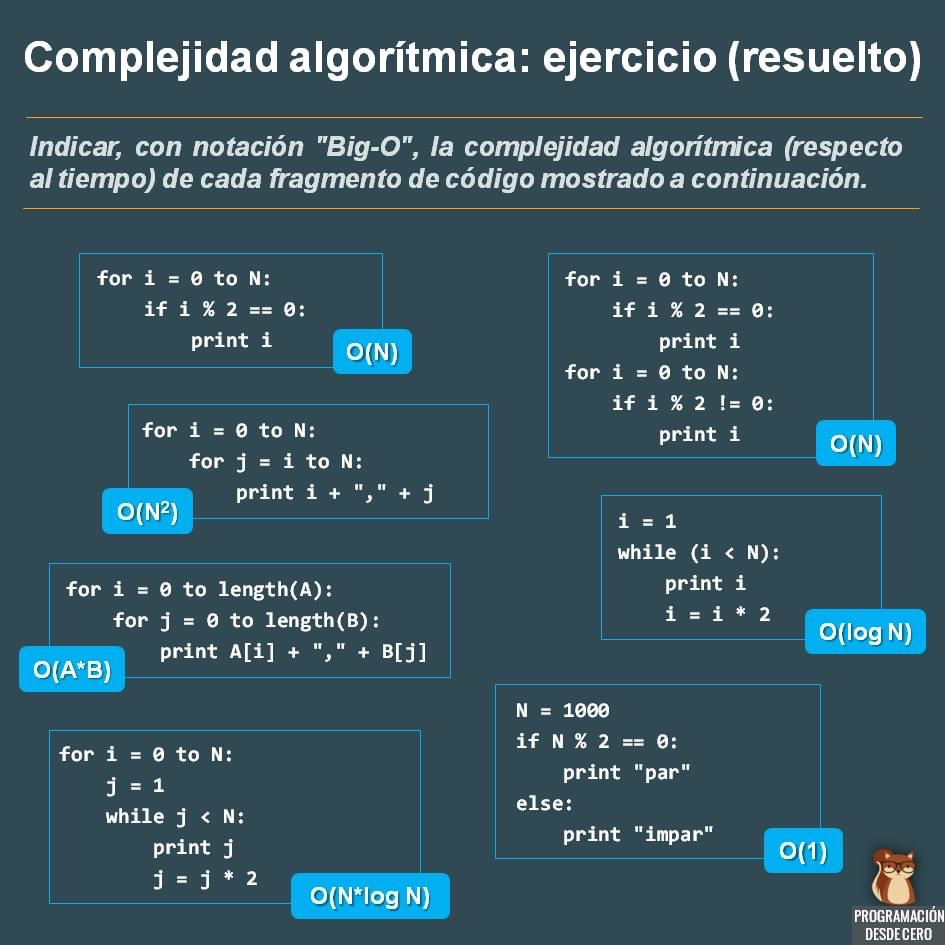
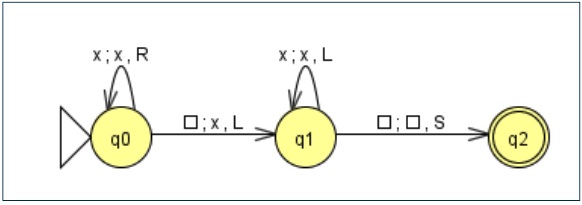

# Teoria de la Complejidad Computacional

## Algoritmia

* Es el estudio del diseño y análisis de algoritmos
* Los problemas centrales de estos estudios son:
  * **Correctitud de los algoritmos**: finalización y obtención del resultado deseado
  * **Eficiencia de los algoritmos**: cantidad de recursos que utiliza (tiempo, espacio)

### Definiciones

* **Problema computacional**: consiste en una caracterización de un conjunto de datos de entrada, junto con una especificación de la salida deseada en base a cada entrada

* **Algoritmo**: es una secuencia bien determinada de acciones elementales que transforma los datos de entrada en datos de salida con el objeto de resolver un problema computacional

* Un problema computacional tiene una o más **instancias**, valores particulares de los datos de entrada, sobre las cuales se puede ejecutar un algoritmo para resolver el problema

* Un problema computacional **abarca** a otro problema si las instancias del segundo pueden ser resueltos como instancias del primero en forma directa
  * Por ejemplo, **multiplicar n por 350** es un problema computacional abarcado por el problema de **multiplicar dos números enteros**

### Factores

* Dos recursos importantes al momento de analizar la complejidad algorítmica: el **tiempo** y el **espacio**
* Problema: medirlos objetivamente:
  * Para analizar el tiempo podría ejecutar el algoritmo sobre una computadora y medir el tiempo de ejecución...
    * **Pero esto es relativo a una computadora en particular**
  * Para analizar el tiempo podría contar el número de operaciones ejecutadas...
    * **Pero esto es relativo a un lenguaje determinado**

* En realidad existen dos formas de analizar la eficiencia:
  * **Empíricamente**: se programa el algoritmo y se corren tests con distintas entradas
  * **Teóricamente**: se determina matemáticamente la cantidad de recursos necesarios como una función de la entrada

* Es claro que para cada algoritmo, la cantidad de recursos (memoria, tiempo) depende fuertemente del tamaño de la entrada
* Se definen entonces funciones de **cantidad** de recursos en base al **tamaño de la entrada** (cantidad de dígitos de un número, cantidad de elementos en un vector, etc.)
* Estas funciones nos determinan una "unidad de medida" de los factores de complejidad algorítmica

## Análisis de algoritmos

* Dado un algoritmo A, el tiempo de ejecución **tA(n)** de A es la cantidad de pasos, operaciones o acciones elementales
que debe realizar el algoritmo al ser ejecutado en una instancia de tamaño **n**
* El espacio **eA(n)** de A es la cantidad de datos elementales que el algoritmo necesita al ser ejecutado en una instancia
de tamaño **n**, sin contar la representación de la entrada
* Estas definiciones son ambiguas en dos sentidos:
  * No se especifica claramente cuáles son las operaciones o datos elementales
  * Dado que existe más de una instancia de tamaño n no está claro cuál de ellas es la que se tienen en cuenta para el análisis

* Para resolver este último punto se definen varios tipos de análisis:
  * **Análisis en el Peor Caso**: se considera el máximo entre las cantidades de recursos insumidas por todas las instancias de tamaño n
  * **Análisis en el Caso Promedio**: se considera el promedio entre las cantidades de recursos insumidas por todas las instancias de tamaño n
  * **Análisis Probabílistico**: se considera la cantidad de recursos de cada instancia de tamaño n, pesada por su probabilidad de ser ejecutada
  * **Análisis en el mejor caso**: se considera el mínimo entre las cantidades de recursos insumidas por todas las instancias de tamaño n

* Por lo general nos concentraremos en analizar el **peor caso**, pues:
  * Establece una cota superior al total de los recursos insumidos por el algoritmo
  * No se necesita conocer la distribución de probabilidades y por lo tanto es más sencillo
  * En muchas situaciones el peor caso es el más probable
* El tiempo de ejecución de un algoritmo se analiza teniendo en cuenta el costo de sus operaciones elementales, los ciclos repetitivos y la recursión

## Operaciones elementales

* Una **operación elemental** es aquella cuyo tiempo de ejecución está acotado por una constante que depende sólo de la implementación usada
* **No depende del tamaño de la entrada**, por lo tanto sólo interesa el número de operaciones elementales
* En general, las sumas, multiplicaciones y asignaciones son operaciones elementales
* Algunas operaciones no pueden considerarse elementales, por ejemplo:

```sh
x := min{T[i] tal que 0<i<n+1}
```

que busca el mínimo elemento en un arreglo de n componentes

* Ejemplo

|  | costo | veces |
| -- | -- | -- |

```pseudo
Proc select(T[1..n])          costo veces
  for i:=1 to n-1 do            C0   n-1
    minj := i                   C1   n-1
    minx := t[i]                C2   n-1
    for j:=i+1 to n do          C3   n-(i+1)
      if T[j] < min             C4   n-(i+1)
      then minj :=m j           C5   n-(i+1)
           minx := T[j]
    T[minj] := T[i]             C6   n-1
    T[i] := minx                C7   n-1
```

## Tratabilidad de los problemas

### Objetivos

* El estudio de la eficiencia de los algoritmos no puede ser atacado con el argumento ***"las computadoras del futuro serán miles de veces más rápidas y, por lo tanto, no importará que el algoritmo sea eficiente"***
* Ese argumento es **falaz** ya que, sin una mejora algorítmica, el problema del viajante para cien ciudades toma cien millones de años; la factorización de un número de 300 dígitos toma un millón de años
* Por lo tanto, se necesitan mejoras en los algoritmos pero no pequeñas sino en los órdenes de magnitud
* Por caso, la **búsqueda secuencial** toma un tiempo en **O(n)** mientras que la **búsqueda binaria** lo hace en **O(log n)**. Para **n = 10^9**, la diferencia está en esperar **un año** o **un minuto** respectivamente para cada algoritmo
* Dado un algoritmo que resuelve un problema, es razonable preguntarse si no existirá un algoritmo más eficiente
* El objetivo fundamental de la complejidad computacional es clasificar los problemas de acuerdo a su **tratabilidad**, tomando el o los algoritmos más eficientes para resolverlos
* Se debería poder determinar:
  * **¿Cuán tratable es el problema?**
  * Si el problema es tratable: **¿el algoritmo es eficiente?**

### Problemas Abiertos y Cerrados

* Si se demuestra que el problema no admite soluciones mejores, entonces se puede afirmar que el algoritmo es eficiente (salvo las constantes ocultas)
* Un problema se dice **cerrado** si se han encontrado algoritmos que lo resuelven y se ha demostrado que estos algoritmos son óptimos en cuanto al orden exacto del tiempo de ejecución
* Por ejemplo, la **búsqueda en un arreglo ordenado** y el **ordenamiento de un arreglo** son problemas cerrados

### Grados de Tratabilidad

* Para cerrar un problema se puede hacer:
  * Encontrar un algoritmo asintóticamente mejor que los que se conocen
  * Demostrar una cota asintóticamente superior de las que se conocen
* En general, los distintos grados de tratabilidad son muy subjetivos (varían mucho de acuerdo al modelo computacional, los recursos disponibles, las variantes de las estructuras de datos, etc.)
* Por lo tanto, un objetivo primario del estudio de la complejidad es definir cuáles problemas son tratables y cuáles no, para luego considerar distintos grados de tratabilidad o intratabilidad
* Muchos problemas computacionales son **tratables**: tienen solución para instancias grandes
* Algunos problemas son **intratables**: el Problema de las Torres de Hanoi, el Problema del Viajante; los mismos pueden resolverse solamente para instancias pequeñas
* En general, aquellos problemas con **complejidad polinomial** son **tratables**, mientras que los problemas con **complejidad super polinomial** (más allá de polinomial) son **intratables**

### Tratabilidad vs Intratabilidad

* La evidencia empírica (una especie de **Tesis de Turing-Church** para la complejidad) permite acordar que un problema que admite solución polinomial es **tratable** y en caso contrario es **intratable**
* El límite de tratabilidad entre algoritmos polinomiales y superpolinomiales es arbitrario pero mayormente aceptado
* Por ejemplo, **1.00001^n** o **n^(log2 n)** serían intratables mientras que **n^10000** o **100000000n** serían tratables
* El punto es que estas funciones "extremas" raramente aparecen en casos reales como tiempo de ejecución de algoritmos.
* Los algoritmos con tiempo en **O(n^k)** son considerados de tiempo razonable a pesar del **k** y de las posibles variables ocultas
* En cuanto al espacio se debe ser más cuidadoso ya que muchas veces un **espacio polinomial se torna intratable**
* Además, dentro de la tratabilidad e intratabilidad, es posible distinguir varios niveles
* Actualmente, se está estudiando extender el concepto de tratabilidad a **algoritmos probabilísticos** y a **algoritmos paralelos**

| Tiempo | Ejemplo | Tratable/Intratable |
| -- | -- | -- |
| O(1) constante | Agregar un item al principio de una lista | Tratable |
| O(log n) log | Búsqueda en un arreglo ordenado | Tratable |
| O(n) lineal | Búsqueda en un arreglo desordenado | Tratable |
| O(n log n) | Ordenar n items usando mergesort | Tratable |
| O(n^2) cuadrático | Camino más corto entre dos nodos de un grafo | Tratable |
| **O(2^n) exp**| **Resolver Torres de Hanoi** | **Intratable** |



## Complejidad computacional respecto a los autómatas y lenguajes

* Las distintas definiciones de una MT no incrementan la potencia computacional del modelo básico
* Una MT de un tipo puede simular una MT de otro tipo
* Cuando se simulan las acciones de una MT de un tipo más complejo mediante una que corresponde al modelo básico, es habitual que se consuma la mayoría del espacio y del tiempo
* El modelo de MT que se use no afecta a la potencia computacional o a la capacidad para decidir un problema
* Sin embargo, los requerimientos de espacio y tiempo para una computación se ven claramente afectados por el modelo elegido
* La complejidad de una computación se mide por la cantidad de espacio y tiempo que consume
* Las computaciones eficientes tienen unas exigencias de recursos pequeñas
* Es común estudiar la complejidad en el contexto de un sistema computacional fijo, por ejemplo, la MT:



### Complejidad Espacial

* Sea M una MT con k cintas. Suponer que, sobre cualquier entrada de longitud n, la cabeza de lectura/escritura de M consulta al menos S(n) celdas de cualquiera de las cintas, donde S: N -> N es una función
* Entonces se dice que M tiene una complejidad espacial S(n) o que es una MT espacialmente acotada por S(n)
* También se dice que L(M) es un lenguaje con complejidad espacial S(n)
* Es el número de celdas de la cinta que dicho cálculo requiere

| Configuración Inicial | Complejidad Espacial |
| -- | -- |
| ...□**x**xx□□□... | 5 (la cabeza se moverá hasta la cuarta celda de la cinta antes de regresar a la primera y detenerse) |
| ...**□**□□□...| 2 (la máquina ejecutará un cálculo con complejidad espacial dos ya que sólo se utilizarán dos celdas de la cinta) |

### Complejidad Temporal

* La complejidad temporal de las computaciones de MT, depende del tamaño de la cadena de entrada
* El tiempo se mide por el número de movimientos que hace la MT
* Sea M una MT de k cintas. Se supone que M realiza como máximo T(n) movimientos sobre toda cadena de longitud n y para una función T: N -> N
* Entonces se dice que M tiene complejidad temporal T(n) o que es un MT con cota temporal T(n)
* Además se dice que L(M) es un lenguaje temporalmente acotado por T(n) o con complejidad temporal T(n)
* Es el número de pasos que se ejecutan durante los cálculos

| Configuración Inicial | Complejidad Temporal |
| -- | -- |
| ...□**x**xx□□□... | 7 (3 pasos para mover la cabeza al primer espacio en blanco después de la x, 1 paso para escribir una x en este lugar y  3 pasos más para colocar la cabeza en el primer blanco). No se considera Stay |
| ...**□**□□□...| 1. No se considera Stay |

### Complejidad de los cálculos de Máquinas de Turing

* Se observa que las complejidades espacial y temporal son diferentes y, por lo tanto, es posible que difieran para el mismo cálculo
* Sin embargo, no son independientes: "Si la complejidad temporal de una MT es n, entonces la complejidad espacial del cálculo no será mayor que n + 1"

### Ejemplo de complejidad computacional

* Comparar 2 palabras de igual longitud en {x, y, z}\* escritas en la cinta separadas por un asterisco  #yxxz*yxzx###...
* La máquina deberá detenerse con la configuración en cinta:
  * #Y###... Si las palabras son iguales
  * #N###... Si las palabras son diferentes
* El tiempo requerido para que esta máquina complete su tarea depende de la longitud de la palabra de entrada
* El tiempo requerido para ejecutar un algoritmo tiende a ser una función de la longitud de entrada. En este caso, la siguiente fórmula indica el tiempo necesario (medido en pasos ejecutados) para confirmar que 2 palabras de longitud n son idénticas: **2n^2 + 10n + 9**
  * 2n^2 + 5n + 1 pasos para completar el proceso de comparación
  * 5n + 4 pasos para mover la cabeza hacia el extremo derecho de la entrada y borrar la cinta de derecha a izquierda
  * 3 pasos para escribir el símbolo Y en la cinta
  * 1 paso para trasladarse al estado de parada
* Complejidad temporal para comparar 2 palabras idénticas: **2n^2 + 10n + 9**

| Longitud w | Pasos |
| -- | -- |
| 4 | 81 |
| 10 | 309 |

* Al evaluar la complejidad de un algoritmo, se manejan dos variaciones en el rendimiento de un algoritmo identificando las situaciones en el:
  * **Peor caso**: se da en el cálculo más largo, se evalúa toda la cadena (las cadenas son idénticas) -> **2n^2 + 10n + 9**
  * **Mejor caso**: se da en el cálculo más corto, cuando las cadenas difieren en la primera posición -> **6n + 10**
* Se define la Complejidad Temporal de un algoritmo como su rendimiento en el peor caso

## Complejidad de los problemas

* Existe una teoría matemática formal, como refinamiento de la Tesis de Turing, que intenta determinar **cuándo un algoritmo es tratable desde el punto de vista práctico**
* Se clasifican los problemas de decisión de acuerdo al tiempo que tardaría una MT en resolver el problema (expresado como un lenguaje)
* Sin duda son de interés aquellos dispositivos computacionales que se ejecutan un **número de pasos acotados por un polinomio basado en la longitud de la entrada (complejidad polinomial)**
* No importa que tipo de MT seleccionemos (con n cintas, de aceso directo, etc), siempre y cuando dejemos de lado el no-determinismo

## Clases de Problemas

* Entre los problemas decidibles, el hecho de saber si una MT se parará en un tiempo finito no resulta práctico, si dicho tiempo es excesivo
* Por eso es interesante estudiar las necesidades de ejecución de un algoritmo.
* Para ello, se suelen distinguir  dos clases de problemas: P y NP

### Clase P

* Prácticamente todos los algoritmos que se ejecutan en una computadora tienen una complejidad polinomial, es decir; la relación entre el tamaño del problema (número de datos o valor de n) y el tiempo de ejecución se puede encontrar por medio de una expresión polinomial
* Son algoritmos que tienen una complejidad de O(n), O(log n)
* Ejemplos: algoritmos de búsqueda, ordenamiento, etc.
* La clase P se compone de todos los lenguajes que acepta una MTD que tiene una cota temporal polinómica
* Un lenguaje se dice polinomialmente decidible, si es Turing-decidible con una MT acotada polinomialmente
* P es la clase de lenguajes polinomialmente decidibles
* Informalmente, P es la clase de problemas que se resuelven en un tiempo polinomial por una MTD
* Aparentemente, el Problema del Viajante no se encuentra en esta categoría, ya que el tiempo para hallar la solución crece exponencialmente con la cantidad de ciudades del mapa
* A pesar de los constantes esfuerzos de encontrar una MTD que resuelva el Problema del Viajante (entre otros) en tiempo polinomial, ninguna se ha encontrado
* Sin embargo, este problema, y otros similares, se pueden resolver en tiempo polinomial, pero con MTND

### Clase NP

* Son aquellos algoritmos en donde el número de pasos que se deben realizar para llegar al resultado tienen un crecimiento exponencial en relación a la cantidad de datos o valor de n
* Esto ocurre en los algoritmos para encontrar combinaciones
* Ejemplo: factorial de n, obtener los movimientos que se realizan para acomodar n discos con el algoritmo de las torres de Hanoi
* Se dice que no es conveniente ejecutar algoritmos con complejidad NP con valores medianamente grandes de n, ya que la computadora no puede con ellos, no solamente por el factor tiempo sino también por el espacio
* La clase NP se compone de todos los lenguajes que aceptan MTND que tengan una cota temporal polinómica
* Se define entonces otra clase de problemas
* NP es la clase de lenguajes decidibles con MTND  polinomialmente acotada
* Informalmente, NP es la clase de problemas que pueden ser resueltos por una MTND en tiempo polinomial
* Ejemplos:
  * Dados 2 AFN con el mismo alfabeto, responder "S" si y sólo si aceptan lenguajes distintos
  * Dada un GIC y un entero positivo k, responder "S" si y sólo si la GIC no es LR(k)
  * Dada una colección finita k de enteros positivos y otro entero positivo n, responder "S" si y sólo si existe un subconjunto de k cuya suma sea n
  * Dado un grafo, responder "S" si y sólo si dicho grafo contiene una ruta que visita precisamente una vez cada uno de los vértices y termina en el mismo vértice donde se inició (esta ruta se conoce como circuito de Hamilton)

### P vs. NP

* Claramente, **P ⊆ NP**
* Es decir, un problema que pertenezca a la clase **P**, también pertenece a la clase **NP**, pues las MTD pueden considerarse MTND donde existe una sola opción en cada paso posible
* Aún no se sabe si **NP ⊆ P**
* Esto es, un problema perteneciente a la clase NP ¿puede pertenecer a la clase P?
* Y por lo tanto, **no se pudo demostrar si P = NP**
* Es uno de los problemas abiertos más importantes de las ciencias de la computación actualmente
* El **Clay Mathematics Institute** (USA) ha ofrecido un premio de un millón de dólares para la persona que presente la primer demostración de este resultado

### NP-completos

* Un problema L que pertenece a NP es NP-completo si todos los demás problemas de NP se pueden reducir a él en tiempo polinómico en una MTD
* Esta  clase de problemas es importante, pues bastaría encontrar una solución en tiempo polinómico en una MTD para un solo problema L que sea NP-completo, para demostrar que P = NP
* En efecto: como cualquier problema NP se puede reducir a L en tiempo polinómico y L se puede resolver en tiempo polinómico, todo problema en NP tiene que tener una solución determinista en tiempo polinómico
* Teorema de Cook. SAT es NP-completo
* Dada una expresión de la lógica proposicional, el problema SAT tiene por objeto descubrir si es posible satisfacerla. Por ejemplo: p ^ (q v ¬p)
* La expresión completa será verdadera si y sólo si las dos cláusulas son verdaderas. Se puede afirmar que ésta es satisfactible
* Este problema es resoluble. Pertenece a NP y es NP-completo
