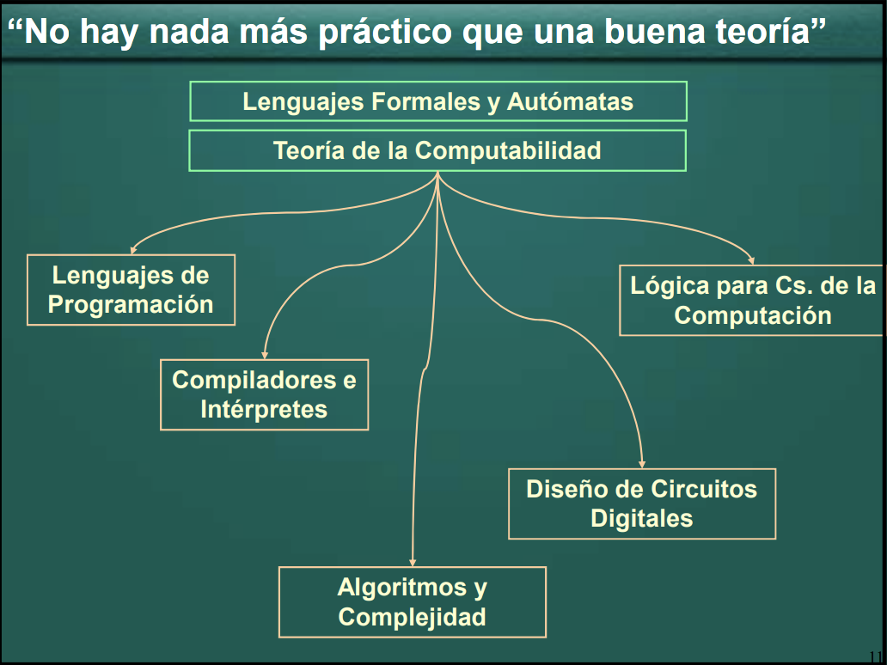
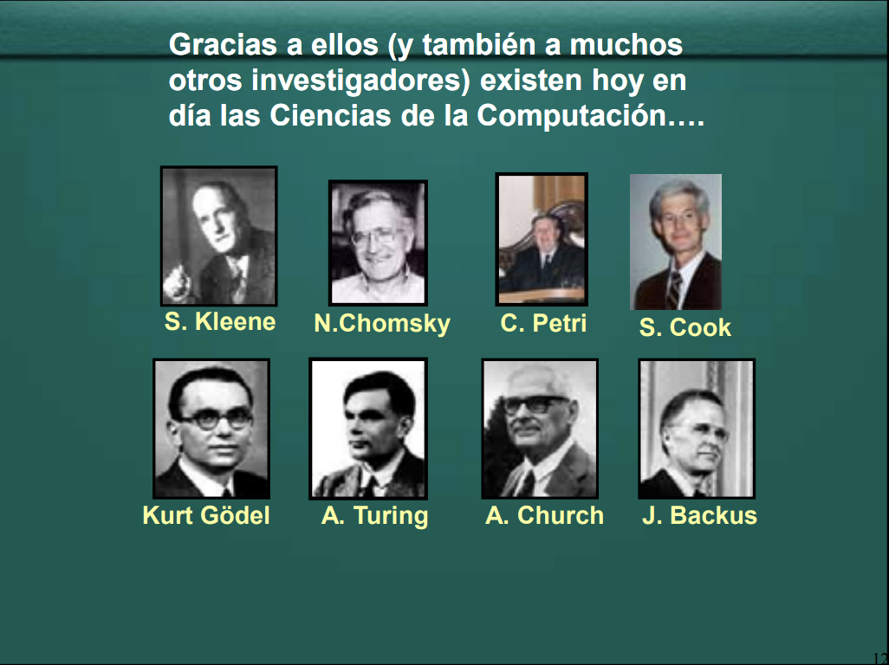

# Conclusiones

## Computación

* Las ciencias son un conjunto sistematizado de conocimientos que constituyen una rama del saber humano (geografía, biología, física, etc)
* En sus bases, **cada ciencia posee un conjunto de inquietudes fundamentales**, como cuál es el origen de la vida orgánica, o como está conformado el universo
* Los científicos de cada área intentan solucionar diversos problemas que nos brindan paulatinamente el conocimiento que estas inquietudes motivan descubrir

* La Ciencia de la Computación no es la excepción y posee su propio conjunto de motivaciones fundamentales. Entre ellas,

1. **¿Qué es un algoritmo?**
1. **¿Qué puede ser computado y qué no?**
1. **¿Cómo realizar cómputos eficientemente?**

* Por más de sesenta años, varios científicos han tratado de responder a estas preguntas, y produjeron ingeniosas respuestas que impactaron en las Ciencias de la Computación
* En esta materia hemos visto varios formalismos que surgieron como respuesta a estas preguntas

  

  
