# Otros autómatas

* Autómatas probabilísticos o estocásticos
* Autómatas de células de McCulloch-Pitts
* Máquinas secuenciales (Mealy y Moore)
* Máquinas concurrentes (Redes de Petri)

## Autómatas probabilísticos o estocásticos

* En su funcionamiento interviene el concepto de probabilidad, asociada a que se produzca una determinada transición.

## Autómatas de células de McCulloch-Pitts

* Modelo de funcionamiento de las neuronas cerebrales, tienen capacidades de reconocimiento similar a los AF. Primer paso para RNA.

## Máquinas secuenciales

* Representan un tipo de autómata que es capaz de, dada una palabra de entrada, generar otra palabra de salida.
* Para ello, se definen un conjunto de estados, que "memorizan" la parte de la palabra de entrada leída en cada momento y generan, al mismo tiempo que transitan entre los estados, una salida.
* Se pueden ver como un autómata que tienen dos cintas asociadas: una por la que va leyendo las palabras de entrada, y otra de salida, en la que va generando la salida.

### Máquina finita de Mealy (ME)

* Es un tipo de máquina de estados finitos.
* Dada una palabra de entrada genera otra de salida, **los símbolos de salida dependen del estado y del símbolo de entrada**.
* El nombre **"Máquina de Mealy"** viene del promotor del concepto: **George H. Mealy**, un pionero de las máquina de estados, quien escribió Un Método para sintetizar Circuitos Secuenciales, Bell System Tech. J. vol 34, pp. 1045-1079, Setiembre **1955**.

* Es una quíntupla definida como: ME = <ΣE, ΣS, Q, f, g> donde:
  * ΣE: es el alfabeto de símbolos de entrada.
  * ΣS es el alfabeto de símbolos de salida.
  * Q es el conjunto finito no vacío de estados.
  * f es la función de transición, definida como f: Q x ΣE -> Q
  * g es la función de salida, definida como g: Q x ΣE -> ΣS

#### Ejemplo ME: genera "p" (par) si la cantidad de 1s es par, caso contrario "i" (impar)

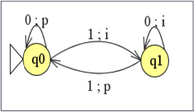

* ME = <{0, 1}, {p, i}, {q0, q1}, f, g>
  * f = {f(q0, 0) = q0, f(q0, 1) = q1,  f(q1, 0) = q1, f(q1, 1) = q0}
  * g = {g(q0, 0) = p, g(q0, 1) = i, g(q1, 0) = i, g(q1, 1) = p}

| Q | 0 | 1 |
| -- | -- | -- |
| q0 | q0/p | q1/i |
| q1 | q1/i | q0/p |

#### Ejemplo ME: calcula el resto 3 de un número unario

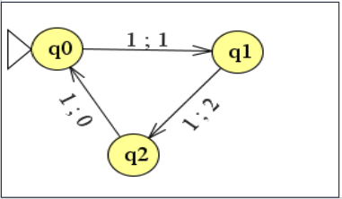

* ME = <{1}, {0, 1, 2}, {q0, q1, q2}, f, g>
  * f = {f(q0, 1) = q1, f(q1, 1) = q2,  f(q2, 1) = q0}
  * g = {g(q0, 1) = 1, g(q1, 1) = 2, g(q2, 1) = 0}

| Q | 1 |
| -- | -- |
| q0 | q1/1 |
| q1 | q2/2 |
| q2 | q0/0 |

### Ejemplo ME: (a|b)*(aa|bb)

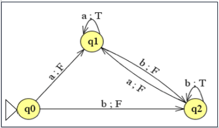

* ME = <{a, b}, {T, F}, {q0, q1, q2}, f, g>
  * f = {f(q0, a) = q1, f(q0, b) = q2, f(q1, a) = q1, f(q1, b) = q2, f(q2, a) = q1, f(q2, b) = q2}
  * g = {g(q0, a) = F, g(q0, b) = F, g(q1, a) = T,  g(q1, b) = F, g(q2, a) = F, g(q2, b) = T}

| Q | a | b |
| -- | -- | -- |
| q0 | q1/F | q2/F |
| q1 | q1/T | q2/F |
| q2 | q1/F | q2/T |

### Máquina finita de Moore (MO)

* Es un autómata de estados finitos.
* Dada una palabra de entrada genera otra de salida, **los símbolos de salida dependen sólo del estado**.
* El nombre **"Máquina de Moore"** viene de su promotor: **Edward F. Moore**, un pionero de las máquinas de estados, quien escribió Gedanken-experiments on Sequential Machines, pp 129 – 153, Estudios de Autómatas, Anuales de los Estudios Matemáticos, no. 34, Princeton University Press, Princeton, N. J., **1956**.

* Es una definición alternativa de máquina secuencial en la que la función g sólo depende del estado en el que se esté. La definición será: MO = <ΣE, ΣS, Q, f, g>
* Donde la única diferencia con respecto a la definición de Mealy es que la función de salida g se define como: g: Q -> ΣS

#### Ejemplo MO: genera "p" (par) si la cantidad de 1s es par, caso contrario "i" (impar)

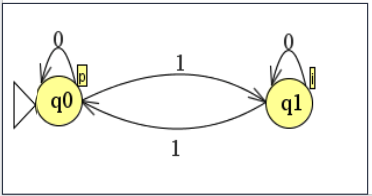

* MO = <{0, 1}, {p, i}, {q0, q1}, f, g>
  * f = {f(q0, 0) = q0, f(q0, 1) = q1, f(q1, 0) = q1, f(q1, 1) = q0}
  * g = {g(q0) = p, g(q1) = i}

| Q | 0 | 1 |
| -- | -- | -- |
| q0/p | q0 | q1 |
| q1/i | q1 | q0 |

* En el caso de las Máquinas de Moore, generan en la salida el correspondiente símbolo del estado en el que estén después de realizar cada transición. Siempre que esté en el estado q0 genera una p en la salida, y siempre que esté en el estado q1 genera una i en la salida.

#### Ejemplo MO: calcula el resto 3 de un número binario

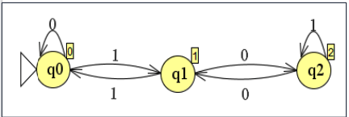

* MO = <{0, 1}, {0, 1, 2}, {q0, q1, q2}, f, g>
  * f = {f(q0, 0) = q0, f(q0, 1) = q1, f(q1, 0) = q2, f(q1, 1) = q0, f(q2, 0) = q1, f(q2, 1) = q2}
  * g = {g(q0) = 0, g(q1) = 1, g(q2) = 2}

| Q | 0 | 1 |
| -- | -- | -- |
| q0/0 | q0 | q1 |
| q1/1 | q2 | q0 |
| q2/2 | q1 | q2 |

## Máquinas concurrentes: Redes de Petri (PN)

* Es un modelo gráfico, matemático, formal y abstracto para describir y analizar el flujo de información.
* Se caracteriza por la **concurrencia, sincronización, exclusión mutua y conflictos**.
* Inventadas en agosto de 1939 por el alemán **Carl Petri**, a la edad de 13 años, con el propósito de describir procesos químicos. Aunque en el mundo científico se publicó en su tesis doctoral en **1962**.
* En su tesis doctoral "kommunikation mit automaten" (Comunicación con autómatas), establece los fundamentos para el desarrollo teórico de los conceptos básicos de las PN.
* Pueden considerarse como autómatas formales o como generadores de LF y tienen asociación con la teoría de grafos.
* Son inherentemente no deterministas.
* Excelentes para representar procesos concurrentes, así como, procesos donde pueden existir restricciones sobre la concurrencia, precedencia, o frecuencia de esas ocurrencias.
* Aplicaciones:
  * Modelado de sistemas dinámicos.
  * Sistemas flexibles de manufactura.
  * Robótica.
  * Cómputo paralelo.
  * Autómatas.

* Una Red de Petri se define como una 5-upla  \<P, T, F, W, M0\>,  donde:
  * P = {p1, p2, ... , pm} es un conjunto finito no vacío de lugares (estados, situaciones, condiciones)
  * T = {t1, t2, ... , tn} es un conjunto finito no vacío de transiciones. P ∩ T = {}
  * F = es un conjunto de arcos dirigidos.
  * W: F -> {1, 2, 3, ... } es una función de pesos.
  * Mi = es el marcado inicial de la red. Define un número inicial de marcas por lugar (representan la evolución de la ejecución de una PN)

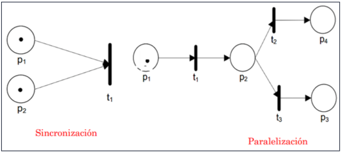

### Ejemplo PN: aritmética

```pascal
A := 1;
B := 2;
C := 3;
A := A + 1;
C := B + C;
B := A + C;
```

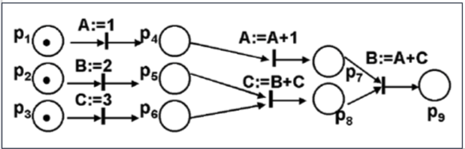

### Ejemplo PN: L = {a^nb^mc / n, m > 0}

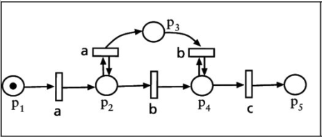

### Ejemplo PN: Máquina expendedora de bebidas

* La misma tiene un depósito de bebidas con una cierta carga inicial, y un depósito de monedas el cual inicialmente se encuentra vacío.
* Cuando se le ingresa una moneda y hay bebidas, la máquina entrega una bebida y almacena la moneda en el depósito correspondiente.


### Ejemplo PN: Cinta de correr

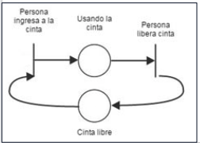

### Ejemplo PN: Cobro de un minimercado

* El mercado cuenta con dos cajas y en cada caja hay un cajero que cobra de a una persona a la vez.
* Cuando las personas llegan forman una única fila y van pasando por alguna de las dos cajas a medida que se desocupan.

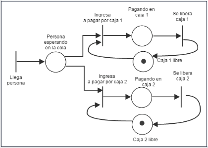

### Ejemplo PN: Lavadero de autos

* El lavadero cuenta con dos puestos de lavado.
* Los autos llegan, forman una única fila y van pasando por cualquiera de los puestos de a uno a la vez
* Luego de finalizado el lavado, pasan por la caja, de a un auto por vez. Hay una sola caja, para los dos puestos de lavado.

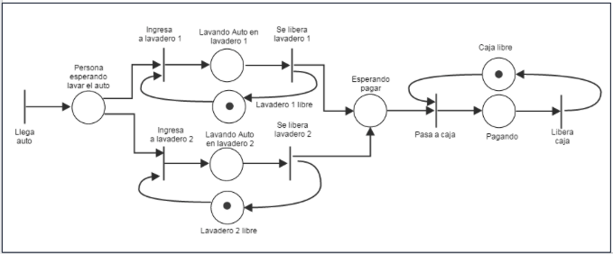

### Ejemplo PN: Canchas de tenis

* El complejo cuenta con 2 canchas singles (es decir, solo juegan 2 personas).
* Las personas llegan y esperan que llegue algún otro jugador.
* Cuando hay 2 jugadores, ingresan a cualquiera de las 2 canchas a jugar.
* Por cada cancha, se debe controlar que no ingresen más jugadores hasta que no terminen de jugar los anteriores.


## Ejercicios Diseño Máquinas Secuenciales

1. Se desea regular el tráfico de un cruce de cuatro calles con un semáforo en la confluencia de cada calle con el cruce. Las reglas que regirán estos semáforos son las siguientes:
    * Un semáforo no podrá estar en rojo si no existe tráfico en ninguna de las calles perpendiculares a la que regula dicho semáforo.
    * Habrá que respetar la regla: "el que viene por la derecha tiene prioridad", pero sólo si hay el mismo número de calles ocupadas en una dirección que en otra.
    * Tendrá prioridad la dirección que tenga más calles ocupadas con tráfico.

1. Determinar la Máquina Secuencial capaz de ir calculando la suma parcial de los números que va recibiendo y producir como salida el módulo 5 de dicha suma parcial. Por ejemplo, si se recibe la cadena 642531, la suma parcial sería 6, 10, 12, 17, 20 y 21; y la salida que deberá producir la máquina será: 102201.

1. Determinar la Máquina Secuencial capaz de ir calculando el producto parcial de los números que va recibiendo y producir como salida el módulo 4 de dicho producto parcial. Por ejemplo, si se recibe la cadena 372947 los productos parciales serían: 3, 21, 42, 378, 1512 y 10584; y la salida que deberá producir la máquina será: 312200.

1. Se dispone de una máquina expendedora de tres productos distintos: P1, P2 y P3. El precio del primero es de U$ 20, el del segundo de 15 y el del tercero de 40. La máquina admite monedas de 5, 10 y 25 U$, y tiene cuatro botones uno para cada uno de los productos que provee, y otro que devuelva el dinero introducido en caso de arrepentimiento a la hora de seleccionar el producto. Se considerarán las siguientes restricciones:
    * La máquina no podrá memorizar una cantidad de dinero que sobrepase la cantidad de producto más caro.
    * Si se selecciona un producto para el que no se ha introducido el dinero suficiente, la máquina devolverá todo el dinero introducido y no dará el producto.
    * Si se selecciona un producto para el cual se ha introducido dinero de sobra, dará el producto y se quedará con el dinero para que se pueda realizar una nueva selección o introducir más dinero.

1. Un ascensor se mueve entre tres pisos. En cada piso existe un botón para solicitar el ascensor, y en el interior hay 3 botones, uno para cada piso, con los cuales se indica el piso al que se desea ir. El ascensor tiene capacidad para una sola persona. Se trata de que el sistema que gobierne el comportamiento del ascensor sea lo más eficaz posible. Como es lógico el ascensor puede estar vacío, lleno, parado o en movimiento.

1. Se desea regular el tráfico en un paso a nivel con barrera. Para ello se dispone de una señal que se acciona cuando un tren está cerca del paso a nivel. Se dispone, a su vez, de cuatro células fotoeléctricas (c1 a c4) capaces de recoger la llegada de vehículos. Las células disponen de dos tipos de señal. Una que determina que un vehículo ha pasado por delante, y otra que es capaz de determinar si un vehículo está parado frente a ella. Las células c1 y c2 estarán controlando a los vehículos que se dirigen al paso a nivel en cada uno de los sentidos. Las células c3 y c4 a los que se acaban de salir del mismo. Se trata de, automáticamente, determinar cuando los semáforos que controlan el paso a nivel deben estar rojo o verde. Hay que tener en cuenta las siguientes restricciones:
    * El tren no deberá pararse bajo ninguna circunstancia.
    * No deben producirse colisiones.
    * Si la carretera está atascada a la salida del paso a nivel, no permitir que los vehículos entren en el paso a nivel, aunque no venga ningún tren.

1. Una máquina expendedora de monedas recibe dinero en billetes y entrega su equivalente en monedas. La cantidad ingresada en billetes no puede superar a un monto X dado, el cual se encuentra configurado en la máquina. En caso que el monto en monedas disponibles en la máquina sea inferior al ingresado en billetes (valor admitido menor a X), el dinero en billetes se devuelve. Si la máquina se queda sin monedas pasa a un estado “no disponible” hasta que reciba recarga de monedas, que nuevamente pasa a estado "disponible".

## Ejercicios Diseño de Red de Petri

1. Cuando un tren se acerca, éste es detectado por un sensor que ocasiona que se baje la barrera del paso a nivel. Cuando se aleja el tren, es detectado por otro sensor que ocasiona que se eleve la barrera. Si la barrera está elevada, los vehículos que lleguen al paso a nivel pueden pasar a través de él, en caso contrario deben esperar hasta que la barrera sea levantada.

1. Representar el encendido y apagado de una llave de luz de un pasillo de edificio. En el caso de que la luz esté apagada al presionar la llave se enciende y permanece en ese estado durante X minutos. Si al presionar la llave la luz se encuentre encendida, permanece encendida durante X minutos a partir de esa nueva presión sobre la llave.

1. Un proceso despachador de mensajes recibe mensajes provenientes de dos canales diferentes. Verifica la paridad de cada mensaje. Si la paridad es incorrecta, envía un aviso de no reconocimiento del mensaje a través de un canal de respuesta (existe un canal de respuesta por cada canal de entrada); si la paridad es correcta, coloca el mensaje recibido en un buffer. El buffer puede contener hasta diez mensajes. Cuando el buffer está lleno, el despachador envía todo el contenido del buffer a una unidad de procesamiento a través de otro canal. No se pueden colocar mensajes en un buffer lleno.

1. Se tiene un tanque de agua caliente que se comporta de la siguiente manera: el tanque dispensa agua caliente siempre que el mismo se encuentre en el estado "dispensar". El tanque cambia a estado "en reposición" cuando el nivel de agua alcanza un valor X, a partir del cual se comienza a cargar nuevamente para alcanzar el nivel de agua Y (nivel de completado). Cuando el tanque alcanza el nivel Y pasa a un estado "en calentamiento", el cual se mantiene durante un periodo T que es el tiempo que le lleva calentar el agua. Transcurrido ese tiempo el tanque pasa nuevamente a estado "dispensar". El tanque dispensa agua siempre que un usuario presione el botón de dispensación. Cada dispensación entrega agua por igual cantidad, es decir, luego de dispensar se debe controlar que no se haya alcanzado el nivel X.

1. Representar el encendido de las luces de un auto considerando que si se enciende el motor del auto y la perilla de encendido de luces está en ON, las luces se prenden automáticamente, en cambio si está en OFF, las luces no se encienden. Cuando el motor del auto se apaga, si las luces están encendidas se apagan automáticamente.
