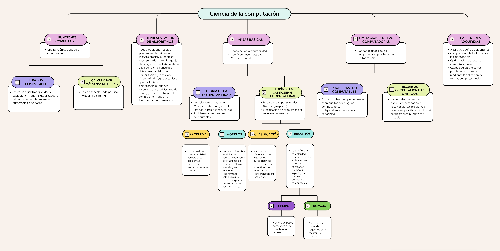
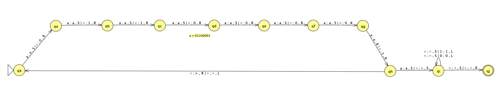
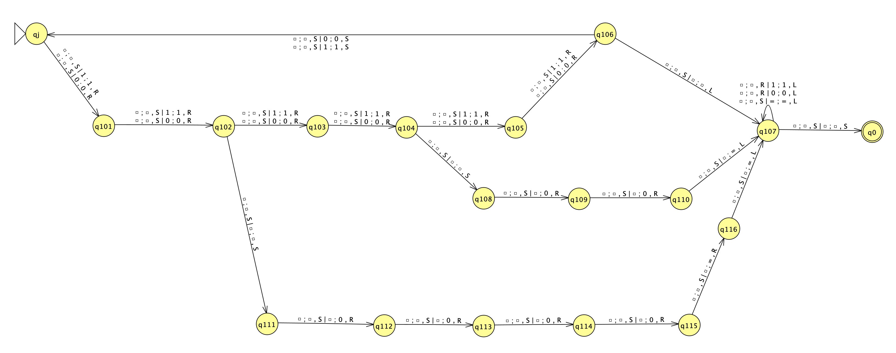
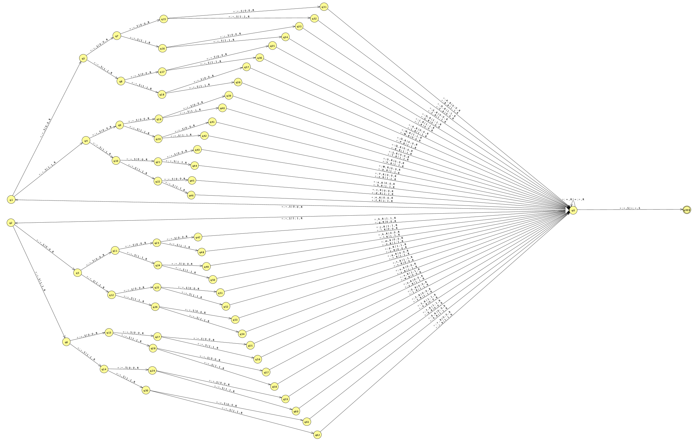

# TP

* Año: 2024
* Alumno: Martín Acuña

## Mapa conceptual

* El siguiente mapa conceptual muestra las áreas básicas de la ciencia de la computación y su relación con la teoría de la computabilidad y la teoría de la complejidad computacional. Respondiendo a las siguientes preguntas:

1. ¿En qué áreas básicas se sustenta la ciencia de la computación?
2. ¿Que estudia la teoría de la computabilidad?
3. ¿Qué estudia la teoría de la complejidad computacional?
4. ¿Qué habilidades pueden adquirir en relación al estudio de los contenidos de la ciencia de la computación?
5. ¿Qué es lo que puede limitar las capacidades de las computadoras?
6. ¿Cuáles son los recursos más comunes que se estudian en la relación de un cálculo?
7. ¿Todos los algoritmos creados pueden representarse en un lenguaje de programación?
8. ¿Cuándo se considera que una función es computable?

## Máquina de Turing

* En esta sección del trabajo práctico se presenta una máquina de Turing

1. Nombre
2. Función que computa
3. Formalismo
4. Diseño JFlap
5. Programa Simulator
6. Programa Prolog
7. Inputs X 10: configuraciones de computación
8. Complejidad Temporal
9. Complejidad Espacial

---

1. **Nombre**: Convertir ASCII a base64. Esta maquina de Turing convierte un texto ASCII a base64 utilizando una mt de dos cintas. Para simplificar la mt, solo se puede convertir parlabras en minusculas y sin espacios

1. **Función que computa**: Convertir un texto ASCII a base64, mediante los siguientes pasos:
    1. Convertir cada caracter del texto a su valor ASCII
    1. Convertir cada valor ASCII a binario de 8 bits
    1. Agrupar los valores binarios en grupos de 6 bits
    1. Completar con ceros a la derecha si es necesario
    1. Convertir cada grupo de 6 bits a su valor decimal
    1. Convertir cada valor decimal a su valor base64
    1. Concatenar los valores base64
    1. Si el texto no tiene una cantidad de caracteres múltiplo de 3, se deben agregar caracteres de relleno. En el caso de que falte un caracter, se debe agregar un signo de igual (=). Si faltan dos caracteres, se deben agregar dos signos de igual
    1. El texto convertido a base64 es el resultado final

1. **Formalismo**:

    1. Definición de la Máquina de Turing "ASCII a binario de 8 bits". Para simplificar solo se formaliza la conversión del caracter 'a' a su valor ASCII binario '01100001'. El proceso se repite para los demás caracteres
        * $MT = < \Gamma, \Sigma, b, Q, q0, F, \delta >$
        * **Alfabeto de la Cinta**: $\Gamma =$ { $0, 1, a, b, c, d, e, f, g, h, i, j, k, l, m, n, o, p, q, r, s, t, u, v, w, x, y, z, > \, □$ }
        * **Alfabeto de Entrada**: $\Sigma =$ { $0, 1, a, b, c, d, e, f, g, h, i, j, k, l, m, n, o, p, q, r, s, t, u, v, w, x, y, z, >$ }
        * **Símbolo en Blanco:** $b = □$
        * **Estados**: $Q =$ { $qk, qa, qb, qc, qd, qe, qf, qg, qh, qi, qj$ }
        * **Estado Inicial**: $q0 = qk$
        * **Estados de Aceptación**: $F =$ { $qj$ }
        * **Transiciones**:
            * $\delta(qk,(a,□)) \Rightarrow (qa,(a,0),(S,R))$
            * $\delta(qa,(a,□)) \Rightarrow (qb,(a,1),(S,R))$
            * $\delta(qb,(a,□)) \Rightarrow (qc,(a,1),(S,R))$
            * $\delta(qc,(a,□)) \Rightarrow (qd,(a,0),(S,R))$
            * $\delta(qd,(a,□)) \Rightarrow (qe,(a,0),(S,R))$
            * $\delta(qe,(a,□)) \Rightarrow (qf,(a,0),(S,R))$
            * $\delta(qf,(a,□)) \Rightarrow (qg,(a,0),(S,R))$
            * $\delta(qg,(a,□)) \Rightarrow (qh,(a,1),(R,R))$
            * $\delta(qh,(a,□)) \Rightarrow (qi,(a,□),(S,S))$
            * $\delta(qh,(□,□)) \Rightarrow (qk,(>,□),(R,L))$
            * $\delta(qi,(□,□)) \Rightarrow (qi,(0,0),(S,L))$
            * $\delta(qi,(□,□)) \Rightarrow (qi,(1,1),(S,L))$
            * $\delta(qi,(□,□)) \Rightarrow (qj,(□,□),(S,R))$

    1. Definición de la Máquina de Turing "Adaptador 8bits a 6bits"
        * $MT = < \Gamma, \Sigma, b, Q, q0, F, \delta >$
        * **Alfabeto de la Cinta**: $\Gamma =$ { $0, 1, =, □$ }
        * **Alfabeto de Entrada**:  $\Sigma =$ { $0, 1, =$ }
        * **Símbolo en Blanco**: $b = □$
        * **Estados**: $Q =$ { $qj, q101, q102, q103, q104, q105, q106, q107, q108, q109, q110, q111, q112, q113, q114, q115, q116, q0$ }
        * **Estado Inicial**: $q0 = qj$
        * **Estados de Aceptación**: $F =$ { $q0$ }
        * **Transiciones**:
            * $\delta(qj,(□,0)) \Rightarrow (q101,(□,0),(S,R))$
            * $\delta(qj,(□,1)) \Rightarrow (q101,(□,1),(S,R))$
            * $\delta(q101,(□,0)) \Rightarrow (q102,(□,0),(S,R))$
            * $\delta(q101,(□,1)) \Rightarrow (q102,(□,1),(S,R))$
            * $\delta(q102,(□,0)) \Rightarrow (q103,(□,0),(S,R))$
            * $\delta(q102,(□,1)) \Rightarrow (q103,(□,1),(S,R))$
            * $\delta(q103,(□,0)) \Rightarrow (q104,(□,0),(S,R))$
            * $\delta(q103,(□,1)) \Rightarrow (q104,(□,1),(S,R))$
            * $\delta(q104,(□,0)) \Rightarrow (q105,(□,0),(S,R))$
            * $\delta(q104,(□,1)) \Rightarrow (q105,(□,1),(S,R))$
            * $\delta(q105,(□,0)) \Rightarrow (q106,(□,0),(S,R))$
            * $\delta(q105,(□,1)) \Rightarrow (q106,(□,1),(S,R))$
            * $\delta(q106,(□,□)) \Rightarrow (q107,(□,□),(S,L))$
            * $\delta(q107,(□,0)) \Rightarrow (q107,(□,0),(R,L))$
            * $\delta(q107,(□,1)) \Rightarrow (q107,(□,1),(R,L))$
            * $\delta(q107,(□,=)) \Rightarrow (q107,(□,=),(S,L))$
            * $\delta(q107,(□,□)) \Rightarrow (q0,(□,□),(S,S))$
            * $\delta(q104,(□,□)) \Rightarrow (q108,(□,□),(S,S))$
            * $\delta(q108,(□,□)) \Rightarrow (q109,(□,0),(S,R))$
            * $\delta(q109,(□,□)) \Rightarrow (q110,(□,0),(S,R))$
            * $\delta(q110,(□,□)) \Rightarrow (q107,(□,=),(S,L))$
            * $\delta(q102,(□,□)) \Rightarrow (q111,(□,□),(S,S))$
            * $\delta(q111,(□,□)) \Rightarrow (q112,(□,0),(S,R))$
            * $\delta(q112,(□,□)) \Rightarrow (q113,(□,0),(S,R))$
            * $\delta(q113,(□,□)) \Rightarrow (q114,(□,0),(S,R))$
            * $\delta(q114,(□,□)) \Rightarrow (q115,(□,0),(S,R))$
            * $\delta(q115,(□,□)) \Rightarrow (q116,(□,=),(S,R))$
            * $\delta(q116,(□,□)) \Rightarrow (q107,(□,=),(S,L))$

    1. Definición de la Máquina de Turing "Binario a Base64"
        * $MT = < \Gamma, \Sigma, b, Q, q0, F, \delta >$
        * **Alfabeto de la Cinta**: $\Gamma =$ { $A,B,C,D,E,F,G,H,I,J,K,L,M,N,O,P,Q,R,S,T,U,V,W,X,Y,Z,a,b,c,d,e,f,g,h,i,j,k,l,m,n,o,p,q,r,s,t,u,v,w,x,y,z,0,1,2,3,4,5,6,7,8,9,+,/, =, □$ }
        * **Alfabeto de Entrada**: $\Sigma =$ { $A,B,C,D,E,F,G,H,I,J,K,L,M,N,O,P,Q,R,S,T,U,V,W,X,Y,Z,a,b,c,d,e,f,g,h,i,j,k,l,m,n,o,p,q,r,s,t,u,v,w,x,y,z,0,1,2,3,4,5,6,7,8,9,+,/, =$ }
        * **Símbolo en Blanco**: $b = □$
        * **Estados**: $Q =$ { $q0, q1, q2, q3, q4, q5, q6, q7, q8, q9 ... q63, q999$ }
        * **Estado Inicial**: $q0 = q0$
        * **Estados de Aceptación**: $F =$ { $q999$ }
        * **Transiciones**:
            * $\delta(q0,(□,0)) \Rightarrow (q1,(□,0),(S,R))$
            * $\delta(q0,(□,1)) \Rightarrow (q2,(□,1),(S,R))$
            * $\delta(q1,(□,0)) \Rightarrow (q3,(□,0),(S,R))$
            * $\delta(q1,(□,1)) \Rightarrow (q4,(□,1),(S,R))$
            * $\delta(q2,(□,0)) \Rightarrow (q5,(□,0),(S,R))$
            * $\delta(q2,(□,1)) \Rightarrow (q6,(□,1),(S,R))$
            * $\delta(q3,(□,0)) \Rightarrow (q7,(□,0),(S,R))$
            * $\delta(q3,(□,1)) \Rightarrow (q8,(□,1),(S,R))$
            * $\delta(q4,(□,0)) \Rightarrow (q9,(□,0),(S,R))$
            * $\delta(q4,(□,1)) \Rightarrow (q10,(□,1),(S,R))$
            * $\delta(q5,(□,0)) \Rightarrow (q11,(□,0),(S,R))$
            * $\delta(q5,(□,1)) \Rightarrow (q12,(□,1),(S,R))$
            * $\delta(q6,(□,0)) \Rightarrow (q13,(□,0),(S,R))$
            * $\delta(q6,(□,1)) \Rightarrow (q14,(□,1),(S,R))$
            * $\delta(q7,(□,0)) \Rightarrow (q15,(□,0),(S,R))$
            * $\delta(q7,(□,1)) \Rightarrow (q16,(□,1),(S,R))$
            * $\delta(q8,(□,0)) \Rightarrow (q17,(□,0),(S,R))$
            * $\delta(q8,(□,1)) \Rightarrow (q18,(□,1),(S,R))$
            * $\delta(q9,(□,0)) \Rightarrow (q19,(□,0),(S,R))$
            * $\delta(q9,(□,1)) \Rightarrow (q20,(□,1),(S,R))$
            * $\delta(q10,(□,0)) \Rightarrow (q21,(□,0),(S,R))$
            * $\delta(q10,(□,1)) \Rightarrow (q22,(□,1),(S,R))$
            * $\delta(q11,(□,0)) \Rightarrow (q23,(□,0),(S,R))$
            * $\delta(q11,(□,1)) \Rightarrow (q24,(□,1),(S,R))$
            * $\delta(q12,(□,0)) \Rightarrow (q25,(□,0),(S,R))$
            * $\delta(q12,(□,1)) \Rightarrow (q26,(□,1),(S,R))$
            * $\delta(q13,(□,0)) \Rightarrow (q27,(□,0),(S,R))$
            * $\delta(q13,(□,1)) \Rightarrow (q28,(□,1),(S,R))$
            * $\delta(q14,(□,0)) \Rightarrow (q29,(□,0),(S,R))$
            * $\delta(q14,(□,1)) \Rightarrow (q30,(□,1),(S,R))$
            * $\delta(q15,(□,0)) \Rightarrow (q31,(□,0),(S,R))$
            * $\delta(q15,(□,1)) \Rightarrow (q32,(□,1),(S,R))$
            * $\delta(q16,(□,0)) \Rightarrow (q33,(□,0),(S,R))$
            * $\delta(q16,(□,1)) \Rightarrow (q34,(□,1),(S,R))$
            * $\delta(q17,(□,0)) \Rightarrow (q35,(□,0),(S,R))$
            * $\delta(q17,(□,1)) \Rightarrow (q36,(□,1),(S,R))$
            * $\delta(q18,(□,0)) \Rightarrow (q37,(□,0),(S,R))$
            * $\delta(q18,(□,1)) \Rightarrow (q38,(□,1),(S,R))$
            * $\delta(q19,(□,0)) \Rightarrow (q39,(□,0),(S,R))$
            * $\delta(q19,(□,1)) \Rightarrow (q40,(□,1),(S,R))$
            * $\delta(q20,(□,0)) \Rightarrow (q41,(□,0),(S,R))$
            * $\delta(q20,(□,1)) \Rightarrow (q42,(□,1),(S,R))$
            * $\delta(q21,(□,0)) \Rightarrow (q43,(□,0),(S,R))$
            * $\delta(q21,(□,1)) \Rightarrow (q44,(□,1),(S,R))$
            * $\delta(q22,(□,0)) \Rightarrow (q45,(□,0),(S,R))$
            * $\delta(q22,(□,1)) \Rightarrow (q46,(□,1),(S,R))$
            * $\delta(q23,(□,0)) \Rightarrow (q47,(□,0),(S,R))$
            * $\delta(q23,(□,1)) \Rightarrow (q48,(□,1),(S,R))$
            * $\delta(q24,(□,0)) \Rightarrow (q49,(□,0),(S,R))$
            * $\delta(q24,(□,1)) \Rightarrow (q50,(□,1),(S,R))$
            * $\delta(q25,(□,0)) \Rightarrow (q51,(□,0),(S,R))$
            * $\delta(q25,(□,1)) \Rightarrow (q52,(□,1),(S,R))$
            * $\delta(q26,(□,0)) \Rightarrow (q53,(□,0),(S,R))$
            * $\delta(q26,(□,1)) \Rightarrow (q54,(□,1),(S,R))$
            * $\delta(q27,(□,0)) \Rightarrow (q55,(□,0),(S,R))$
            * $\delta(q27,(□,1)) \Rightarrow (q56,(□,1),(S,R))$
            * $\delta(q28,(□,0)) \Rightarrow (q57,(□,0),(S,R))$
            * $\delta(q28,(□,1)) \Rightarrow (q58,(□,1),(S,R))$
            * $\delta(q29,(□,0)) \Rightarrow (q59,(□,0),(S,R))$
            * $\delta(q29,(□,1)) \Rightarrow (q60,(□,1),(S,R))$
            * $\delta(q30,(□,0)) \Rightarrow (q61,(□,0),(S,R))$
            * $\delta(q30,(□,1)) \Rightarrow (q62,(□,1),(S,R))$
            * $\delta(q31,(□,0)) \Rightarrow (q0,(A,0),(R,R))$
            * $\delta(q31,(□,1)) \Rightarrow (q0,(B,1),(R,R))$
            * $\delta(q32,(□,0)) \Rightarrow (q0,(C,0),(R,R))$
            * $\delta(q32,(□,1)) \Rightarrow (q0,(D,1),(R,R))$
            * $\delta(q33,(□,0)) \Rightarrow (q0,(E,0),(R,R))$
            * $\delta(q33,(□,1)) \Rightarrow (q0,(F,1),(R,R))$
            * $\delta(q34,(□,0)) \Rightarrow (q0,(G,0),(R,R))$
            * $\delta(q34,(□,1)) \Rightarrow (q0,(H,1),(R,R))$
            * $\delta(q35,(□,0)) \Rightarrow (q0,(I,0),(R,R))$
            * $\delta(q35,(□,1)) \Rightarrow (q0,(J,1),(R,R))$
            * $\delta(q36,(□,0)) \Rightarrow (q0,(K,0),(R,R))$
            * $\delta(q36,(□,1)) \Rightarrow (q0,(L,1),(R,R))$
            * $\delta(q37,(□,0)) \Rightarrow (q0,(M,0),(R,R))$
            * $\delta(q37,(□,1)) \Rightarrow (q0,(N,1),(R,R))$
            * $\delta(q38,(□,0)) \Rightarrow (q0,(O,0),(R,R))$
            * $\delta(q38,(□,1)) \Rightarrow (q0,(P,1),(R,R))$
            * $\delta(q39,(□,0)) \Rightarrow (q0,(Q,0),(R,R))$
            * $\delta(q39,(□,1)) \Rightarrow (q0,(R,1),(R,R))$
            * $\delta(q40,(□,0)) \Rightarrow (q0,(S,0),(R,R))$
            * $\delta(q40,(□,1)) \Rightarrow (q0,(T,1),(R,R))$
            * $\delta(q41,(□,0)) \Rightarrow (q0,(U,0),(R,R))$
            * $\delta(q41,(□,1)) \Rightarrow (q0,(V,1),(R,R))$
            * $\delta(q42,(□,0)) \Rightarrow (q0,(W,0),(R,R))$
            * $\delta(q42,(□,1)) \Rightarrow (q0,(X,1),(R,R))$
            * $\delta(q43,(□,0)) \Rightarrow (q0,(Y,0),(R,R))$
            * $\delta(q43,(□,1)) \Rightarrow (q0,(Z,1),(R,R))$
            * $\delta(q44,(□,0)) \Rightarrow (q0,(a,0),(R,R))$
            * $\delta(q44,(□,1)) \Rightarrow (q0,(b,1),(R,R))$
            * $\delta(q45,(□,0)) \Rightarrow (q0,(c,0),(R,R))$
            * $\delta(q45,(□,1)) \Rightarrow (q0,(d,1),(R,R))$
            * $\delta(q46,(□,0)) \Rightarrow (q0,(e,0),(R,R))$
            * $\delta(q46,(□,1)) \Rightarrow (q0,(f,1),(R,R))$
            * $\delta(q47,(□,0)) \Rightarrow (q0,(g,0),(R,R))$
            * $\delta(q47,(□,1)) \Rightarrow (q0,(h,1),(R,R))$
            * $\delta(q48,(□,0)) \Rightarrow (q0,(i,0),(R,R))$
            * $\delta(q48,(□,1)) \Rightarrow (q0,(j,1),(R,R))$
            * $\delta(q49,(□,0)) \Rightarrow (q0,(k,0),(R,R))$
            * $\delta(q49,(□,1)) \Rightarrow (q0,(l,1),(R,R))$
            * $\delta(q50,(□,0)) \Rightarrow (q0,(m,0),(R,R))$
            * $\delta(q50,(□,1)) \Rightarrow (q0,(n,1),(R,R))$
            * $\delta(q51,(□,0)) \Rightarrow (q0,(o,0),(R,R))$
            * $\delta(q51,(□,1)) \Rightarrow (q0,(p,1),(R,R))$
            * $\delta(q52,(□,0)) \Rightarrow (q0,(q,0),(R,R))$
            * $\delta(q52,(□,1)) \Rightarrow (q0,(r,1),(R,R))$
            * $\delta(q53,(□,0)) \Rightarrow (q0,(s,0),(R,R))$
            * $\delta(q53,(□,1)) \Rightarrow (q0,(t,1),(R,R))$
            * $\delta(q54,(□,0)) \Rightarrow (q0,(u,0),(R,R))$
            * $\delta(q54,(□,1)) \Rightarrow (q0,(v,1),(R,R))$
            * $\delta(q55,(□,0)) \Rightarrow (q0,(w,0),(R,R))$
            * $\delta(q55,(□,1)) \Rightarrow (q0,(x,1),(R,R))$
            * $\delta(q56,(□,0)) \Rightarrow (q0,(y,0),(R,R))$
            * $\delta(q56,(□,1)) \Rightarrow (q0,(z,1),(R,R))$
            * $\delta(q57,(□,0)) \Rightarrow (q0,(0,0),(R,R))$
            * $\delta(q57,(□,1)) \Rightarrow (q0,(1,1),(R,R))$
            * $\delta(q58,(□,0)) \Rightarrow (q0,(2,0),(R,R))$
            * $\delta(q58,(□,1)) \Rightarrow (q0,(3,1),(R,R))$
            * $\delta(q59,(□,0)) \Rightarrow (q0,(4,0),(R,R))$
            * $\delta(q59,(□,1)) \Rightarrow (q0,(5,1),(R,R))$
            * $\delta(q60,(□,0)) \Rightarrow (q0,(6,0),(R,R))$
            * $\delta(q60,(□,1)) \Rightarrow (q0,(7,1),(R,R))$
            * $\delta(q61,(□,0)) \Rightarrow (q0,(8,0),(R,R))$
            * $\delta(q61,(□,1)) \Rightarrow (q0,(9,1),(R,R))$
            * $\delta(q62,(□,0)) \Rightarrow (q0,(+,0),(R,R))$
            * $\delta(q62,(□,1)) \Rightarrow (q0,(/,1),(R,R))$
            * $\delta(q0,(□,□)) \Rightarrow (q999,(□,□),(S,S))$

1. **Diseño JFlap**: Para diseñar la máquina de Turing que convierte un texto ASCII a base64, se divide el proceso en tres partes que estan concatenadas o sea que la salida de una parte es la entrada de la siguiente parte
    1. Convertir cada caracter del texto a su valor ASCII binario de 8 bits
        * 
        * JFLAP: [ASCII a binario](./resources/diagrama_ascii_bin.jff)
        * En este paso, la máquina de Turing recibe un caracter del texto y lo convierte a su valor ASCII binario de 8 bits. Luego, se desplaza a la derecha para leer el siguiente caracter. Para simplificar el diagrama solo se describen los estados para convertir el caracter 'a' a su valor ASCII binario '01100001'. El proceso se repite para los demás caracteres
    1. Convertir los valores binarios en grupos de 6 bits
        * 
        * JFLAP: [Adaptador 8bits a 6bits](./resources/diagrama_adapter.jff)
        * En este paso, la máquina de Turing recibe una cadena de 8 bits y lo convierte en grupos de 6 bits. En el caso de que la cadena no sea múltiplo de 6, se agregan ceros a la derecha. En caso de agregar dos ceros, también se agrega el simbolo '=' como caracter de relleno. En el caso de agregar cuatro ceros, se agregan dos simbolos '=' como caracteres de relleno. Luego, se desplaza a la derecha para leer el siguiente grupo de 8 bits
    1. Convertir cada grupo de 6 bits a su valor ASCII
        * 
        * JFLAP: [binario a base64](./resources/diagrama_base64.jff)
        * En este paso, la máquina de Turing recibe una cadena multiplo de 6 bits y lo convierte en su valor ASCII utilizando un arbol binario. Luego, se desplaza a la derecha para leer el siguiente grupo de 6 bits

1. **Programa Simulator**: El programa Simulator es una implementación de la máquina de Turing que convierte un texto ASCII a base64. El programa recibe como entrada un texto ASCII y devuelve el texto convertido a base64
    * Online Turing Machine Simulator: [Simulator](https://turingmachinesimulator.com/)
    * Codigo: [ASCII a base64](./resources/ascii_base64.mt)

1. [Programa Prolog](./resources/ascii_base64.pl)

1. **Inputs X 10: configuraciones de computación**

    palabra | base64
    --- | ---
    a | YQ==
    mt | bXQ=
    par | cGFy
    hola | aG9sYQ==
    cinco | Y2luY28=
    teoria | dGVvcmlh
    ciencia | Y2llbmNpYQ==
    colchita | Y29sY2hpdGE=
    computado | Y29tcHV0YWRv
    hurlingham | aHVybGluZ2hhbQ==

1. **Complejidad Temporal**

    Observamos cómo aumenta la complejidad temporal a medida que crece la longitud de la palabra:

    w entrada | longitud entrada | w salida | longitud salida | Comp. Temporal | Incremento
    --- | --- | --- | --- | --- | ---
    a | 1 | YQ== | 4 | 63 | -
    mt | 2 | bXQ= | 4 | 96 | 33
    par | 3 | cGFy | 4 | 130 | 34
    hola | 4 | aG9sYQ== | 8 | 190 | 60
    cinco | 5 | Y2luY28= | 8 | 223 | 33
    teoria | 6 | dGVvcmlh | 8 | 257 | 34
    ciencia | 7 | Y2llbmNpYQ== | 12 | 317 | 60
    colchita | 8 | Y29sY2hpdGE= | 12 | 350 | 33
    computado | 9 | Y29tcHV0YWRv | 12 | 384 | 34
    hurlingham | 10 | aHVybGluZ2hhbQ== | 16 | 444 | 60

    Los incrementos se alternar entre `33`, `34`, y `60`. Observando este patrón, determinamos que la complejidad temporal es lineal con fluctuaciones periódicas. El tiempo aumenta proporcionablemente a la longitud de la palabra, se presenta una **complejidad temporal lineal (O(n))**

1. **Complejidad Espacial**

    Observamos cómo aumenta la complejidad espacial a medida que crece la longitud de la palabra:

    Long. w entrada | separador | logn. w salida | blanco cinta #1 | blanco cinta #2 | bits | simbolo = | total | incremento
    --- | --- | --- | --- | --- | --- | --- | --- | ---
    1 | 1 | 4 | 2 | 2 | 12 | 2 | 24 | -
    2 | 1 | 4 | 2 | 2 | 18 | 1 | 30 | 6
    3 | 1 | 4 | 2 | 2 | 24 | 0 | 36 | 6
    4 | 1 | 8 | 2 | 2 | 36 | 2 | 55 | 19
    5 | 1 | 8 | 2 | 2 | 42 | 1 | 61 | 6
    6 | 1 | 8 | 2 | 2 | 48 | 0 | 67 | 6
    7 | 1 | 12 | 2 | 2 | 60 | 2 | 86 | 19
    8 | 1 | 12 | 2 | 2 | 66 | 1 | 92 | 6
    9 | 1 | 12 | 2 | 2 | 72 | 0 | 98 | 6
    10 | 1 | 16 | 2 | 2 | 84 | 2 | 117 | 19

    Los incrementos se alternar entre `6` y `19`. Observando este patrón, determinamos que la complejidad espacial es lineal con fluctuaciones periódicas. El espacio aumenta proporcionablemente a la longitud de la palabra, se presenta una **complejidad espacial lineal (O(n))**
