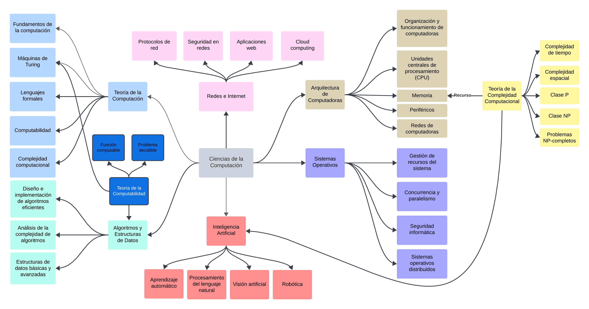
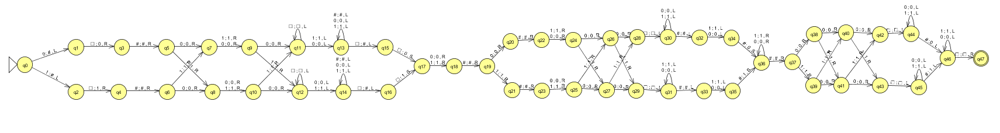
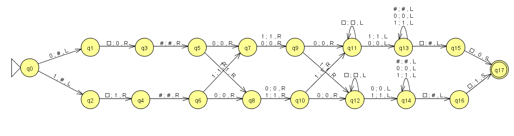
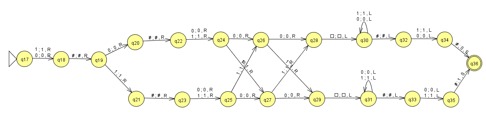
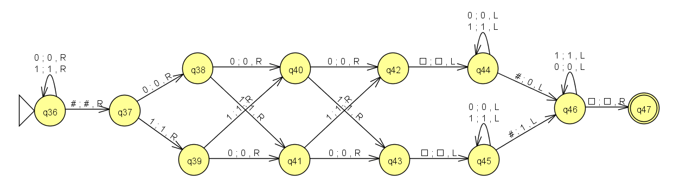
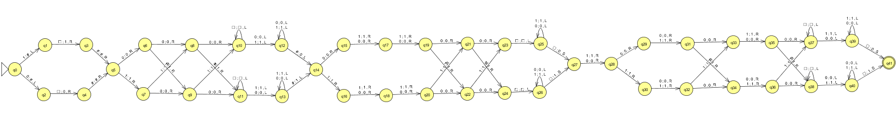
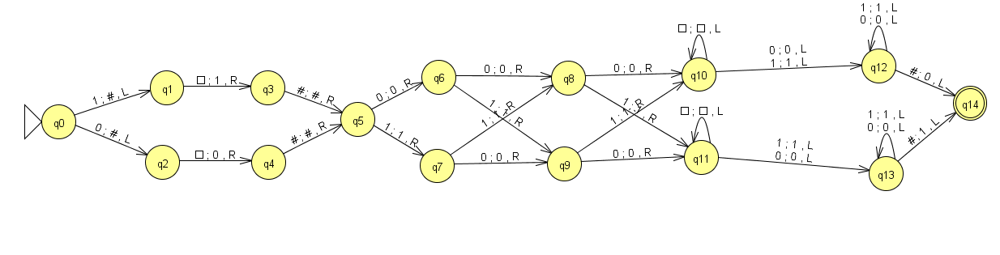
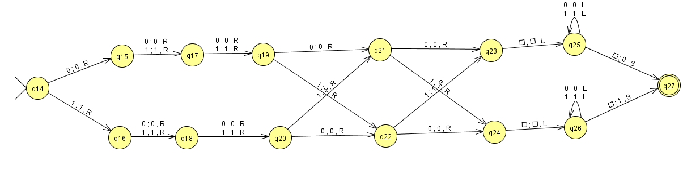
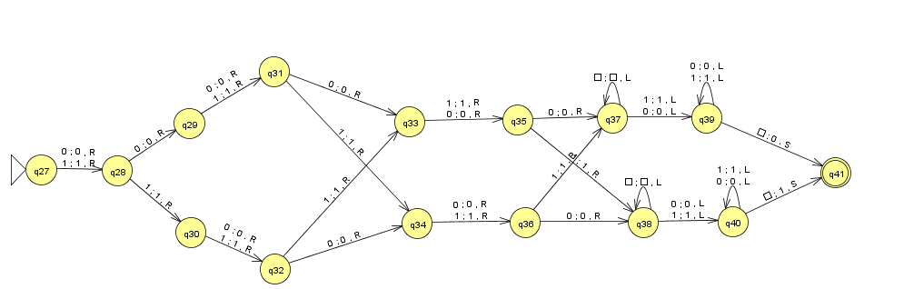

# TP

* Año: 2024

## Mapa Conceptual

## Máquina de Turing

* El objetivo es diseñar una MT que a partir de un dato en binario de 4 bits genere el correspondiente código de Hamming para su posterior transmisión. A este escenario se lo denomina Código Hamming que para el caso particular de un dato de 4 bits, las tres paridades que se deben calcular son:

$$P_1(d_1,d_2,d_4)$$
$$P_2(d_1,d_3,d_4)$$
$$P_3(d_2,d_3,d_4)$$

Esto significa que para el bit de paridad $P_1$ se analizaran los bits de datos $d_1$, $d_2$ y $d_4$ y así con $P_2$ y $P_3$ respectivamente. Además de generar los 3 bits de paridad se deben posicionar en la palabra de salida en las siguiente posiciones:

$$P_1 \quad P_2 \quad d_1 \quad P_3 \quad d_2 \quad d_3 \quad d_4$$

## Estrategias utilizadas

Para lograr este objetivo se plantean dos estrategias diferentes donde en la **estrategia 1** se genera el formato de salida primero con el uso del simbolo auxiliar `#` y luego se reemplaza con las paridades generadas en orden: $P_1$, $P_2$ y $P_3$. Luego en la **estrategia 2** a partir de los 4 bits de entrada se van generando los bits de paridad y formateando la salida a la vez que se va generando las paridades que a partir de una simple inspección del formato el orden que se selecciona es $P_3$, $P_2$ y $P_1$.

### Estrategia 1

* **Función que computa**: Generar un Codigo Hamming 7,4 a partir de 4 bits de datos se generan 3 bits de paridad par en función de 3 de los 4 bits de entrada.
* **Formalismo**: $$MT = < \Gamma, \Sigma, \square, Q, q_{0}, F, \delta >$$
  * Alfabeto de símbolos de cinta: $\Gamma = \{ 0,1,\square, \# \}$
  * $Simbolos_{aux} =\{ \# \}$
  * Alfabeto de símbolos de entrada: $\Sigma = \{ 0, 1 \}$
  * Símbolo blanco: $\square$
  * Estados: $$Q = \{ \\ q_0, q_1, q_2, q_3, q_4, q_5, q_6, q_7, q_8, q_9, q_{10}, \\ q_{11}, q_{12}, q_{13}, q_{14}, q_{15}, q_{16}, q_{17}, q_{18}, q_{19}, q_{20}, \\ q_{21}, q_{22}, q_{23}, q_{24}, q_{25}, q_{26}, q_{27}, q_{28}, q_{29}, q_{30}, \\ q_{31}, q_{32}, q_{33}, q_{34}, q_{35}, q_{36}, q_{37}, q_{38}, q_{39}, q_{40}, \\ q_{41}, q_{42}, q_{43}, q_{44}, q_{45}, q_{46}, q_{47} \\ \} $$
  * Estado inicial: $q_0 \in Q$
  * Estados finales: $F = \{ q_{47} \}$
  * Transiciones:
    $$\delta(q0,0) = (q1,\#,L)$$
    $$\delta(q0,1) = (q2,\#,L)$$
    $$\delta(q1,\square) = (q3,0,R)$$
    $$\delta(q2,\square) = (q4,1,R)$$
    $$\delta(q3,\#) = (q5,\#,R)$$
    $$\delta(q4,\#) = (q6,\#,R)$$
    $$\delta(q5,0) = (q7,0,R)$$
    $$\delta(q5,1) = (q8,1,R)$$
    $$\delta(q6,0) = (q8,0,R)$$
    $$\delta(q6,1) = (q7,1,R)$$
    $$\delta(q7,0) = (q9,0,R)$$
    $$\delta(q7,1) = (q9,1,R)$$
    $$\delta(q8,0) = (q10,0,R)$$
    $$\delta(q8,1) = (q10,1,R)$$
    $$\delta(q9,0) = (q11,0,R)$$
    $$\delta(q9,1) = (q12,1,R)$$
    $$\delta(q10,0) = (q12,0,R)$$
    $$\delta(q11,\square) = (q11,\square,L)$$
    $$\delta(q10,0) = (q12,0,R)$$
    $$\delta(q11,0) = (q13,0,L)$$
    $$\delta(q11,1) = (q13,1,L)$$
    $$\delta(q12,\square) = (q12,\square,L)$$
    $$\delta(q13,1) = (q13,1,L)$$
    $$\delta(q13,0) = (q13,0,L)$$
    $$\delta(q13,\#) = (q13,\#,L)$$
    $$\delta(q12,0) = (q14,0,L)$$
    $$\delta(q12,1) = (q14,1,L)$$
    $$\delta(q13,\square) = (q15,\#,L)$$
    $$\delta(q14,1) = (q14,1,L)$$
    $$\delta(q14,0) = (q14,0,L)$$
    $$\delta(q14,\#) = (q14,\#,L)$$
    $$\delta(q14,\square) = (q16,\#,L)$$
    $$\delta(q15,\square) = (q17,0,S)$$
    $$\delta(q16,\square) = (q17,1,S)$$
    $$\delta(q17,0) = (q18,0,R)$$
    $$\delta(q17,1) = (q18,1,R)$$
    $$\delta(q18,\#) = (q19,\#,R)$$
    $$\delta(q19,0) = (q20,0,R)$$
    $$\delta(q19,1) = (q21,1,R)$$
    $$\delta(q20,\#) = (q22,\#,R)$$
    $$\delta(q21,\#) = (q23,\#,R)$$
    $$\delta(q22,0) = (q24,0,R)$$
    $$\delta(q22,1) = (q24,1,R)$$
    $$\delta(q23,1) = (q25,1,R)$$
    $$\delta(q23,0) = (q25,0,R)$$
    $$\delta(q24,0) = (q26,0,R)$$
    $$\delta(q24,1) = (q27,1,R)$$
    $$\delta(q25,0) = (q27,0,R)$$
    $$\delta(q25,1) = (q26,1,R)$$
    $$\delta(q26,0) = (q28,0,R)$$
    $$\delta(q26,1) = (q29,1,R)$$
    $$\delta(q27,0) = (q29,0,R)$$
    $$\delta(q27,1) = (q28,1,R)$$
    $$\delta(q28,\square) = (q30,\square,L)$$
    $$\delta(q29,\square) = (q31,\square,L)$$
    $$\delta(q30,1) = (q30,1,L)$$
    $$\delta(q30,0) = (q30,0,L)$$
    $$\delta(q31,0) = (q31,0,L)$$
    $$\delta(q31,1) = (q31,1,L)$$
    $$\delta(q30,\#) = (q32,\#,L)$$
    $$\delta(q31,\#) = (q33,\#,L)$$
    $$\delta(q32,0) = (q34,0,L)$$
    $$\delta(q32,1) = (q34,1,L)$$
    $$\delta(q33,0) = (q35,0,L)$$
    $$\delta(q33,1) = (q35,1,L)$$
    $$\delta(q34,\#) = (q36,0,S)$$
    $$\delta(q35,\#) = (q36,1,S)$$
    $$\delta(q36,0) = (q36,0,R)$$
    $$\delta(q36,1) = (q36,1,R)$$
    $$\delta(q36,\#) = (q37,\#,R)$$
    $$\delta(q37,0) = (q38,0,R)$$
    $$\delta(q37,1) = (q39,1,R)$$
    $$\delta(q38,0) = (q40,0,R)$$
    $$\delta(q38,1) = (q41,1,R)$$
    $$\delta(q39,0) = (q41,0,R)$$
    $$\delta(q39,1) = (q40,1,R)$$
    $$\delta(q40,0) = (q42,0,R)$$
    $$\delta(q40,1) = (q43,1,R)$$
    $$\delta(q41,0) = (q43,0,R)$$
    $$\delta(q41,1) = (q42,1,R)$$
    $$\delta(q42,\square) = (q44,\square,L)$$
    $$\delta(q43,\square) = (q45,\square,L)$$
    $$\delta(q44,1) = (q44,1,L)$$
    $$\delta(q44,0) = (q44,0,L)$$
    $$\delta(q45,0) = (q45,0,L)$$
    $$\delta(q45,1) = (q45,1,L)$$
    $$\delta(q44,\#) = (q46,0,L)$$
    $$\delta(q45,\#) = (q46,1,L)$$
    $$\delta(q46,1) = (q46,1,L)$$
    $$\delta(q46,0) = (q46,0,L)$$
    $$\delta(q46,\square) = (q47,\square,R)$$
    $$\delta(q46,\square) = (q47,\square,R)$$
* **JFLAP**: [Diseño](./resources/E1-jflap.jff)
* **JFLAP**: 
* **Simulator**: [Programa](./resources/E1-simulator.mt)
* **Prolog**: [Programa](./resources/E1-prolog.pl)
* **Inputs X 10: configuraciones de computación**:

  | Entrada | Salida   | Pasos | Espacios | Estado  |
  |:--------|:--------:|:-----:|:--------:|:--------|
  | 0000    | 0000000  |  43   |    9     | Aceptado|
  | 1000    | 1110000  |  43   |    9     | Aceptado|
  | 0100    | 1001100  |  43   |    9     | Aceptado|
  | 1100    | 0111100  |  43   |    9     | Aceptado|
  | 0010    | 0101010  |  43   |    9     | Aceptado|
  | 1010    | 1011010  |  43   |    9     | Aceptado|
  | 0110    | 1100110  |  43   |    9     | Aceptado|
  | 1110    | 0010110  |  43   |    9     | Aceptado|
  | 0001    | 1101001  |  43   |    9     | Aceptado|
  | 1001    | 0011001  |  43   |    9     | Aceptado|
  | 0101    | 0100101  |  43   |    9     | Aceptado|
  | 1101    | 1010101  |  43   |    9     | Aceptado|
  | 0011    | 1000011  |  43   |    9     | Aceptado|
  | 1011    | 0110011  |  43   |    9     | Aceptado|
  | 0111    | 0001111  |  43   |    9     | Aceptado|
  | 1111    | 1111111  |  43   |    9     | Aceptado|

* **Complejidad Temporal**: el tiempo de ejecución $t_H1(n)$ de la estrategia 1, para tamaño de la entrada $n=4$

$$t_{H1}(4) = 43$$

* **Complejidad Espacial**: el espacio de ejecución $e_{H1}(n)$ de la estrategia 1, para el tamaño de la entrada de $n=4$

$$e_{H1}(4) = 9$$

#### Descripción de Estrategia 1

Comenzando con los 4 bit de entraga se posicionan los carcteres auxiliares `#` en los lugares correspondientes para el formato deseado. Luego se genera el $P_1$.

* Entrada: $d_1 \quad d_2 \quad d_3 \quad d_4$
* Salida: $P_1 \quad \# \quad d_1 \quad \# \quad d_2 \quad d_3 \quad d_4$

Se genera $P_2$ y se reemplaza el `#` correspondiente según el formato.

* Entrada: $P_1 \quad \# \quad d_1 \quad \# \quad d_2 \quad d_3 \quad d_4$
* Salida: $P_1 \quad P_2 \quad d_1 \quad \# \quad d_2 \quad d_3 \quad d_4$

Se genera $P_3$ y se reemplaza el `#` correspondiente según el formato y se posiciona al comienzo de la cadena el cabezal.

* Entrada: $P_1 \quad P_2 \quad d_1 \quad \# \quad d_2 \quad d_3 \quad d_4$
* Salida: $P_1 \quad P_2 \quad d_1 \quad P_3 \quad d_2 \quad d_3 \quad d_4$

### Estrategia 2

* **Función que computa**: Generar un Codigo Hamming 7,4 a partir de 4 bits de datos se generan 3 bits de paridad par en función de 3 de los 4 bits de entrada.
* **Formalismo**: $$MT = < \Gamma, \Sigma, \square, Q, q_0, F, \delta >$$
  * Alfabeto de cinta: $\Gamma = \{ 0,1,\square, \# \}$
  * $Simbolos_{aux} =\{ \# \}$
  * Alfabeto de entrada: $\Sigma = \{ 0, 1 \}$
  * Símbolo blanco: $\square$
  * Estados: $$Q = \{ \\ q_0, q_1, q_2, q_3, q_4, q_5, q_6, q_7, q_8, q_9, q_{10}, \\ q_{11}, q_{12}, q_{13}, q_{14}, q_{15}, q_{16}, q_{17}, q_{18}, q_{19}, q_{20}, \\ q_{21}, q_{22}, q_{23}, q_{24}, q_{25}, q_{26}, q_{27}, q_{28}, q_{29}, q_{30}, \\ q_{31}, q_{32}, q_{33}, q_{34}, q_{35}, q_{36}, q_{37}, q_{38}, q_{39}, q_{40}, \\ q_{41} \\ \} $$
  * Estado inicial: $q_0 \in Q$
  * Estados finales: $F = \{ q_{41} \}$
  * Transiciones:
    $$\delta(q0,1) = (q1,\#,L)$$
    $$\delta(q0,0) = (q2,\#,L)$$
    $$\delta(q1,\square) = (q3,1,R)$$
    $$\delta(q2,\square) = (q4,0,R)$$
    $$\delta(q3,\#) = (q5,\#,R)$$
    $$\delta(q4,\#) = (q5,\#,R)$$
    $$\delta(q5,0) = (q6,0,R)$$
    $$\delta(q5,1) = (q7,1,R)$$
    $$\delta(q6,0) = (q8,0,R)$$
    $$\delta(q6,1) = (q9,1,R)$$
    $$\delta(q7,0) = (q9,0,R)$$
    $$\delta(q7,1) = (q8,1,R)$$
    $$\delta(q8,0) = (q10,0,R)$$
    $$\delta(q8,1) = (q11,1,R)$$
    $$\delta(q9,0) = (q11,0,R)$$
    $$\delta(q9,1) = (q10,1,R)$$
    $$\delta(q10,\square) = (q10,\square,L)$$
    $$\delta(q11,\square) = (q11,\square,L)$$
    $$\delta(q10,0) = (q12,0,L)$$
    $$\delta(q10,1) = (q12,1,L)$$
    $$\delta(q11,0) = (q13,0,L)$$
    $$\delta(q11,1) = (q13,1,L)$$
    $$\delta(q12,1) = (q12,1,L)$$
    $$\delta(q12,0) = (q12,0,L)$$
    $$\delta(q13,1) = (q13,1,L)$$
    $$\delta(q13,0) = (q13,0,L)$$
    $$\delta(q12,\#) = (q14,0,L)$$
    $$\delta(q13,\#) = (q14,1,L)$$
    $$\delta(q14,0) = (q15,0,R)$$
    $$\delta(q14,1) = (q16,1,R)$$
    $$\delta(q15,0) = (q17,0,R)$$
    $$\delta(q15,1) = (q17,1,R)$$
    $$\delta(q16,0) = (q18,0,R)$$
    $$\delta(q16,1) = (q18,1,R)$$
    $$\delta(q17,0) = (q19,0,R)$$
    $$\delta(q17,1) = (q19,1,R)$$
    $$\delta(q18,0) = (q20,0,R)$$
    $$\delta(q18,1) = (q20,1,R)$$
    $$\delta(q19,0) = (q21,0,R)$$
    $$\delta(q19,1) = (q22,1,R)$$
    $$\delta(q20,0) = (q22,0,R)$$
    $$\delta(q20,1) = (q21,1,R)$$
    $$\delta(q21,0) = (q23,0,R)$$
    $$\delta(q21,1) = (q24,1,R)$$
    $$\delta(q22,0) = (q24,0,R)$$
    $$\delta(q22,1) = (q23,1,R)$$
    $$\delta(q23,\square) = (q25,\square,L)$$
    $$\delta(q24,\square) = (q26,\square,L)$$
    $$\delta(q25,0) = (q25,0,L)$$
    $$\delta(q25,1) = (q25,1,L)$$
    $$\delta(q26,0) = (q26,0,L)$$
    $$\delta(q26,1) = (q26,1,L)$$
    $$\delta(q25,\square) = (q27,0,S)$$
    $$\delta(q26,\square) = (q27,1,S)$$
    $$\delta(q27,0) = (q28,0,R)$$
    $$\delta(q27,1) = (q28,1,R)$$
    $$\delta(q28,0) = (q29,0,R)$$
    $$\delta(q28,1) = (q30,1,R)$$
    $$\delta(q29,0) = (q31,0,R)$$
    $$\delta(q29,1) = (q31,1,R)$$
    $$\delta(q30,0) = (q32,0,R)$$
    $$\delta(q30,1) = (q32,1,R)$$
    $$\delta(q31,0) = (q33,0,R)$$
    $$\delta(q31,1) = (q34,1,R)$$
    $$\delta(q32,0) = (q34,0,R)$$
    $$\delta(q32,1) = (q33,1,R)$$
    $$\delta(q33,0) = (q35,0,R)$$
    $$\delta(q33,1) = (q35,1,R)$$
    $$\delta(q34,0) = (q36,0,R)$$
    $$\delta(q34,1) = (q36,1,R)$$
    $$\delta(q35,0) = (q37,0,R)$$
    $$\delta(q35,1) = (q38,1,R)$$
    $$\delta(q36,0) = (q38,0,R)$$
    $$\delta(q36,1) = (q37,1,R)$$
    $$\delta(q37,\square) = (q37,\square,L)$$
    $$\delta(q38,\square) = (q38,\square,L)$$
    $$\delta(q37,0) = (q39,0,L)$$
    $$\delta(q37,1) = (q39,1,L)$$
    $$\delta(q38,0) = (q40,0,L)$$
    $$\delta(q38,1) = (q40,1,L)$$
    $$\delta(q39,0) = (q39,0,L)$$
    $$\delta(q39,1) = (q39,1,L)$$
    $$\delta(q40,0) = (q40,0,L)$$
    $$\delta(q40,1) = (q40,1,L)$$
    $$\delta(q39,\square) = (q41,0,S)$$
    $$\delta(q40,\square) = (q41,1,S)$$
* **JFLAP**: [Diseño](./resources/E2-jflap.jff)
* **JFLAP**: 
* **Simulator**: [Programa](./resources/E2-simulator.mt)
* **Prolog**: [Programa](./resources/E2-prolog.pl)
* **Inputs X 10: configuraciones de computación**:

| Entrada | Salida   | Pasos | Espacios | Estado  |
|:--------|:--------:|:-----:|:--------:|:--------|
| 0000    | 0000000  |  37   |    8     | Aceptado|
| 1000    | 1110000  |  37   |    8     | Aceptado|
| 0100    | 1001100  |  37   |    8     | Aceptado|
| 1100    | 0111100  |  37   |    8     | Aceptado|
| 0010    | 0101010  |  37   |    8     | Aceptado|
| 1010    | 1011010  |  37   |    8     | Aceptado|
| 0110    | 1100110  |  37   |    8     | Aceptado|
| 1110    | 0010110  |  37   |    8     | Aceptado|
| 0001    | 1101001  |  37   |    8     | Aceptado|
| 1001    | 0011001  |  37   |    8     | Aceptado|
| 0101    | 0100101  |  37   |    8     | Aceptado|
| 1101    | 1010101  |  37   |    8     | Aceptado|
| 0011    | 1000011  |  37   |    8     | Aceptado|
| 1011    | 0110011  |  37   |    8     | Aceptado|
| 0111    | 0001111  |  37   |    8     | Aceptado|
| 1111    | 1111111  |  37   |    8     | Aceptado|

* **Complejidad Temporal**: el tiempo de ejecución $t_{H2}(n)$ de la estrategia 2, para tamaño de la entrada $n=4$

$$t_{H2}(4) = 37$$

* **Complejidad Espacial**: el espacio de ejecución $e_{H2}(n)$ de la estrategia 2, para el tamaño de la entrada de $n=4$

$$e_{H2}(4) = 8$$

#### Descripción de Estrategia 2

Como pasos a realizar para obtener el objetivo nos propusimos los siguientes pasos:

1. Diseñar las MT que generen los bits de Paridad al final del dato de 4 bits
2. Diseñar las MT que generen los bits de Paridad en la posición correspondiente a la salida deseada.
3. Interconectar las MT generadas anteriormente donde cada estado final es el estado incial de la siguiente máquina.

### Las MT que generan los bits de Paridad en la posición correspondiente a la salida deseada

En este caso se tiene como regla generar terminar con el cabezal en la posicion de la cinta más a la izquiera donde haya un dato válido.

En principio se decidio comenzar generando $P_3$, posicionarlo entre los bits de datos $d_1$ y $d_2$ esto es:

Entrada: $d_1 d_2 d_3 d_4$

Salida: $d_1 P_3 d_2 d_3 d_4$

Entrada: $d_1 P_3 d_2 d_3 d_4$

Salida: $P_2 d_1 P_3 d_2 d_3 d_4$

Entrada: $P_2 d_1 P_3 d_2 d_3 d_4$

Salida: $P_1 P_2 d_1 P_3 d_2 d_3 d_4$

* **Comparación de ambas máquinas, justificando cual es la "mejor"**:

Luego de los análisis de ambas MT podemos resumir en la siguiente tabla

|      MT      | Complejidad Espacial | Complejidad Temporal |
|:------------:|:--------------------:|:--------------------:|
| Estrategia 1 | $e_{H1}(4) = 9$      | $t_{H1}(4) = 43$     |
| Estrategia 2 | $e_{H2}(4) = 8$      | $t_{H2}(4) = 37$     |

Podemos concluir que en ambos criterios de evaluación de la complejidad del algoritmo tanto espacial como temporal, la estrategia 2 es la más óptima, más rapida, y la que menos recursos necesita.
