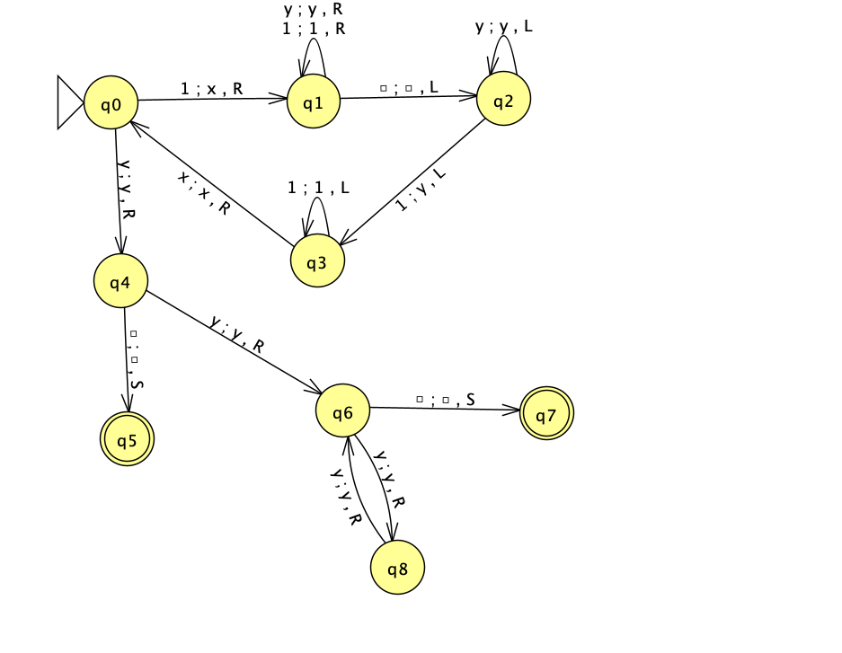
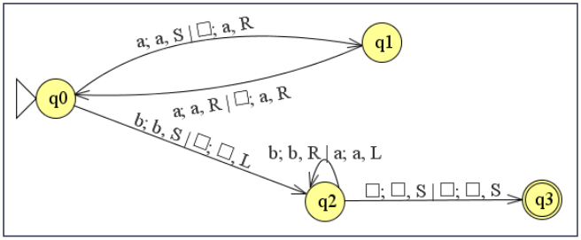

# Máquina de Turing (MT)

## Ejercicios diseño de MT-aceptable

1. Palabras con cantidad par de 0’s
1. Palabras que comienzan y terminan con el mismo símbolo
1. Palabras del LR representado por la ER aba*
1. Palabras de parejas de paréntesis
1. Palabras que contengan 1’s y/o 0’s pero no contengan 3 ceros seguidos
1. Palabras con un número par de x. Ejemplo xx, xxxx, ...
1. Palabras de 1’s cuya longitud es una potencia de 2

    

1. Palabras con cantidad de aes igual a cantidad de bes
1. Palabras con cantidad de aes igual a cantidad de bes e igual a cantidad de ces

1. {wb / w ∈ {a, b}*}
1. {yx^nzy / n ≥ 0}
1. {w#w / w ∈ a {a, b}+}
1. {xww^(-1)y / x, y, w ∈ a {a, b}+ y |x| ≥ |y|}
1. {ww donde w ∈ {a, b}*}
1. {a^nb^kd^(2n)e^(n+1) / k, n ≥ 1} sobre Σ = {a, b, c, d, e}
1. {a^(i+2)b^jc^(2i)d^j / i, j ≥ 0} sobre Σ = {a, b, c, d, e}
1. {b^(2r)a^(n+1)b^nd^je^(r+1) / n, r ≥ 0 y j > r} sobre Σ = {a, b, c, d, e}
1. {a^(n+1)b^nd^ne^k/ n ≥ 0 y k > n} sobre Σ = {a, b, c, d, e}
1. {a^(2n)d^(s+1)b^ke^n/ s ≥ 0 y n, k > 0 y k ≠n} sobre Σ = {a, b, c, d, e}
1. {a^(p+1)d^(2n)b^ne^(2k+1) / p, k ≥ 0 y n > p} sobre Σ = {a, b, c, d, e}
1. {a^nb^(2k+1)d^(p+1)c^k / p, k ≥ 0 y n > p} U {a^nb^(2k+1)e^(2n) / n, k > 0} sobre Σ = {a, b, c, d, e}

## Ejercicios diseño de MT-aceptable multicinta

1. {a^nb^2n/ n ≥ 1}

    

1. {a^nb^nc^(n+1) / n ≥ 1}
1. {ww^(-1) / w ∈ {a, b}+}
